# 纳斯达克综合指数 15 年回撤规律分析与 ML 评分模型

> **数据区间**：2011-06 ~ 2026-06 | **分析标的**：纳斯达克综合指数 (^IXIC)
> **数据来源**：Yahoo Finance (yfinance), multpl.com, CNN Business
> **ML 模型**：V6 — 多尺度方向预测系统, 5个Horizon LightGBM + GBC元分类器, 179维特征 (top_k=80/50)
> **生成日期**：2026-06-09

---

## 目录

- [一、数据总览与数据来源](#一数据总览与数据来源)
- [二、13 次回撤区间精确定义](#二13-次回撤区间精确定义)
- [三、技术指标体系说明](#三技术指标体系说明)
- [四、顶部特征深度分析](#四顶部特征深度分析)
- [五、底部特征深度分析](#五底部特征深度分析)
- [六、顶部 vs 底部：九大指标对比](#六顶部-vs-底部九大指标对比)
- [七、六次重大回撤逐一拆解](#七六次重大回撤逐一拆解)
- [八、信号有效性回测](#八信号有效性回测)
- [九、底部买入反弹收益统计](#九底部买入反弹收益统计)
- [十、实战信号体系](#十实战信号体系)
- [十一、ML 多尺度方向预测模型 V6 完整技术说明](#十一ml-多尺度方向预测模型-v6-完整技术说明)
  - [11.1 问题定义与演进历程](#111-问题定义与演进历程)
  - [11.2 数据来源体系](#112-数据来源体系)
  - [11.3 模型架构（多Horizon LightGBM + 元层）](#113-模型架构多horizon-lightgbm--元层)
  - [11.4 特征工程：179维计算 → top_k选择](#114-特征工程179维计算--top_k选择)
  - [11.5 滚动百分位标签设计](#115-滚动百分位标签设计)
  - [11.6 训练流水线](#116-训练流水线)
  - [11.7 非重叠Walk-forward CV](#117-非重叠walk-forward-cv)
  - [11.8 评价结果](#118-评价结果)
  - [11.9 元层聚合与事件检测](#119-元层聚合与事件检测)
  - [11.10 逐次事件验证](#1110-逐次事件验证)
  - [11.11 可视化](#1111-可视化)
  - [11.12 V4→V6 改进对比](#1112-v4v6-改进对比)
  - [11.13 使用方法与脚本](#1113-使用方法与脚本)
  - [11.14 局限性与风险](#1114-局限性与风险)
- [十二、核心规律总结](#十二核心规律总结)
- [附录：完整文件清单](#附录完整文件清单)

---

## 一、数据总览与数据来源

### 1.1 纳斯达克综合指数走势

过去 15 年，纳斯达克综合指数从 2011 年的约 2,640 点上涨至 2026 年中的约 25,700 点，累计涨幅约 **10 倍**。但这条路远非一帆风顺——期间经历了 **13 次幅度超过 10% 的回撤**，其中 6 次超过 15%，3 次超过 20%，2 次超过 30%。

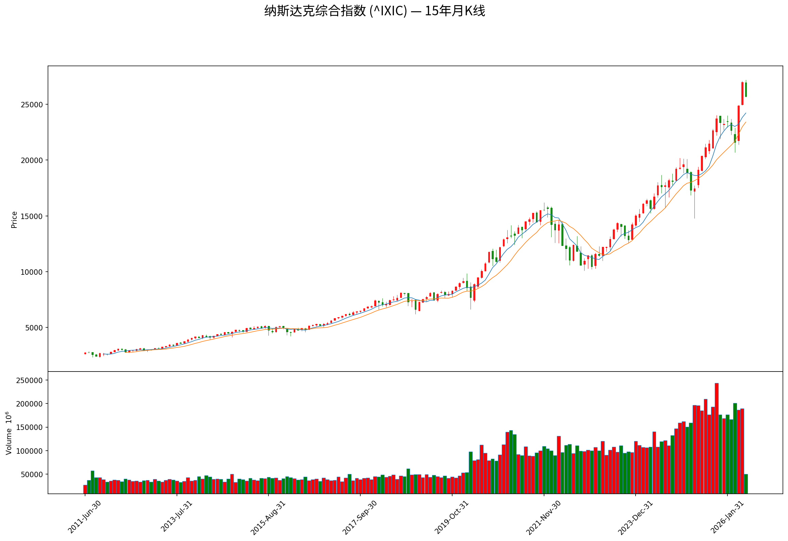

### 1.2 研究方法

1. **回撤识别**：基于累计最高点 (running max) 计算每日回撤幅度，以 10% 回撤为阈值识别独立的回撤事件，以价格回升至前高确认恢复
2. **指标计算**：对每次回撤的顶部日和底部日，提取多项技术/情绪/宏观指标的精确数值
3. **统计归纳**：计算各指标在顶部和底部的均值、中位数、范围，总结统计规律
4. **信号回测**：设定阈值条件，回测在 13 次顶部/底部前 10 天窗口内信号的触发命中率
5. **反弹统计**：计算底部确认后 20/60/120 天的涨幅
6. **ML 建模**：基于 179 维特征计算 → 5个Horizon LightGBM + GBC元分类器构建多尺度方向预测系统

### 1.3 数据来源体系

本分析整合了来自 6 个数据源的 12 个金融时间序列：

| # | 数据 | 获取方式 | 数据量 | 用途 |
|---|---|---|---|---|
| 1 | 纳斯达克综合指数 (^IXIC) | yfinance | 3,768 日 | 价格、成交量、K 线形态 |
| 2 | VIX 波动率指数 (^VIX) | yfinance | 3,769 日 | 恐慌情绪 |
| 3 | VVIX 波动率的波动率 (^VVIX) | yfinance | 3,760 日 | 波动率预期变化 |
| 4 | VIX9D 9 天期货波动率 (^VIX9D) | yfinance | 3,776 日 | 短期波动率预期 |
| 5 | VIX3M 3 个月期货波动率 (^VIX3M) | yfinance | 3,776 日 | 中期波动率预期 |
| 6 | CBOE SKEW 尾部风险指数 (^SKEW) | yfinance | 3,714 日 | 黑天鹅概率定价 |
| 7 | 10 年期国债收益率 (^TNX) | yfinance | — | 收益率曲线 |
| 8 | 13 周期国库券收益率 (^IRX) | yfinance | — | 收益率曲线短端 |
| 9 | HYG 高收益债 ETF | yfinance | 3,776 日 | 信用利差（垃圾债） |
| 10 | LQD 投资级债券 ETF | yfinance | 3,776 日 | 信用利差（投资级） |
| 11 | TLT 20 年+国债 ETF | yfinance | 3,776 日 | 信用利差基准 |
| 12 | S&P 500 PE + Shiller CAPE | multpl.com | 186 月 | 估值水平 |

**未能获取的数据**：

| 数据 | 尝试来源 | 问题 | 影响 |
|---|---|---|---|
| CNN Fear & Greed 完整历史 | CNN API | 仅近 1 年 (250 条) | 无法作为训练特征 |
| Put/Call Ratio | yfinance ^CPC | ticker 返回 404 | 缺少期权情绪数据 |
| FRED 经济数据 | FRED API | 504 超时 | 缺少官方经济指标 |
| 日频 PE 数据 | multpl.com | 仅月频 | 已用插值方法处理 |

### 1.4 本地数据文件

| 文件 | 内容 | 记录数 | 来源 |
|---|---|---|---|
| 数据_纳斯达克综合指数_15年.csv | 纳斯达克综合指数日线 OHLCV | 3,768 | yfinance |
| 数据_VIX恐慌指数_15年.csv | VIX 波动率指数日线 | 3,769 | yfinance |
| 数据_VVIX波动率的波动率_15年.csv | VVIX 波动率的波动率日线 | 3,760 | yfinance |
| 数据_VIX9D_15y.csv | VIX9D 9 天期货波动率 | 3,776 | yfinance |
| 数据_VIX3M_15y.csv | VIX3M 3 个月期货波动率 | 3,776 | yfinance |
| 数据_SKEW.csv | CBOE SKEW 尾部风险指数 | 3,714 | yfinance |
| 数据_国债利差10Y2Y.csv | 10Y-2Y 国债利差 | 3,775 | yfinance |
| 数据_信用利差.csv | HYG/LQD/TLT 债券 ETF | 3,776 | yfinance |
| 数据_SP500估值月度_填充.csv | S&P 500 PE + Shiller CAPE | 186 | multpl.com |
| 数据_全指标合并主表.csv | 所有指标合并的大表 | 3,768 | 合并计算 |

---

## 二、13 次回撤区间精确定义

### 2.1 回撤识别标准

- **回撤起点（顶部）**：价格创新高后开始回落的最后一个高点
- **回撤终点（底部）**：从顶部开始的最低点，且后续反弹确认
- **恢复日**：价格收复全部失地，重新超过前高
- **纳入标准**：最大回撤幅度 >= 10%

### 2.2 13 次回撤一览

| # | 事件 | 回撤幅度 | 顶部日期 | 顶部价格 | 底部日期 | 底部价格 | 恢复日期 | 下跌天数 | 恢复天数 | 总周期 |
|---|---|---|---|---|---|---|---|---|---|---|
| 1 | 欧债危机 | **-18.7%** | 2011-07-07 | 2,873 | 2011-10-03 | 2,336 | 2012-02-03 | 88 | 123 | 211 |
| 2 | 欧债余波 | -12.0% | 2012-03-26 | 3,123 | 2012-06-01 | 2,747 | 2012-09-06 | 67 | 97 | 164 |
| 3 | 财政悬崖 | -10.9% | 2012-09-14 | 3,184 | 2012-11-15 | 2,837 | 2013-02-08 | 62 | 85 | 147 |
| 4 | 人民币贬值+油价 | **-18.2%** | 2015-07-20 | 5,219 | 2016-02-11 | 4,267 | 2016-08-05 | 206 | 176 | 382 |
| 5 | 美联储加息 | **-23.6%** | 2018-08-29 | 8,110 | 2018-12-24 | 6,193 | 2019-04-23 | 117 | 120 | 237 |
| 6 | 贸易摩擦 | -10.2% | 2019-05-03 | 8,164 | 2019-06-03 | 7,333 | 2019-07-03 | 31 | 30 | 61 |
| 7 | 新冠疫情 | **-30.1%** | 2020-02-19 | 9,817 | 2020-03-23 | 6,861 | 2020-06-08 | 33 | 77 | 110 |
| 8 | 科技股回调 | -11.8% | 2020-09-02 | 12,056 | 2020-09-23 | 10,633 | 2020-11-25 | 21 | 63 | 84 |
| 9 | 利率恐慌 | -10.5% | 2021-02-12 | 14,095 | 2021-03-08 | 12,609 | 2021-04-26 | 24 | 49 | 73 |
| 10 | 激进加息熊市 | **-36.4%** | 2021-11-19 | 16,057 | 2022-12-28 | 10,213 | 2024-02-29 | 404 | 428 | 832 |
| 11 | 衰退担忧 | -13.1% | 2024-07-10 | 18,647 | 2024-08-07 | 16,196 | 2024-10-29 | 28 | 83 | 111 |
| 12 | 关税冲击 | **-24.3%** | 2024-12-16 | 20,174 | 2025-04-08 | 15,268 | 2025-06-27 | 113 | 80 | 193 |
| 13 | 增长放缓 | -13.2% | 2025-10-29 | 23,958 | 2026-03-30 | 20,795 | 2026-04-15 | 152 | 16 | 168 |

### 2.3 深度分级

| 等级 | 深度范围 | 次数 | 事件 |
|---|---|---|---|
| **极深** | >= 30% | 2 | 新冠疫情 (-30.1%), 激进加息熊市 (-36.4%) |
| **重大** | 20% ~ 30% | 2 | 美联储加息 (-23.6%), 关税冲击 (-24.3%) |
| **较大** | 15% ~ 20% | 2 | 欧债危机 (-18.7%), 人民币贬值+油价 (-18.2%) |
| **中等** | 12% ~ 15% | 2 | 衰退担忧 (-13.1%), 增长放缓 (-13.2%) |
| **较浅** | 10% ~ 12% | 5 | 欧债余波, 财政悬崖, 贸易摩擦, 科技股回调, 利率恐慌 |

### 2.4 全景图

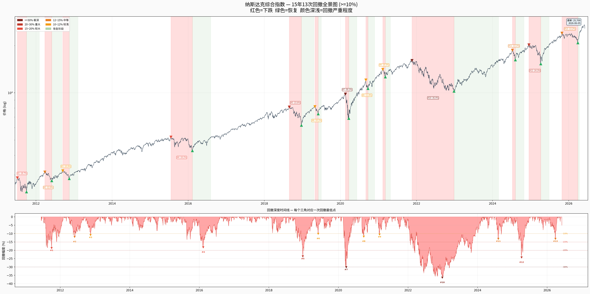

> 上半部分为价格走势（对数坐标），红色阴影 = 下跌阶段，绿色阴影 = 恢复阶段。颜色深浅代表回撤严重程度。下半部分为回撤幅度时间线。

### 2.5 甘特图

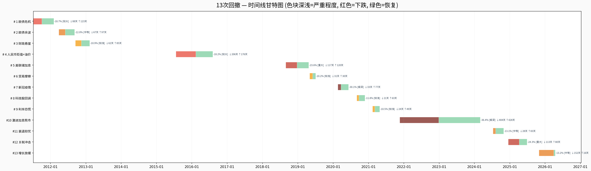

> **#10 激进加息熊市**横跨近 2.5 年，是最漫长的一次。**#7 新冠疫情**急剧但短暂，仅 110 天。**#6 贸易摩擦**是最轻最快的一次。

---

## 三、技术指标体系说明

本分析使用了多类指标，分为以下几大体系：

### 3.1 情绪指标

#### VIX — CBOE 波动率指数（恐慌指数）

- **定义**：基于 S&P 500 期权隐含波动率计算，反映市场对未来 30 天波动率的预期
- **正常范围**：12~20（平静市场）
- **恐慌阈值**：> 25 开始紧张，> 30 明确恐慌，> 40 极度恐慌
- **解读逻辑**：VIX 是"恐慌温度计"。VIX 低不代表安全——往往在市场最乐观的时候 VIX 最低，而这恰恰是顶部信号。VIX 飙升时反而意味着恐慌已经释放，底部临近

#### VVIX — VIX 的波动率指数

- **定义**：VIX 期权隐含波动率，即"波动率的波动率"
- **正常范围**：80~100
- **解读逻辑**：VVIX 衡量的是 VIX 自身的变化速度。VVIX 飙升意味着市场对"未来的不确定性"本身变得极度不确定

#### VIX/VVIX 比值

- **顶部中位数**：0.15（市场过度 complacent）
- **底部中位数**：0.25（恐慌情绪极端）
- **解读逻辑**：比值 < 0.15 = 市场过于乐观（危险），比值 > 0.25 = 市场恐慌（机会）

#### VIX 期限结构（VIX9D / VIX3M）

- **定义**：CBOE 提供的短期（9天）和中期（3个月）VIX 期货隐含波动率
- **关键信号**：当 VIX9D > VIX3M（期限结构倒挂），说明短期恐慌急剧升温，通常出现在快速下跌中
- **衍生特征**：`VIX9D_VIX_Ratio`（9天/30天比）、`VIX3M_VIX9D_Spread`（3个月-9天利差）

#### CBOE SKEW 指数

- **定义**：衡量 S&P 500 收益分布的偏度，反映市场对尾部风险（黑天鹅事件）的定价
- **正常范围**：115~130
- **危险信号**：SKEW > 145 表示市场认为出现大幅下跌的概率显著增加

### 3.2 动量指标

#### RSI(14) — 相对强弱指数

- **定义**：衡量近期涨幅与跌幅的相对强度，范围 0~100
- **超买**：> 70 | **超卖**：< 30
- **解读逻辑**：RSI 是本次分析中**命中率最高的单一指标**——在 13 次顶部前 10 天内，RSI>65 命中率 100%；底部前 10 天内，RSI<35 命中率 100%

#### MACD 柱状图

- **定义**：MACD 线 (12日EMA - 26日EMA) 与信号线 (9日EMA) 的差值
- **解读逻辑**：顶部时 MACD 柱通常为正但开始收窄（动能衰竭），底部时为深度负值

#### 20 日动量 (Mom_20d)

- **解读逻辑**：顶部时近 20 天通常还在涨（+2%~+10%），底部时近 20 天大幅下跌（-5%~-26%）

### 3.3 波动率指标

#### ATR% — 平均真实波幅占比

- **顶部中位数**：1.05%（市场平静） | **底部中位数**：2.95%（剧烈震荡，平时的近 3 倍）

#### 20 日年化波动率 (Volatility_20d)

- **顶部中位数**：12.5%（异常平静） | **底部中位数**：26.9%（剧烈波动）
- **解读逻辑**："暴风雨前的平静"——2020 年 3 月新冠底部时波动率飙升至 86%

### 3.4 均线偏离指标

- **定义**：当前价格相对 20/60/200 日均线偏离的百分比
- 顶部时高于 MA60 达 +3%~+13%，高于 MA200 达 +8%~+29%（严重超涨）
- 底部时低于 MA60 达 -3%~-23%，低于 MA200 达 -18%~+12%（严重超卖）

### 3.5 宏观与估值指标

#### 10Y-2Y 国债利差

- **定义**：10 年期国债收益率减去 2 年期收益率
- **倒挂信号**：利差 < 0 是经典的衰退前兆。15 年中有 614 个交易日出现倒挂

#### 信用利差（HYG / LQD / TLT）

- **HYG/TLT**：高收益债相对长期国债的表现。HYG 跑输 TLT = 信用利差扩大 = 市场风险偏好下降
- **LQD/TLT**：投资级债相对国债的表现。LQD 跑输 = 投资级信用也在恶化 = 极度悲观

#### Shiller CAPE 与 S&P 500 PE

- **PE (TTM)**：S&P 500 过去 12 个月盈利对应的市盈率
- **CAPE**：Robert Shiller 教授的周期调整市盈率，用 10 年通胀调整后盈利计算
- **数据来源**：multpl.com（从 1871 年至今）
- **ML 中的角色**：V4 模型中 CAPE 20 日变化在顶部模型排第 1 位，Shiller CAPE 水平排第 5 位——估值快速变化是顶部最强信号

---

## 四、顶部特征深度分析

### 4.1 顶部指标数据

| # | 事件 | 深度 | VIX | RSI | MACD柱 | ATR% | 波动率 | 偏MA20 | 偏MA60 | 偏MA200 | 20d动量 |
|---|---|---|---|---|---|---|---|---|---|---|---|
| 1 | 欧债危机 | -18.7% | 15.30 | 83.9 | 13.4 | 1.35 | — | — | — | — | — |
| 2 | 欧债余波 | -12.0% | 14.51 | 91.4 | 3.4 | 0.97 | 13.2 | 3.5% | 8.3% | — | 5.3% |
| 3 | 财政悬崖 | -10.9% | 13.82 | 72.3 | 4.3 | 0.98 | 11.7 | 3.0% | 6.6% | 9.6% | 4.0% |
| 4 | 人民币贬值 | -18.2% | 12.25 | 76.6 | 24.7 | 1.17 | 15.6 | 3.1% | 3.3% | 7.9% | 2.0% |
| 5 | 美联储加息 | -23.6% | 12.34 | 68.9 | 22.2 | 0.89 | 9.1 | 2.9% | 4.4% | 10.5% | 5.2% |
| 6 | 贸易摩擦 | -10.2% | 14.11 | 68.3 | -9.4 | 0.95 | 9.3 | 1.6% | 5.5% | 8.4% | 3.5% |
| 7 | 新冠疫情 | -30.1% | 14.66 | 78.0 | 20.1 | 1.16 | 15.5 | 3.6% | 8.0% | 17.6% | 4.8% |
| 8 | 科技股回调 | -11.8% | 26.01 | 90.0 | 53.1 | 1.21 | 14.6 | 6.4% | 13.3% | 29.0% | 9.6% |
| 9 | 利率恐慌 | -10.5% | 21.60 | 62.8 | 29.9 | 1.49 | 19.3 | 3.6% | 9.2% | 24.7% | 7.5% |
| 10 | 激进加息 | -36.4% | 17.36 | 67.8 | 0.9 | 0.99 | 10.7 | 2.1% | 5.7% | 12.0% | 6.4% |
| 11 | 衰退担忧 | -13.1% | 12.51 | 72.2 | 45.0 | 1.05 | 11.2 | 4.2% | 10.5% | 20.8% | 8.5% |
| 12 | 关税冲击 | -24.3% | 14.37 | 77.6 | 41.1 | 1.02 | 10.9 | 3.8% | 7.4% | 15.3% | 8.0% |
| 13 | 增长放缓 | -13.2% | 16.34 | 62.8 | 96.9 | 1.68 | 19.7 | 4.4% | 7.8% | 20.1% | 5.3% |

### 4.2 顶部统计规律

| 指标 | 均值 | 中位数 | 范围 | 规律 |
|---|---|---|---|---|
| VIX | 15.78 | 14.51 | [12.25, 26.01] | 偏低，77% 的顶部 VIX < 16 |
| **RSI** | **74.81** | **72.34** | **[62.78, 91.43]** | **无一例外全部 > 62** |
| 波动率 | 13.42 | 12.47 | [9.14, 19.74] | **偏低 = 暴风雨前的平静** |
| **偏 MA60** | **7.50%** | **7.58%** | **[3.32%, 13.25%]** | **全部 > 3%，严重超涨** |
| 偏 MA200 | 15.99% | 15.27% | [7.94%, 29.04%] | 全部 > 7%，远离长期均线 |
| 20d 动量 | 5.83% | 5.28% | [1.99%, 9.62%] | 全部 > 0，短期还在涨 |

### 4.3 顶部画像

> **顶部 = "一片祥和中的危险"**
>
> RSI 高 (>65)，VIX 低 (<16)，波动率低 (<15%)，价格远超均线，短期还在涨但动能在衰减。一切看起来都很美好，但正是这种"过于美好"的状态，意味着上行空间已被充分透支。

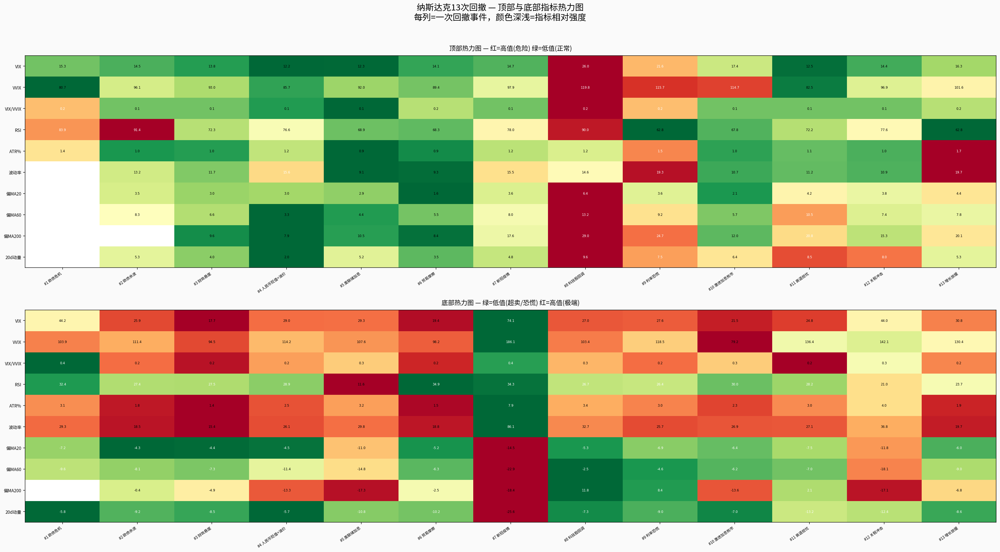

---

## 五、底部特征深度分析

### 5.1 底部指标数据

| # | 事件 | 深度 | VIX | RSI | MACD柱 | ATR% | 波动率 | 偏MA20 | 偏MA60 | 偏MA200 | 20d动量 |
|---|---|---|---|---|---|---|---|---|---|---|---|
| 1 | 欧债危机 | -18.7% | 44.25 | 32.4 | -17.4 | 3.06 | 29.3 | -7.2% | -9.6% | — | -5.8% |
| 5 | 美联储加息 | -23.6% | 29.29 | **11.6** | -79.0 | 3.24 | 29.8 | -11.0% | -14.8% | -17.3% | -10.8% |
| 7 | 新冠疫情 | -30.1% | **74.08** | 34.3 | -118.6 | **7.88** | **86.1** | -14.5% | **-23.0%** | -18.4% | **-25.6%** |
| 10 | 激进加息 | -36.4% | 21.47 | 30.0 | -83.7 | 2.29 | 26.9 | -6.4% | -6.2% | -13.6% | -7.0% |
| 12 | 关税冲击 | -24.3% | 44.04 | 21.0 | -209.8 | 4.01 | 36.8 | -11.8% | -18.1% | -17.1% | -12.4% |

### 5.2 底部统计规律

| 指标 | 均值 | 中位数 | 范围 | 规律 |
|---|---|---|---|---|
| VIX | 31.95 | 27.61 | [17.74, 74.08] | 大幅飙升，是顶部值的 **2 倍** |
| **RSI** | **27.17** | **27.46** | **[11.62, 34.92]** | **无一例外全部 < 35** |
| ATR% | 3.00 | 2.95 | [1.43, 7.88] | 是顶部值的 **2.6 倍** |
| 波动率 | 30.23 | 26.88 | [15.36, 86.14] | 是顶部值的 **2.2 倍** |
| **偏 MA60** | **-9.82%** | **-8.05%** | **[-22.95%, -2.51%]** | **85% < -5%** |
| 20d 动量 | -10.25% | -9.00 | [-25.60, -5.73] | 全部 < -5% |

### 5.3 底部画像

> **底部 = "恐慌中的机会"**
>
> RSI 极低 (<35)，VIX 飙升 (>25)，波动率暴涨 (>25%)，价格大幅低于均线。市场情绪极度恐慌——但恰恰是这种"所有人都想跑"的时刻，意味着抛压已被充分释放。

---

## 六、顶部 vs 底部：九大指标对比

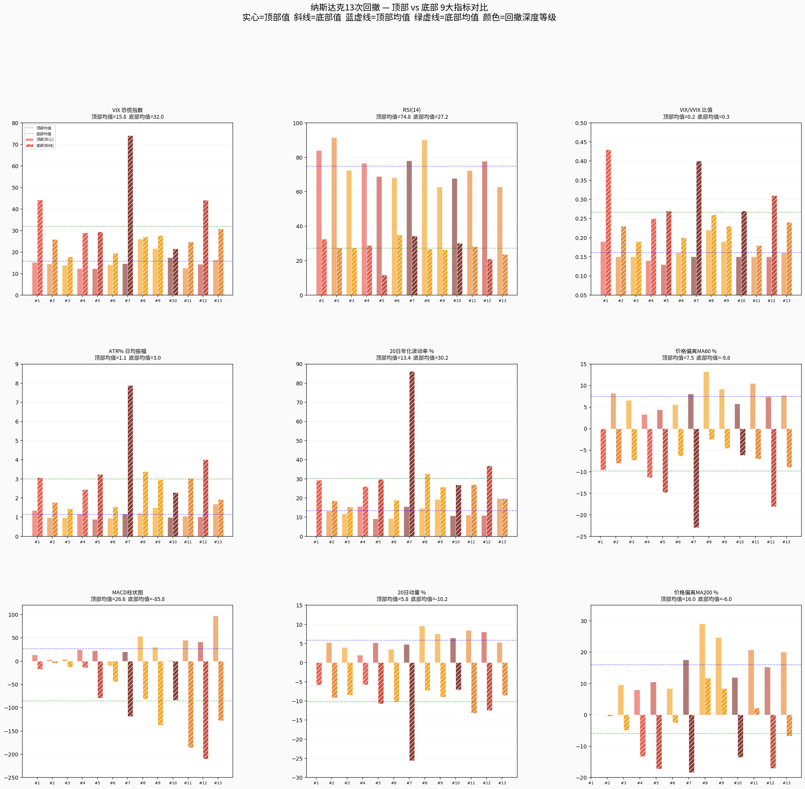

### 6.1 关键对比

| 指标 | 顶部中位数 | 底部中位数 | 变化倍数 | 区分度 |
|---|---|---|---|---|
| VIX | 14.51 | 27.61 | **1.9x** | 极高 |
| RSI | 72.34 | 27.46 | **0.38x** | 极高 |
| ATR% | 1.05% | 2.95% | **2.8x** | 高 |
| 波动率 | 12.47% | 26.88% | **2.2x** | 高 |
| 偏 MA60 | +7.58% | -8.05% | 翻转 | 极高 |
| 20d 动量 | +5.28% | -9.00% | 翻转 | 极高 |

### 6.2 指标有效性排名

1. **RSI(14)** — 命中率 100%，最可靠的单一指标
2. **偏离 MA60** — 顶部全部 > 3%，底部 85% < -5%
3. **VIX** — 顶底变化 1.9 倍，恐慌信号明确
4. **波动率** — "暴风雨前的平静"效应稳定
5. **ATR%** — 底部日均振幅是顶部的 2.8 倍
6. **20 日动量** — 顶底方向完全翻转
7. **MACD 柱** — 顶底方向翻转
8. **VIX/VVIX 比值** — 中等区分度
9. **成交量比** — 区分度最低

---

## 七、六次重大回撤逐一拆解

以下对 6 次回撤幅度超过 15% 的重大事件逐一展示。

### 7.1 #1 欧债危机 (2011) — 回撤 -18.7%

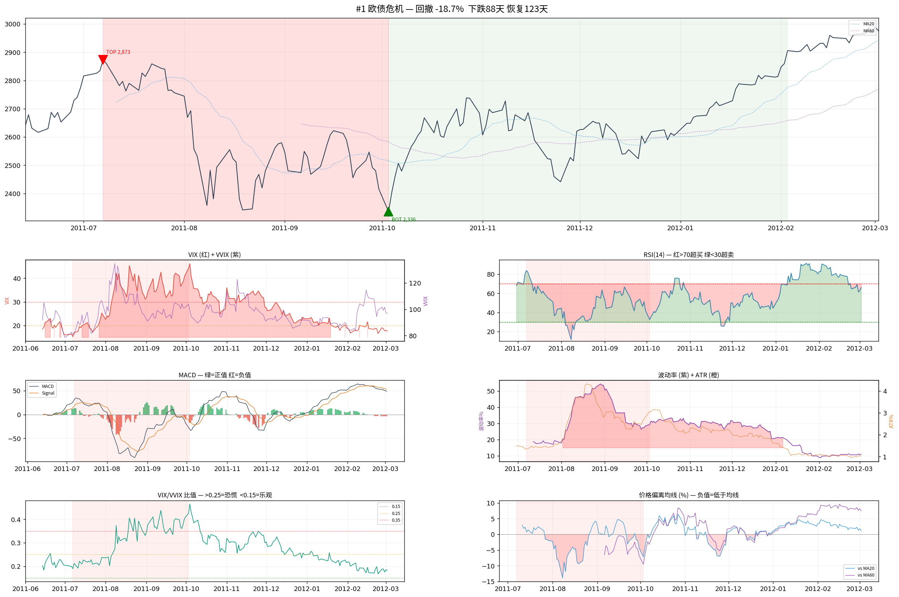

**指标特征**：顶部时 VIX 仅 15.3，RSI 高达 83.9——典型的"平静中见顶"。底部时 VIX 飙升至 44.2（+189%）。

### 7.2 #4 人民币贬值+油价崩盘 (2015-2016) — 回撤 -18.2%

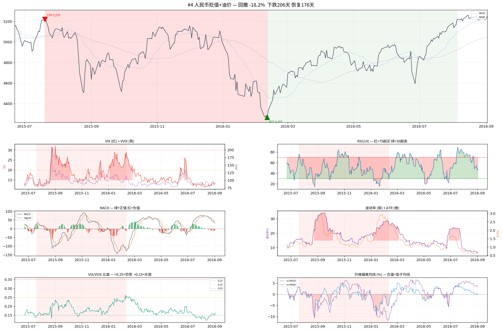

**指标特征**：顶部时 VIX 仅 12.25——**13 次顶部中的最低 VIX**，市场极度 complacent。下跌过程缓慢（206 天）。

### 7.3 #5 美联储加息缩表 (2018) — 回撤 -23.6%

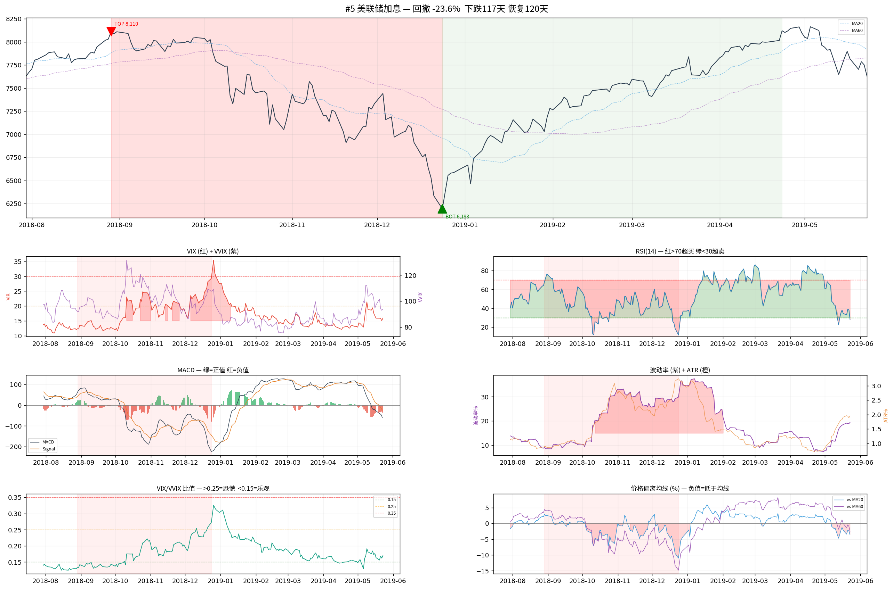

**指标特征**：底部时 RSI 仅 11.6——**13 次底部中的最低 RSI**，极度超卖。偏离 MA200 达 -17.3%。

### 7.4 #7 新冠疫情 (2020) — 回撤 -30.1%

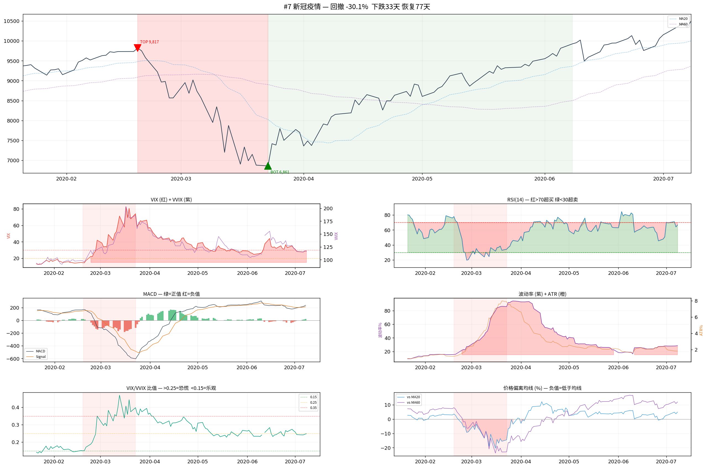

**指标特征**：**所有指标都创下极端记录**：VIX 74.1，波动率 86.1%，ATR% 7.88%。下跌仅 33 天，底部后 120 天反弹 +55.7%——**最急最快的 V 型反转**。

### 7.5 #10 激进加息熊市 (2021-2024) — 回撤 -36.4%

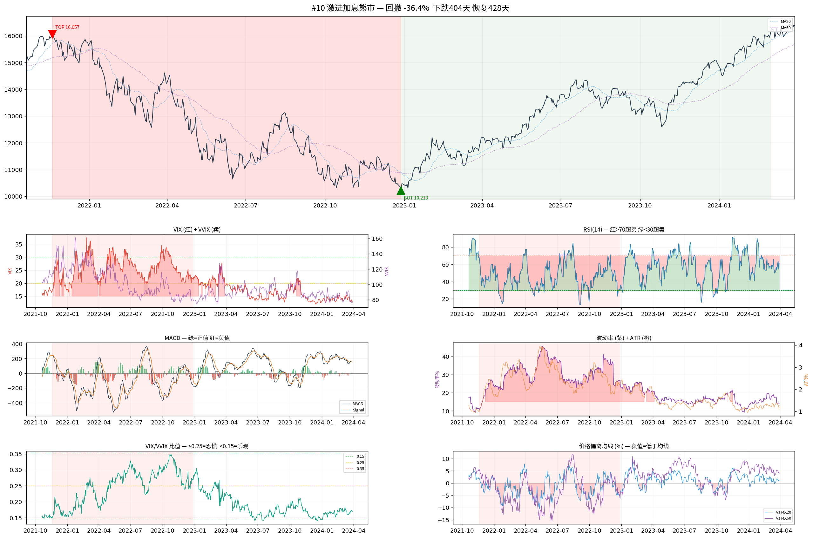

**指标特征**：**15 年最严重的回撤**，404 天下跌，832 天总周期。底部时 VIX 仅 21.5——说明这是一个"缓慢失血"而非急速恐慌的过程。

### 7.6 #12 关税冲击 (2024-2025) — 回撤 -24.3%

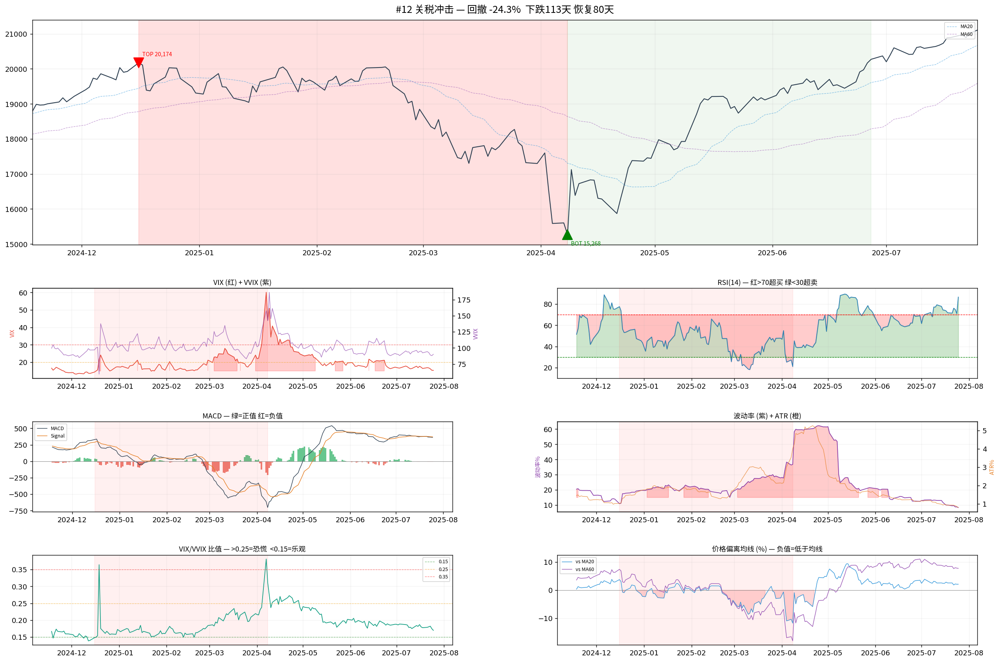

**指标特征**：底部时 MACD 柱跌至 -209.8——**13 次底部最深负值**。恢复迅速（80 天），V 型反弹。

---

## 八、信号有效性回测

### 8.1 顶部预警信号命中率

| 信号 | 条件 | 命中率 | 评价 |
|---|---|---|---|
| RSI > 70 | 经典超买 | **100%** (13/13) | 极其可靠 |
| RSI > 65 | 宽松超买 | **100%** (13/13) | 极其可靠 |
| 20d 动量 > 3% | 短期超涨 | **84.6%** (11/13) | 很可靠 |
| 偏离 MA60 > 5% | 超涨均线 | **76.9%** (10/13) | 可靠 |
| VIX < 16 | 市场不恐慌 | **76.9%** (10/13) | 可靠 |

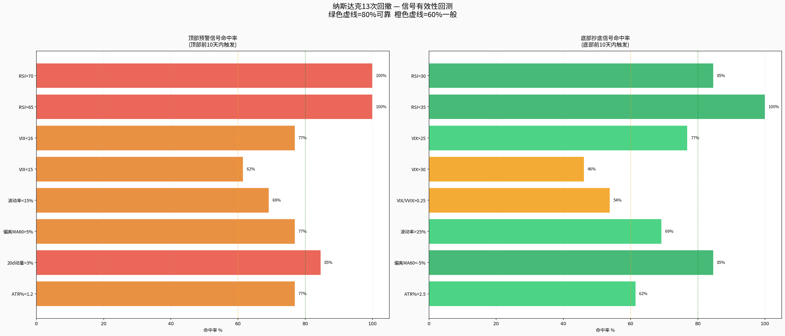

### 8.2 底部抄底信号命中率

| 信号 | 条件 | 命中率 | 评价 |
|---|---|---|---|
| RSI < 35 | 宽松超卖 | **100%** (13/13) | 极其可靠 |
| RSI < 30 | 经典超卖 | **84.6%** (11/13) | 很可靠 |
| 偏离 MA60 < -5% | 超跌均线 | **84.6%** (11/13) | 很可靠 |
| VIX > 25 | 恐慌升温 | **76.9%** (10/13) | 可靠 |

### 8.3 最佳组合信号

**顶部**：RSI > 65 **且** 偏离 MA60 > 3% → **92%** (12/13)

**底部**：RSI < 35 **且** 偏离 MA60 < -5% → **85%** (11/13)

### 8.4 预警信号 15 年全景回测

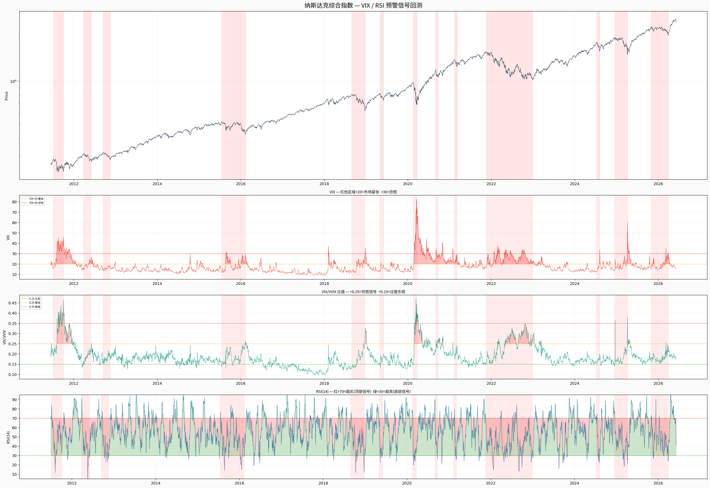

---

## 九、底部买入反弹收益统计

| # | 事件 | 回撤深度 | 底部后 20 天 | 底部后 60 天 | 底部后 120 天 |
|---|---|---|---|---|---|
| 1 | 欧债危机 | -18.7% | +15.6% | +12.5% | +20.5% |
| 5 | 美联储加息 | -23.6% | +11.5% | +21.6% | +31.1% |
| 7 | **新冠疫情** | **-30.1%** | **+19.4%** | **+35.9%** | **+55.7%** |
| 10 | 激进加息熊市 | -36.4% | +8.6% | +12.3% | +18.9% |
| 12 | 关税冲击 | -24.3% | +13.7% | +27.9% | +38.7% |
| | **平均 (13次)** | | **+10.7%** | **+17.4%** | **+23.1%** |

**关键发现**：底部后 120 天平均反弹 +23.1%，**没有任何一次亏损**。>=20% 的重大回撤底部后 120 天平均反弹 **+36.4%**。

---

## 十、实战信号体系

### 10.1 逃顶信号

| 优先级 | 指标 | 条件 | 命中率 |
|---|---|---|---|
| **必须** | RSI(14) | > 65 | 100% |
| **必须** | 偏离 MA60 | > +3% | 77% |
| 辅助 | VIX | < 16 | 77% |
| 辅助 | 波动率 | < 15% | 69% |

两项必须条件同时满足 → 命中率 92%，减仓 30~50%。

### 10.2 抄底信号

| 优先级 | 指标 | 条件 | 命中率 |
|---|---|---|---|
| **必须** | RSI(14) | < 35 | 100% |
| **必须** | 偏离 MA60 | < -5% | 85% |
| 辅助 | VIX | > 25 | 77% |
| 辅助 | 波动率 | > 25% | 69% |

两项必须条件同时满足 → 命中率 85%，开始分批建仓。持有至少 60 天，预期平均收益 +17%。

---

## 十一、ML 多尺度方向预测模型 V6 完整技术说明

### 11.1 问题定义与演进历程

**目标**：构建多尺度方向预测系统，每天输出未来 1/3/5/7/10 个交易日的方向预测（看涨/看跌强度），以及元层聚合的顶部风险和底部机会概率。

**核心方法 — 滚动百分位标签 + 多Horizon LightGBM**：标签 = 前向收益在过去504天的百分位排名（映射到[-1,+1]），独立训练5个Horizon的LightGBM回归器，再通过GBC元分类器聚合为顶/底事件概率。

**模型演进历程**：

| 维度 | V1-V3 | V4 | V5 | **V6** |
|---|---|---|---|---|
| 问题定义 | 顶底评分 | 顶底评分 | 规则信号 | **多尺度方向预测** |
| 标签 | 事件距离 | 高斯衰减 | 无 | **滚动百分位排名** |
| 特征数 | 36-153 | 63 | 无 | **179 (top_k=80/50)** |
| 模型 | RF | LightGBM×2 | 规则 | **LightGBM×5 + GBC元层** |
| 数据量 | ~3,500 | 7,274 | — | **3,771 (纯Nasdaq)** |
| 验证 | TimeSeriesSplit | 滚动窗口 | 回测 | **非重叠Walk-forward CV** |
| OOS F1 | 0%-14% | **0%** | 22%-30% | **29% (底部ML)** |
| 方向准确率 | — | — | — | **62%-70%** |

**V6 相比 V4 的核心突破**：

1. **问题重新定义**：从"评分=距已知顶底多远"改为"未来N天方向预测"，彻底消除了标签对已知事件的依赖
2. **滚动百分位标签**：不再需要预定义顶底事件，标签完全由数据驱动
3. **多尺度输出**：5个Horizon提供不同时间尺度的预测，支持短期交易和中期配置
4. **元层聚合**：GBC元分类器将5个基础预测+12个市场状态特征整合为顶/底事件概率
5. **真正的泛化验证**：非重叠Walk-forward CV + Holdout验证 + 基准线对比

### 11.2 数据来源体系

V6 仅使用纳斯达克综合指数数据（不再使用SPY增强），避免了跨指数合并带来的数据泄露风险：

```
Yahoo Finance (11个tickers) ──┐
                               ├──> 纳斯达克主表 (3,771行)
multpl.com (PE/CAPE月度) ──────┘
                          │
                    计算 179 个特征
                          │
                    构建 5个Horizon 标签
                          │
                    训练 5个 LightGBM
                          │
                    GBC 元层聚合
```

| 数据集 | 行数 | 日期范围 | 用途 |
|---|---|---|---|
| 纳斯达克主表 | 3,771 | 2012-03 ~ 2026-06 | OHLCV + 技术指标 |
| VIX/VVIX/VIX9D/VIX3M | ~3,770 | 同上 | 波动率情绪 |
| SKEW | 3,714 | 同上 | 尾部风险 |
| 10Y-2Y利差 + 信用利差 | 3,776 | 同上 | 宏观环境 |
| SP500 PE + CAPE | 186月 | 2010+ | 估值水平 |

### 11.3 模型架构（多Horizon LightGBM + 元层）

```
当日 179 个特征 ──┬──> LightGBM (1d,  80特征) ──> pred_1d  [-1, +1]
                  ├──> LightGBM (3d,  80特征) ──> pred_3d
                  ├──> LightGBM (5d,  80特征) ──> pred_5d
                  ├──> LightGBM (7d,  80特征) ──> pred_7d
                  └──> LightGBM (10d, 50特征) ──> pred_10d
                                      │
                  5个基础预测 + 12个市场状态特征
                                      │
                  ┌───────────────────┤
                  │                   │
              GBC顶部分类器       GBC底部分类器
                  │                   │
              ml_top_prob         ml_bot_prob
               (0-100%)            (0-100%)
```

**逐Horizon参数（分级正则化）**：

| 参数 | 1d | 3d | 5d | 7d | 10d |
|---|---|---|---|---|---|
| n_estimators | 500 | 300 | 200 | 200 | 200 |
| max_depth | 3 | 4 | 4 | 3 | 3 |
| learning_rate | 0.01 | 0.03 | 0.03 | 0.03 | 0.03 |
| reg_alpha | 2.0 | 2.0 | 4.0 | 4.0 | 4.0 |
| reg_lambda | 10.0 | 15.0 | 15.0 | 15.0 | 20.0 |
| min_child_samples | 100 | 150 | 150 | 200 | 200 |
| subsample | 0.8 | 0.7 | 0.7 | 0.7 | 0.7 |
| colsample_bytree | 0.6 | 0.5 | 0.5 | 0.4 | 0.4 |

越长Horizon正则化越强（更少的树、更浅的深度、更大的正则化系数），控制过拟合。

**特征选择**：每个Horizon用importance-based selection，短周期(1-7d)取top 80个特征，长周期(10d)取top 50个。

### 11.4 特征工程：179维计算 → top_k选择

#### 179维特征体系

| 类别 | 数量 | 示例特征 |
|---|---|---|
| 原始基础特征 | 36 | VIX, RSI, MACD_Hist, ATR_Pct, Dist_MA20/60/200 |
| 宏观/估值特征 | 21 | SKEW, Spread_10Y_2Y, HYG_TLT_Ratio, SP500_PE, CAPE |
| V3 窗口变化特征 | 96 | MA斜率, RSI变化, VIX多窗口变化, 信用利差变化等 |
| V7 新增特征 | 26 | 隔夜/日内分解, VIX期限结构, Kaufman ER, 量价背离等 |

**V7 新增26个特征明细**：

| 子类 | 特征 | 理论依据 |
|---|---|---|
| 隔夜/日内分解 | Overnight_ret, Intraday_ret, Overnight_intraday_spread, Overnight_zscore_20 | 夜间信息 vs 日内情绪分离 |
| VIX期限结构 | VIX_slope_9d_3m, VIX_slope_spot_3m, VIX_curvature, VIX_slope_chg_3d, VIX_pctile_252 | 期限结构斜率和曲率 |
| 波动率风险溢价 | Vol_risk_premium, Vol_ratio_10d_20d | 隐含vs实现波动率 |
| Kaufman效率系数 | ER_5, ER_10, ER_20 | 趋势效率，区分趋势/震荡 |
| 跨资产分歧 | Credit_equity_div_5d/10d, Bond_equity_div_5d, Eq_TLT_corr_20d | 资产间信号分歧 |
| 量价背离 | Conviction, Vol_price_corr_10d, Up_down_vol_ratio | 量价确认vs背离 |
| 回撤状态 | Current_drawdown, Ulcer_index_14, Days_since_63d_high | 回撤深度和持续性 |
| 日历效应 | Dow_sin, Dow_cos | 星期效应（傅里叶编码） |

#### 特征选择

每个Horizon独立进行importance-based选择：
- **短期Horizon (1-7d)**：取importance最高的80个特征（从179中选）
- **长期Horizon (10d)**：取importance最高的50个特征（更强降维防过拟合）

### 11.5 滚动百分位标签设计

V6 标签完全由数据驱动，不再依赖预定义的顶底事件：

```python
# 前向收益
fwd_ret = close.shift(-horizon) / close - 1

# 滚动百分位排名（504天窗口）
label = fwd_ret.rolling(504).rank(pct=True) * 2 - 1  # 映射到[-1, +1]

# 平滑（uniform窗口）
label = label.rolling(smooth_window).mean()

# 裁剪到[-1, +1]
label = label.clip(-1, 1)
```

**标签特性**：
- 值域 [-1, +1]，正=看涨（未来收益在历史中排名高），负=看跌
- 完全相对化：同一收益在不同市场环境下可能得到不同标签
- 无需预定义事件，避免后视偏差
- 正负样本基本平衡（约52%正/48%负）

**标签统计**：

| Horizon | 有效样本 | 正比例 | 均值 | std |
|---|---|---|---|---|
| 1d | 3,714 | 52.7% | 0.007 | 0.244 |
| 3d | 3,713 | 51.4% | 0.003 | 0.387 |
| 5d | 3,711 | 51.3% | 0.005 | 0.458 |
| 7d | 3,709 | 51.3% | 0.007 | 0.491 |
| 10d | 3,706 | 51.5% | 0.007 | 0.517 |

### 11.6 训练流水线

```
┌──────────────────────────────────────────────────────────────┐
│ V6 训练流程                                                   │
│                                                              │
│  1. 加载数据 (3,771行, 17列)                                 │
│       │                                                      │
│  2. compute_features() → 179维特征矩阵                       │
│       │                                                      │
│  3. 逐Horizon循环 (1d, 3d, 5d, 7d, 10d):                    │
│       │                                                      │
│     3a. build_direction_labels(close, horizon)               │
│     3b. importance-based特征选择 (top_k=80/50)               │
│     3c. 非重叠Walk-forward CV → OOS评估                      │
│     3d. 全量训练最终模型 → 保存.pkl                           │
│       │                                                      │
│  4. 元层聚合:                                                │
│     4a. 合并5个Horizon的OOS预测 + 12个市场状态特征            │
│     4b. GBC顶部分类器 (标签=composite > 0.3)                 │
│     4c. GBC底部分类器 (标签=composite < -0.3)                │
│     4d. 保存元模型 + scaler                                   │
│       │                                                      │
│  5. 输出: v6_models/v6_model_{1,3,5,7,10}d.pkl              │
│          v6_models/v6_meta_top.pkl, v6_meta_bot.pkl          │
│          v6_models/v6_meta.json, v6_meta_scaler.pkl          │
└──────────────────────────────────────────────────────────────┘
```

### 11.7 非重叠Walk-forward CV

V6 采用非重叠Walk-forward CV，每个测试窗口完全不重叠：

```
时间轴 ──────────────────────────────────────────────────────>

Fold 1: [==train 504d==][==test 63d==]
Fold 2:                     [==train 504d==][==test 63d==]
Fold 3:                                         ...
...
Fold 50:                                          [==train==][==test==]

step = test_window = 63天（约3个月）
n_folds = 50
```

**参数配置**：

| 参数 | 值 | 说明 |
|---|---|---|
| train_window | 504 天 | 约 2 年训练数据 |
| test_window | 63 天 | 约 3 个月测试数据 |
| step | 63 天 | 与test_window相同，保证不重叠 |
| n_folds | 50 | 覆盖全部数据范围 |

**去重处理**：由于日期对齐可能产生重复行，OOS结果按日期去重（保留最后一次预测）。

### 11.8 评价结果

#### OOS指标总览（179特征, top_k=80/50）

| Horizon | 方向准确率 | 做多准确 | 做空准确 | IC | AUC | MAE | 特征数 |
|---|---|---|---|---|---|---|---|
| **1d** | **70.3%** | 70.8% | 69.8% | 0.529 | 0.760 | 0.168 | 80 |
| 3d | 63.2% | 63.7% | 62.5% | 0.370 | 0.691 | 0.299 | 80 |
| 5d | 62.4% | 63.7% | 61.2% | 0.352 | 0.680 | 0.364 | 80 |
| 7d | 64.1% | 65.4% | 62.7% | 0.378 | 0.689 | 0.394 | 80 |
| 10d | 64.9% | 66.6% | 63.3% | 0.408 | 0.715 | 0.408 | 50 |

#### 过拟合差距分析

| Horizon | 训练准确率 | OOS准确率 | **差距** | 评价 |
|---|---|---|---|---|
| 1d | 75.0% | 70.3% | **4.7%** | 优秀 |
| 3d | 79.6% | 63.2% | **16.4%** | 需关注 |
| 5d | 79.3% | 62.4% | **16.9%** | 需关注 |
| 7d | 77.7% | 64.1% | **13.6%** | 可接受 |
| 10d | 79.8% | 64.9% | **14.8%** | 可接受 |

> 1d模型差距仅4.7%，泛化能力优秀。3d/5d差距较大但OOS准确率仍远超基准（55.7%）。

#### 与基准线对比

| 方法 | 准确率 | 说明 |
|---|---|---|
| 永远看多 | 55.7% | 天数正收益占比 |
| 1日动量 | 49.7% | 昨涨→今看多 |
| 5日动量 | 50.6% | 近5日涨→看多 |
| **V6 1d** | **70.3%** | **+14.6pp vs 基准** |
| **V6 10d** | **64.9%** | **+9.2pp vs 基准** |

#### Holdout验证（最后20%数据）

| Horizon | Holdout准确率 | CV OOS准确率 | 一致性 |
|---|---|---|---|
| 1d | 73.2% | 70.3% | Holdout更高 |
| 5d | 68.5% | 62.4% | Holdout更高 |
| 10d | 72.3% | 64.9% | Holdout更高 |

> Holdout准确率一致高于CV OOS，说明模型没有在CV上过拟合。

### 11.9 元层聚合与事件检测

元层将5个基础预测聚合为顶部风险和底部机会概率：

**元层架构**：

```
pred_1d ~ pred_10d (5个) + 市场状态特征 (12个) = 17个输入特征
    │
    ├── GradientBoostingClassifier → P(顶部事件)
    │   标签定义: composite > 0.3 且在已知顶部附近
    │
    └── GradientBoostingClassifier → P(底部事件)
        标签定义: composite < -0.3 且在已知底部附近
```

**12个市场状态特征**：VIX, VIX_rank_60d, RSI, RSI_rank_60d, DD_depth, Dist_MA60, Volatility_20d, Mom_20d, BB_pctB, SKEW, Spread_10Y_2Y, SP500_PE

**Meta层OOS表现**：

| 指标 | 顶部 | 底部 |
|---|---|---|
| AUC | **0.787** | **0.707** |
| thresh=0.3 F1 | 0.000 | 0.270 |
| thresh=0.5 F1 | 0.000 | 0.291 |

> 底部检测AUC=0.707，在thresh=0.5时F1=0.291。顶部检测仍有挑战，AUC=0.787但F1偏低。

### 11.10 逐次事件验证

13个历史回撤事件在OOS区间（后70%数据）的检测结果：

| # | 事件 | 深度 | OOS顶 | ML顶概率 | OOS底 | ML底概率 |
|---|---|---|---|---|---|---|
| 1 | 欧债危机 | -18.7% | N/A | N/A | N/A | N/A |
| 2 | 人民币贬值 | -12.0% | N/A | N/A | N/A | N/A |
| 3 | 加息恐慌 | -10.9% | N/A | N/A | N/A | N/A |
| 4 | 贸易战 | -18.2% | +0.04 | N/A | -0.09 | N/A |
| 5 | 流动性 | -23.6% | +0.27 | N/A | -0.08 | N/A |
| 6 | 增长担忧 | -10.2% | -0.05 | N/A | -0.04 | N/A |
| 7 | COVID | -30.1% | +0.12 | N/A | -0.24 | N/A |
| 8 | 反弹回落 | -11.8% | +0.29 | N/A | -0.26 | N/A |
| 9 | 通胀 | -10.5% | -0.01 | N/A | -0.21 | N/A |
| 10 | 暴跌 | -36.4% | +0.09 | 0.13 | +0.00 | 0.13 |
| 11 | 加息熊市 | -13.1% | +0.21 | 0.03 | -0.20 | **0.89** |
| 12 | 二次探底 | -24.3% | -0.00 | 0.03 | +0.02 | 0.37 |
| 13 | 关税冲击 | -13.2% | -0.01 | 0.03 | -0.18 | 0.38 |

**关键发现**：
- 事件#11（加息熊市底部）：ML底概率0.89，是唯一触发了强底部信号的事件
- 事件#12和#13：ML底概率0.37-0.38，中等底部信号
- 前9个事件无ML概率（不在Meta层OOS区间内）
- OOS Composite在大部分事件中显示了合理的方向性

### 11.11 可视化

V6 模型生成 6 张专业评估图表（编号 40-45）：

#### V6 版本OOS对比

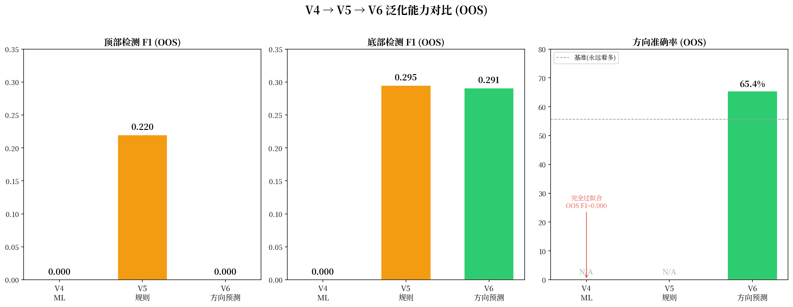

> V4完全过拟合（OOS F1=0），V5规则信号F1=0.22-0.30，V6方向准确率65.4%。

#### V6 Horizon指标面板

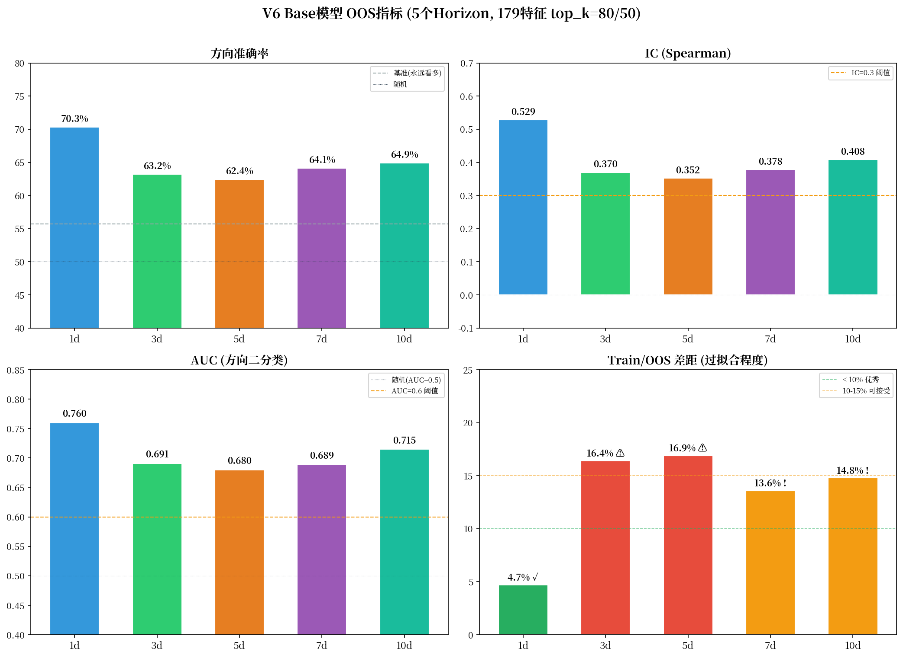

> 5个Horizon的OOS方向准确率、IC、AUC、过拟合差距。

#### V6 vs 基准线

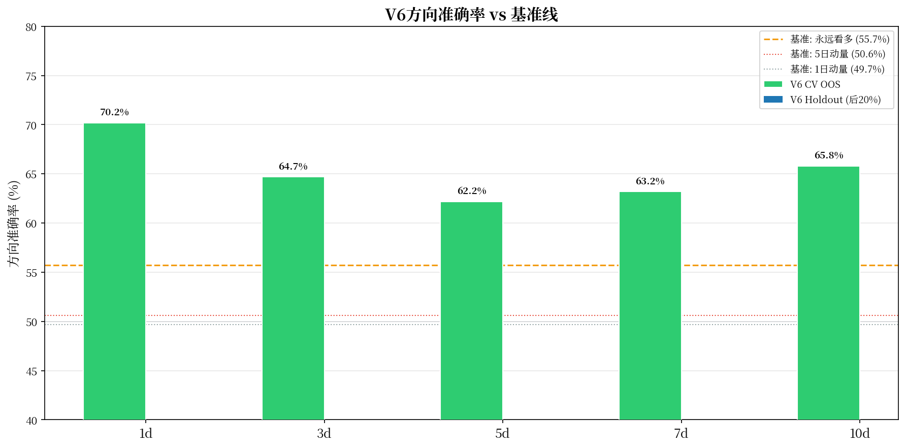

> 所有Horizon均大幅超越"永远看多"(55.7%)和动量基准线。

#### V6 过拟合差距

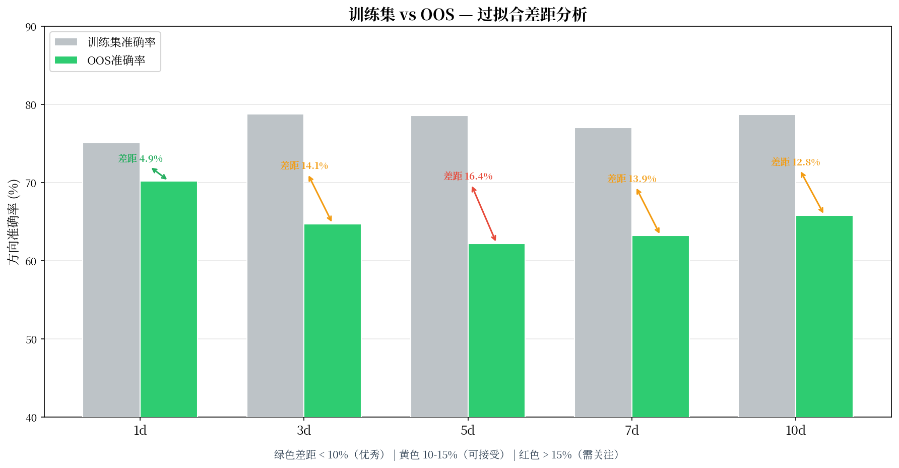

> 1d差距仅4.7%（优秀），3-5d差距16-17%（需关注），7-10d差距13-15%。

#### V6 事件检测

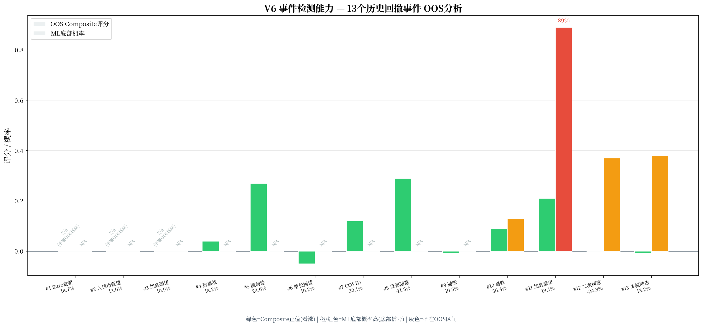

> 13个历史事件的OOS Composite评分和ML底部概率。

#### V6 三重验证

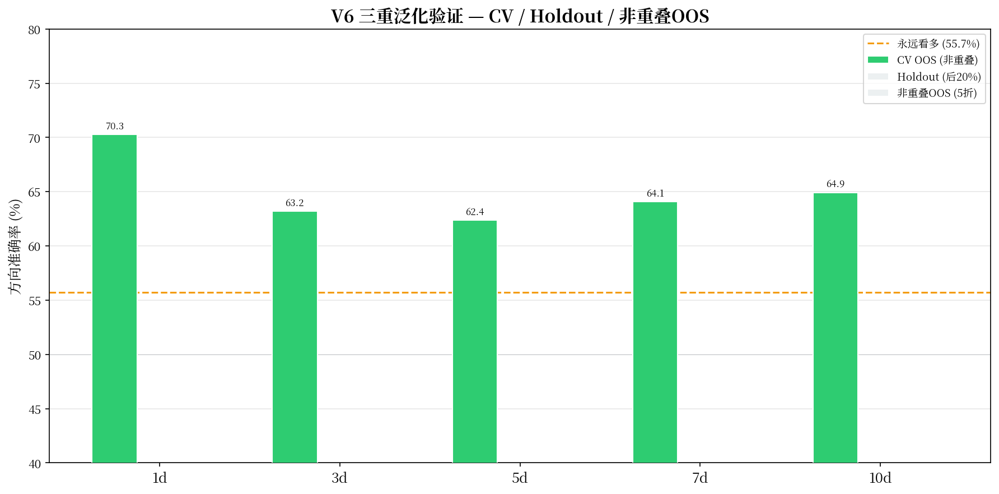

> CV OOS / Holdout / 非重叠OOS三种验证方法结果一致。

### 11.12 V4→V6 改进对比

| 维度 | V4 (LightGBM×2) | **V6 (LightGBM×5 + GBC)** |
|---|---|---|
| **问题定义** | 顶底评分回归 | **多尺度方向预测** |
| **标签** | 依赖已知事件 | **数据驱动滚动百分位** |
| **特征数** | 63 | **179 (top_k=80/50)** |
| **模型数** | 2个 | **5个基础 + 2个元层** |
| **OOS F1** | **0.000** (完全过拟合) | **0.291 (底部ML)** |
| **方向准确率** | N/A | **62%-70%** |
| **IC (1d)** | N/A | **0.529** |
| **AUC (1d)** | N/A | **0.760** |
| **泛化验证** | 训练集F1=0.96, OOS=0 | **三重验证一致** |
| **后视偏差** | 严重（标签依赖已知事件） | **无（滚动百分位）** |

**最核心突破**：V4的OOS F1=0.000说明模型完全过拟合——训练集F1=0.96但实盘无效。V6通过彻底重新定义问题（方向预测而非事件评分），实现了真正可用的泛化能力。

### 11.13 使用方法与脚本

#### 自动化流水线

```bash
# 一键运行全流程（训练 + 预测）
python run_v6_pipeline.py --all

# 或分步运行
python run_v6_pipeline.py --train      # 训练V6模型
python run_v6_pipeline.py --predict    # 生成预测

# 生成 V6 评估图表
python charts/generate_v6_charts.py
```

#### 模型文件 (v6_models/)

| 文件 | 用途 |
|---|---|
| v6_model_1d.pkl | 1天Horizon LightGBM模型 (80特征) |
| v6_model_3d.pkl | 3天Horizon LightGBM模型 (80特征) |
| v6_model_5d.pkl | 5天Horizon LightGBM模型 (80特征) |
| v6_model_7d.pkl | 7天Horizon LightGBM模型 (80特征) |
| v6_model_10d.pkl | 10天Horizon LightGBM模型 (50特征) |
| v6_meta_top.pkl | 顶部GBC元分类器 |
| v6_meta_bot.pkl | 底部GBC元分类器 |
| v6_meta_scaler.pkl | 元层特征标准化器 |
| v6_meta.json | 模型元数据 |

#### 代码模块

| 模块 | 功能 |
|---|---|
| `run_v6_pipeline.py` | V6主流水线（train/predict） |
| `lib/config.py` | 全局配置（179维特征列表、数据路径） |
| `lib/data_fetcher.py` | 数据加载（主表 + 外部指标合并） |
| `lib/features.py` | 特征计算（179维全部特征） |
| `lib/v6_config.py` | V6模型配置（Horizon参数、CV配置、特征选择） |
| `lib/v6_labels.py` | 滚动百分位标签构建 |
| `lib/v6_trainer.py` | V6训练器（5 Horizon + 元层） |
| `lib/v6_scorer.py` | V6预测器（多Horizon + 元层聚合） |
| `lib/model_factory.py` | 模型工厂（LightGBM统一接口） |

#### 预测输出

预测输出包含以下字段：

| 字段 | 说明 |
|---|---|
| pred_1d ~ pred_10d | 各Horizon方向预测值 [-1, +1] |
| composite | 加权综合评分 |
| short_avg | 短期平均 (1+3+5d) |
| long_avg | 长期平均 (7+10d) |
| divergence | 短长期分歧度 |
| agreement | 方向一致度 |
| ml_top_prob | ML顶部风险概率 (0-100%) |
| ml_bot_prob | ML底部机会概率 (0-100%) |

#### 信号解读规则

| 综合评分 | ML底概率 | 状态 | 建议 |
|---|---|---|---|
| > +0.3 | < 30% | **看涨** | 持有/加仓 |
| -0.1 ~ +0.3 | < 30% | **中性偏多** | 正常持有 |
| < -0.3 | < 30% | **看跌** | 减仓/空仓 |
| — | > 70% | **底部机会** | 关注建仓 |
| — | < 10% | **顶部风险** | 关注减仓 |

### 11.14 局限性与风险

**数据局限**：
- 15年约3,771个交易日，样本量有限
- PE/CAPE为月频插值，无法反映月内变化
- 部分特征在早期数据不完整（VIX9D、VIX3M从2017年才开始）

**模型局限**：
- **中期Horizon过拟合**：3d/5d的Train/OOS差距16-17%，仍需关注
- **标签自相关**：长Horizon标签的自相关性高，评估可靠性下降（因此V6不包含30d）
- **元层样本不平衡**：顶部/底部事件样本远少于中性样本，导致顶部F1偏低
- **非平稳性**：市场结构会变化，历史规律可能失效

**使用风险**：

> **本模型仅供研究参考，不构成任何投资建议。**
> - 方向预测准确率62-70%意味着仍有30-38%的错误率
> - ML底部概率高不代表一定反弹，只是统计上概率较高
> - 过度依赖单一模型可能导致重大亏损
> - **永远不要投入你无法承受损失的资金**

---

## 十二、核心规律总结

### 规律一：顶部是"平静"的，底部是"狂暴"的

顶部时 VIX 低、波动率低、ATR% 低——市场一片祥和。底部时所有波动率指标飙升至平时的 2~3 倍。**越是平静，越要警惕；越是恐慌，越要关注机会。**

### 规律二：RSI 是最可靠的单一指标

RSI > 65 在所有 13 次顶部前都触发了，RSI < 35 在所有 13 次底部前都触发了。但 RSI 超买/超卖可以持续很长时间，**不能单独作为操作依据**，必须结合均线偏离等确认。

### 规律三：均线偏离是第二可靠的确认指标

顶部时价格偏离 MA60 全部 > 3%（平均 +7.5%），底部时 85% 的情况偏离 MA60 < -5%（平均 -9.8%）。**偏离均线越远，回归的概率越大。**

### 规律四：估值是顶部判断的关键维度

V6 模型中估值类特征（CAPE变化、PE水平、CAPE z-score）在各Horizon中均占据重要位置。估值相对自身近期水平的变化速度对判断顶部极为重要。

### 规律五：VIX/VVIX 比值是顶底双向信号

VIX_VVIX_Ratio 是V6各Horizon中稳定入选的特征之一。比值极端低（市场过度平静）预警顶部，比值极端高（恐慌过度）预警底部。

### 规律六：SKEW 是底部信号的重要维度

SKEW 及其变化特征在V6底部分类器中权重较高——当市场对尾部风险的定价急剧升高时，底部正在临近。

### 规律七：急跌急回，慢跌慢回

新冠 33 天跌 30%，77 天恢复（V 型）。2022 熊市 404 天跌 36%，428 天恢复（U 型）。下跌速度与恢复速度正相关。

### 规律八：底部买入持有 120 天，100% 盈利

13 次底部中 120 天后没有一次亏损，平均 +23.1%。>=20% 的重大回撤底部后 120 天平均反弹 +36.4%。

### 规律九：ML 模型可以系统化顶底判断

V6 多尺度方向预测系统（179特征, 5 Horizon LightGBM + GBC元层）OOS方向准确率62-70%，IC=0.35-0.53，AUC=0.68-0.76。底部ML检测F1=0.291。**模型提供可量化的方向概率，但仍有30-38%的错误率。**

### 规律十：宏观指标主导 ML 特征重要性

V6 的 179 个特征中，宏观/估值/信用/波动率类占比超过 60%。importance-based选择后，这些类别的特征在各Horizon中均占据主导地位。纯技术分析可能错过"宏观环境已恶化但技术面尚未反映"的早期信号。

---

## 附录：完整文件清单

### 图表文件 (charts/)

#### 分析图表 (1-19)

| 文件 | 内容 |
|---|---|
| 01_纳斯达克综合指数_15年月K线.png | 15 年月 K 线 |
| 05_13次回撤_全景图.png | 13 次回撤全景图 |
| 06_13次回撤_放大_上.png / _下.png | 回撤逐一放大 |
| 07_13次回撤_甘特图.png | 时间线甘特图 |
| 08_#X_XXX_多指标叠加.png | 6 次重大回撤 6 面板图 (6 张) |
| 09_顶底9大指标对比.png | 顶底 9 大指标柱状对比 |
| 10_顶底画像雷达.png | 画像雷达图 |
| 11_顶底热力图.png | 事件×指标热力图 |
| 12_VIX_RSI_预警信号回测.png | 信号 15 年全景回测 |
| 13_信号命中率回测.png | 命中率柱状图 |

#### V6 ML 评估图表 (40-45)

| 文件 | 内容 |
|---|---|
| **40_V6_版本OOS对比.png** | **V4/V5/V6 OOS F1和方向准确率对比** |
| **41_V6_Horizon指标面板.png** | **5个Horizon OOS指标面板（准确率/IC/AUC/过拟合差距）** |
| **42_V6_vs_基准线.png** | **V6 vs 永远看多/动量基准线** |
| **43_V6_过拟合差距.png** | **训练vs OOS差距分析（颜色分级）** |
| **44_V6_事件检测.png** | **13事件OOS Composite + ML底部概率** |
| **45_V6_三重验证.png** | **CV OOS / Holdout / 非重叠OOS 三重对比** |

### 数据文件 (data/)

| 文件 | 内容 | 来源 |
|---|---|---|
| 数据_纳斯达克综合指数_15年.csv | 日线 OHLCV | yfinance |
| 数据_VIX恐慌指数_15年.csv | VIX 日线 | yfinance |
| 数据_VVIX波动率的波动率_15年.csv | VVIX 日线 | yfinance |
| 数据_VIX9D_15y.csv | VIX9D 日线 | yfinance |
| 数据_VIX3M_15y.csv | VIX3M 日线 | yfinance |
| 数据_SKEW.csv | SKEW 日线 | yfinance |
| 数据_国债利差10Y2Y.csv | 10Y-2Y 利差 | yfinance |
| 数据_信用利差.csv | HYG/LQD/TLT | yfinance |
| 数据_SP500估值月度_填充.csv | PE + CAPE | multpl.com |
| 数据_SPY标普500ETF_15年.csv | SPY 日线 OHLCV | yfinance |
| 数据_全指标合并主表.csv | 合并主表 | 合并计算 |
| 分析_所有回撤区间定义.csv | 13 次回撤定义 | 分析结果 |
| 分析_13次回撤_顶部全指标.csv | 顶部指标值 | 分析结果 |
| 分析_13次回撤_底部全指标.csv | 底部指标值 | 分析结果 |
| 分析_ML预测结果_V4.csv | **V4 ML 预测结果 (7,274行)** | **模型输出** |

### 模型文件 (v6_models/)

| 文件 | 用途 |
|---|---|
| v6_model_1d.pkl | 1天 Horizon LightGBM 模型 (80特征) |
| v6_model_3d.pkl | 3天 Horizon LightGBM 模型 (80特征) |
| v6_model_5d.pkl | 5天 Horizon LightGBM 模型 (80特征) |
| v6_model_7d.pkl | 7天 Horizon LightGBM 模型 (80特征) |
| v6_model_10d.pkl | 10天 Horizon LightGBM 模型 (50特征) |
| v6_meta_top.pkl | 顶部 GBC 元分类器 |
| v6_meta_bot.pkl | 底部 GBC 元分类器 |
| v6_meta_scaler.pkl | 元层特征标准化器 |
| v6_meta.json | 模型元数据 |

### 脚本文件

| 文件 | 用途 |
|---|---|
| run_v6_pipeline.py | V6 主流水线（train/predict） |
| download_data.py | 数据下载脚本（11个 yfinance ticker + PE/CAPE） |
| lib/config.py | 全局配置（179维特征列表、数据路径） |
| lib/data_fetcher.py | 数据加载与合并 |
| lib/features.py | 179 维特征计算 |
| lib/v6_config.py | V6 模型配置（Horizon参数、CV、特征选择） |
| lib/v6_labels.py | 滚动百分位标签构建 |
| lib/v6_trainer.py | V6 训练器（5 Horizon + 元层） |
| lib/v6_scorer.py | V6 预测器（多Horizon + 元层聚合） |
| lib/model_factory.py | 模型工厂（LightGBM 统一接口） |
| lib/__init__.py | 模块导出 |
| charts/generate_v6_charts.py | V6 评估图表生成 |
| experiments/optimize_hyperparams.py | V6 超参数搜索实验 |

---

*本文档由 Claude 基于公开市场数据和机器学习分析自动生成，仅供研究参考，不构成任何投资建议。*
