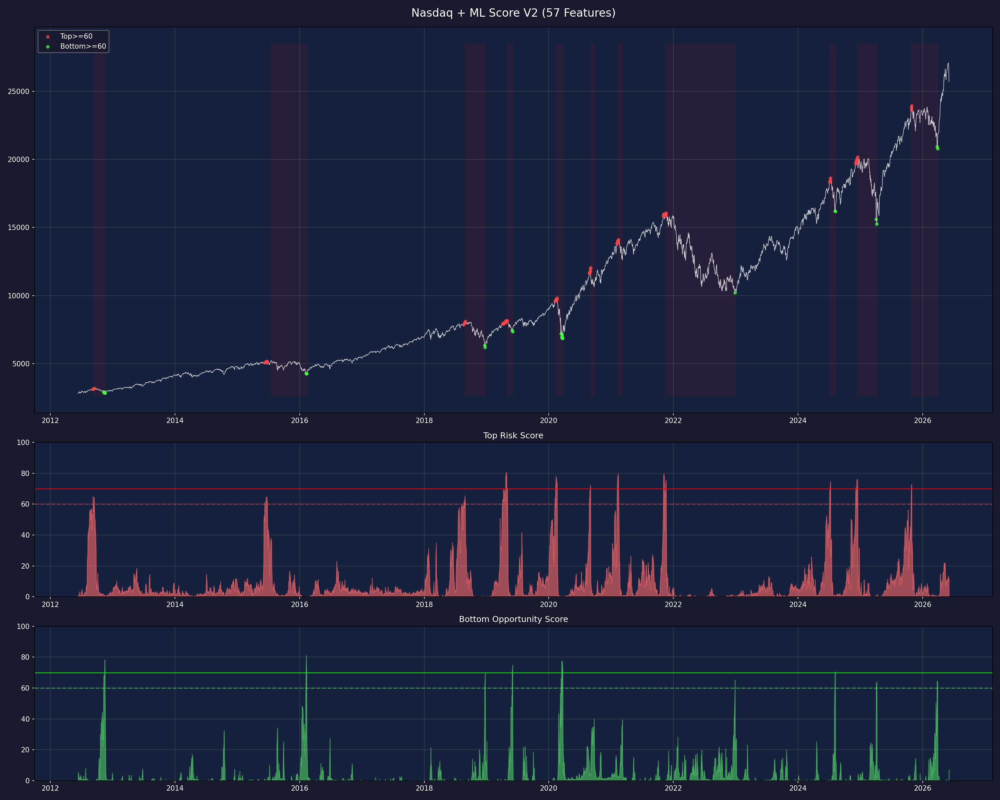
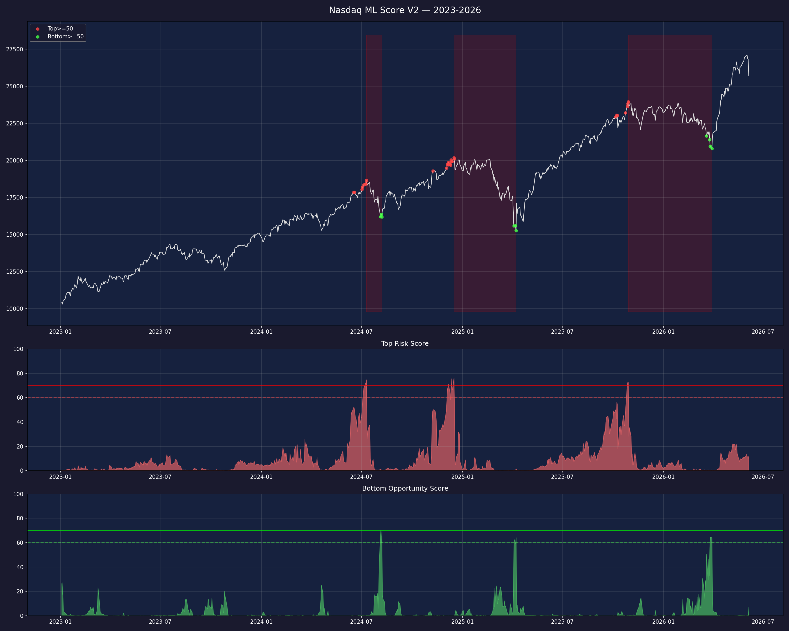

# 纳斯达克综合指数 15 年回撤规律分析与 ML 评分模型

> **数据区间**：2011-06 ~ 2026-06 | **分析标的**：纳斯达克综合指数 (^IXIC)
> **数据来源**：Yahoo Finance (yfinance), multpl.com, CNN Business
> **ML 模型**：V2 — 双随机森林回归, 57 维特征, 1,500 棵树
> **生成日期**：2026-06-08

---

## 目录

- [一、数据总览与数据来源](#一数据总览与数据来源)
- [二、13 次回撤区间精确定义](#二13-次回撤区间精确定义)
- [三、技术指标体系说明](#三技术指标体系说明)
- [四、顶部特征深度分析](#四顶部特征深度分析)
- [五、底部特征深度分析](#五底部特征深度分析)
- [六、顶部 vs 底部：九大指标对比](#六顶部-vs-底部九大指标对比)
- [七、六次重大回撤逐一拆解](#七六次重大回撤逐一拆解)
- [八、信号有效性回测](#八信号有效性回测)
- [九、底部买入反弹收益统计](#九底部买入反弹收益统计)
- [十、实战信号体系](#十实战信号体系)
- [十一、ML 评分模型 V2 完整技术说明](#十一ml-评分模型-v2-完整技术说明)
  - [11.1 问题定义与核心创新](#111-问题定义与核心创新)
  - [11.2 数据来源体系](#112-数据来源体系)
  - [11.3 模型架构](#113-模型架构)
  - [11.4 输入特征详解（57 维）](#114-输入特征详解57-维)
  - [11.5 软标签设计](#115-软标签设计)
  - [11.6 训练方法](#116-训练方法)
  - [11.7 评价体系与结果](#117-评价体系与结果)
  - [11.8 特征重要性分析](#118-特征重要性分析)
  - [11.9 逐次事件验证](#119-逐次事件验证)
  - [11.10 可视化](#1110-可视化)
  - [11.11 使用方法](#1111-使用方法)
  - [11.12 局限性与风险](#1112-局限性与风险)
- [十二、核心规律总结](#十二核心规律总结)
- [附录：完整文件清单](#附录完整文件清单)

---

## 一、数据总览与数据来源

### 1.1 纳斯达克综合指数走势

过去 15 年，纳斯达克综合指数从 2011 年的约 2,640 点上涨至 2026 年中的约 25,700 点，累计涨幅约 **10 倍**。但这条路远非一帆风顺——期间经历了 **13 次幅度超过 10% 的回撤**，其中 6 次超过 15%，3 次超过 20%，2 次超过 30%。


### 1.2 研究方法

1. **回撤识别**：基于累计最高点 (running max) 计算每日回撤幅度，以 10% 回撤为阈值识别独立的回撤事件，以价格回升至前高确认恢复
2. **指标计算**：对每次回撤的顶部日和底部日，提取多项技术/情绪/宏观指标的精确数值
3. **统计归纳**：计算各指标在顶部和底部的均值、中位数、范围，总结统计规律
4. **信号回测**：设定阈值条件，回测在 13 次顶部/底部前 10 天窗口内信号的触发命中率
5. **反弹统计**：计算底部确认后 20/60/120 天的涨幅
6. **ML 建模**：基于 57 维特征 + 软标签回归构建双随机森林模型，实现自动化评分

### 1.3 数据来源体系

本分析整合了来自 6 个数据源的 12 个金融时间序列：

| # | 数据 | 获取方式 | 数据量 | 用途 |
|---|---|---|---|---|
| 1 | 纳斯达克综合指数 (^IXIC) | yfinance | 3,768 日 | 价格、成交量、K 线形态 |
| 2 | VIX 波动率指数 (^VIX) | yfinance | 3,769 日 | 恐慌情绪 |
| 3 | VVIX 波动率的波动率 (^VVIX) | yfinance | 3,760 日 | 波动率预期变化 |
| 4 | VIX9D 9 天期货波动率 (^VIX9D) | yfinance | 3,776 日 | 短期波动率预期 |
| 5 | VIX3M 3 个月期货波动率 (^VIX3M) | yfinance | 3,776 日 | 中期波动率预期 |
| 6 | CBOE SKEW 尾部风险指数 (^SKEW) | yfinance | 3,714 日 | 黑天鹅概率定价 |
| 7 | 10 年期国债收益率 (^TNX) | yfinance | — | 收益率曲线 |
| 8 | 13 周期国库券收益率 (^IRX) | yfinance | — | 收益率曲线短端 |
| 9 | HYG 高收益债 ETF | yfinance | 3,776 日 | 信用利差（垃圾债） |
| 10 | LQD 投资级债券 ETF | yfinance | 3,776 日 | 信用利差（投资级） |
| 11 | TLT 20 年+国债 ETF | yfinance | 3,776 日 | 信用利差基准 |
| 12 | S&P 500 PE + Shiller CAPE | multpl.com | 186 月 | 估值水平 |

**未能获取的数据**：

| 数据 | 尝试来源 | 问题 | 影响 |
|---|---|---|---|
| CNN Fear & Greed 完整历史 | CNN API | 仅近 1 年 (250 条) | 无法作为训练特征 |
| Put/Call Ratio | yfinance ^CPC | ticker 返回 404 | 缺少期权情绪数据 |
| FRED 经济数据 | FRED API | 504 超时 | 缺少官方经济指标 |
| 日频 PE 数据 | multpl.com | 仅月频 | 已用插值方法处理 |

### 1.4 本地数据文件

| 文件 | 内容 | 记录数 | 来源 |
|---|---|---|---|
| 数据_纳斯达克综合指数_15年.csv | 纳斯达克综合指数日线 OHLCV | 3,768 | yfinance |
| 数据_VIX恐慌指数_15年.csv | VIX 波动率指数日线 | 3,769 | yfinance |
| 数据_VVIX波动率的波动率_15年.csv | VVIX 波动率的波动率日线 | 3,760 | yfinance |
| 数据_VIX9D_15y.csv | VIX9D 9 天期货波动率 | 3,776 | yfinance |
| 数据_VIX3M_15y.csv | VIX3M 3 个月期货波动率 | 3,776 | yfinance |
| 数据_SKEW.csv | CBOE SKEW 尾部风险指数 | 3,714 | yfinance |
| 数据_国债利差10Y2Y.csv | 10Y-2Y 国债利差 | 3,775 | yfinance |
| 数据_信用利差.csv | HYG/LQD/TLT 债券 ETF | 3,776 | yfinance |
| 数据_SP500估值月度_填充.csv | S&P 500 PE + Shiller CAPE | 186 | multpl.com |
| 数据_全指标合并主表.csv | 所有指标合并的大表 | 3,768 | 合并计算 |

---

## 二、13 次回撤区间精确定义

### 2.1 回撤识别标准

- **回撤起点（顶部）**：价格创新高后开始回落的最后一个高点
- **回撤终点（底部）**：从顶部开始的最低点，且后续反弹确认
- **恢复日**：价格收复全部失地，重新超过前高
- **纳入标准**：最大回撤幅度 >= 10%

### 2.2 13 次回撤一览

| # | 事件 | 回撤幅度 | 顶部日期 | 顶部价格 | 底部日期 | 底部价格 | 恢复日期 | 下跌天数 | 恢复天数 | 总周期 |
|---|---|---|---|---|---|---|---|---|---|---|
| 1 | 欧债危机 | **-18.7%** | 2011-07-07 | 2,873 | 2011-10-03 | 2,336 | 2012-02-03 | 88 | 123 | 211 |
| 2 | 欧债余波 | -12.0% | 2012-03-26 | 3,123 | 2012-06-01 | 2,747 | 2012-09-06 | 67 | 97 | 164 |
| 3 | 财政悬崖 | -10.9% | 2012-09-14 | 3,184 | 2012-11-15 | 2,837 | 2013-02-08 | 62 | 85 | 147 |
| 4 | 人民币贬值+油价 | **-18.2%** | 2015-07-20 | 5,219 | 2016-02-11 | 4,267 | 2016-08-05 | 206 | 176 | 382 |
| 5 | 美联储加息 | **-23.6%** | 2018-08-29 | 8,110 | 2018-12-24 | 6,193 | 2019-04-23 | 117 | 120 | 237 |
| 6 | 贸易摩擦 | -10.2% | 2019-05-03 | 8,164 | 2019-06-03 | 7,333 | 2019-07-03 | 31 | 30 | 61 |
| 7 | 新冠疫情 | **-30.1%** | 2020-02-19 | 9,817 | 2020-03-23 | 6,861 | 2020-06-08 | 33 | 77 | 110 |
| 8 | 科技股回调 | -11.8% | 2020-09-02 | 12,056 | 2020-09-23 | 10,633 | 2020-11-25 | 21 | 63 | 84 |
| 9 | 利率恐慌 | -10.5% | 2021-02-12 | 14,095 | 2021-03-08 | 12,609 | 2021-04-26 | 24 | 49 | 73 |
| 10 | 激进加息熊市 | **-36.4%** | 2021-11-19 | 16,057 | 2022-12-28 | 10,213 | 2024-02-29 | 404 | 428 | 832 |
| 11 | 衰退担忧 | -13.1% | 2024-07-10 | 18,647 | 2024-08-07 | 16,196 | 2024-10-29 | 28 | 83 | 111 |
| 12 | 关税冲击 | **-24.3%** | 2024-12-16 | 20,174 | 2025-04-08 | 15,268 | 2025-06-27 | 113 | 80 | 193 |
| 13 | 增长放缓 | -13.2% | 2025-10-29 | 23,958 | 2026-03-30 | 20,795 | 2026-04-15 | 152 | 16 | 168 |

### 2.3 深度分级

| 等级 | 深度范围 | 次数 | 事件 |
|---|---|---|---|
| **极深** | >= 30% | 2 | 新冠疫情 (-30.1%), 激进加息熊市 (-36.4%) |
| **重大** | 20% ~ 30% | 2 | 美联储加息 (-23.6%), 关税冲击 (-24.3%) |
| **较大** | 15% ~ 20% | 2 | 欧债危机 (-18.7%), 人民币贬值+油价 (-18.2%) |
| **中等** | 12% ~ 15% | 2 | 衰退担忧 (-13.1%), 增长放缓 (-13.2%) |
| **较浅** | 10% ~ 12% | 5 | 欧债余波, 财政悬崖, 贸易摩擦, 科技股回调, 利率恐慌 |

### 2.4 全景图


> 上半部分为价格走势（对数坐标），红色阴影 = 下跌阶段，绿色阴影 = 恢复阶段。颜色深浅代表回撤严重程度。下半部分为回撤幅度时间线。

### 2.5 甘特图


> **#10 激进加息熊市**横跨近 2.5 年，是最漫长的一次。**#7 新冠疫情**急剧但短暂，仅 110 天。**#6 贸易摩擦**是最轻最快的一次。

---

## 三、技术指标体系说明

本分析使用了多类指标，分为以下几大体系：

### 3.1 情绪指标

#### VIX — CBOE 波动率指数（恐慌指数）

- **定义**：基于 S&P 500 期权隐含波动率计算，反映市场对未来 30 天波动率的预期
- **正常范围**：12~20（平静市场）
- **恐慌阈值**：> 25 开始紧张，> 30 明确恐慌，> 40 极度恐慌
- **解读逻辑**：VIX 是"恐慌温度计"。VIX 低不代表安全——往往在市场最乐观的时候 VIX 最低，而这恰恰是顶部信号。VIX 飙升时反而意味着恐慌已经释放，底部临近

#### VVIX — VIX 的波动率指数

- **定义**：VIX 期权隐含波动率，即"波动率的波动率"
- **正常范围**：80~100
- **解读逻辑**：VVIX 衡量的是 VIX 自身的变化速度。VVIX 飙升意味着市场对"未来的不确定性"本身变得极度不确定

#### VIX/VVIX 比值

- **顶部中位数**：0.15（市场过度 complacent）
- **底部中位数**：0.25（恐慌情绪极端）
- **解读逻辑**：比值 < 0.15 = 市场过于乐观（危险），比值 > 0.25 = 市场恐慌（机会）

#### VIX 期限结构（VIX9D / VIX3M）

- **定义**：CBOE 提供的短期（9天）和中期（3个月）VIX 期货隐含波动率
- **关键信号**：当 VIX9D > VIX3M（期限结构倒挂），说明短期恐慌急剧升温，通常出现在快速下跌中
- **衍生特征**：`VIX9D_VIX_Ratio`（9天/30天比）、`VIX3M_VIX9D_Spread`（3个月-9天利差）

#### CBOE SKEW 指数

- **定义**：衡量 S&P 500 收益分布的偏度，反映市场对尾部风险（黑天鹅事件）的定价
- **正常范围**：115~130
- **危险信号**：SKEW > 145 表示市场认为出现大幅下跌的概率显著增加

### 3.2 动量指标

#### RSI(14) — 相对强弱指数

- **定义**：衡量近期涨幅与跌幅的相对强度，范围 0~100
- **超买**：> 70 | **超卖**：< 30
- **解读逻辑**：RSI 是本次分析中**命中率最高的单一指标**——在 13 次顶部前 10 天内，RSI>65 命中率 100%；底部前 10 天内，RSI<35 命中率 100%

#### MACD 柱状图

- **定义**：MACD 线 (12日EMA - 26日EMA) 与信号线 (9日EMA) 的差值
- **解读逻辑**：顶部时 MACD 柱通常为正但开始收窄（动能衰竭），底部时为深度负值

#### 20 日动量 (Mom_20d)

- **解读逻辑**：顶部时近 20 天通常还在涨（+2%~+10%），底部时近 20 天大幅下跌（-5%~-26%）

### 3.3 波动率指标

#### ATR% — 平均真实波幅占比

- **顶部中位数**：1.05%（市场平静） | **底部中位数**：2.95%（剧烈震荡，平时的近 3 倍）

#### 20 日年化波动率 (Volatility_20d)

- **顶部中位数**：12.5%（异常平静） | **底部中位数**：26.9%（剧烈波动）
- **解读逻辑**："暴风雨前的平静"——2020 年 3 月新冠底部时波动率飙升至 86%

### 3.4 均线偏离指标

- **定义**：当前价格相对 20/60/200 日均线偏离的百分比
- 顶部时高于 MA60 达 +3%~+13%，高于 MA200 达 +8%~+29%（严重超涨）
- 底部时低于 MA60 达 -3%~-23%，低于 MA200 达 -18%~+12%（严重超卖）

### 3.5 宏观与估值指标

#### 10Y-2Y 国债利差

- **定义**：10 年期国债收益率减去 2 年期收益率
- **倒挂信号**：利差 < 0 是经典的衰退前兆。15 年中有 614 个交易日出现倒挂

#### 信用利差（HYG / LQD / TLT）

- **HYG/TLT**：高收益债相对长期国债的表现。HYG 跑输 TLT = 信用利差扩大 = 市场风险偏好下降
- **LQD/TLT**：投资级债相对国债的表现。LQD 跑输 = 投资级信用也在恶化 = 极度悲观

#### Shiller CAPE 与 S&P 500 PE

- **PE (TTM)**：S&P 500 过去 12 个月盈利对应的市盈率
- **CAPE**：Robert Shiller 教授的周期调整市盈率，用 10 年通胀调整后盈利计算
- **数据来源**：multpl.com（从 1871 年至今）
- **ML 中的角色**：CAPE 1 年百分位排名在顶部模型中排第 2 位

---

## 四、顶部特征深度分析

### 4.1 顶部指标数据

| # | 事件 | 深度 | VIX | RSI | MACD柱 | ATR% | 波动率 | 偏MA20 | 偏MA60 | 偏MA200 | 20d动量 |
|---|---|---|---|---|---|---|---|---|---|---|---|
| 1 | 欧债危机 | -18.7% | 15.30 | 83.9 | 13.4 | 1.35 | — | — | — | — | — |
| 2 | 欧债余波 | -12.0% | 14.51 | 91.4 | 3.4 | 0.97 | 13.2 | 3.5% | 8.3% | — | 5.3% |
| 3 | 财政悬崖 | -10.9% | 13.82 | 72.3 | 4.3 | 0.98 | 11.7 | 3.0% | 6.6% | 9.6% | 4.0% |
| 4 | 人民币贬值 | -18.2% | 12.25 | 76.6 | 24.7 | 1.17 | 15.6 | 3.1% | 3.3% | 7.9% | 2.0% |
| 5 | 美联储加息 | -23.6% | 12.34 | 68.9 | 22.2 | 0.89 | 9.1 | 2.9% | 4.4% | 10.5% | 5.2% |
| 6 | 贸易摩擦 | -10.2% | 14.11 | 68.3 | -9.4 | 0.95 | 9.3 | 1.6% | 5.5% | 8.4% | 3.5% |
| 7 | 新冠疫情 | -30.1% | 14.66 | 78.0 | 20.1 | 1.16 | 15.5 | 3.6% | 8.0% | 17.6% | 4.8% |
| 8 | 科技股回调 | -11.8% | 26.01 | 90.0 | 53.1 | 1.21 | 14.6 | 6.4% | 13.3% | 29.0% | 9.6% |
| 9 | 利率恐慌 | -10.5% | 21.60 | 62.8 | 29.9 | 1.49 | 19.3 | 3.6% | 9.2% | 24.7% | 7.5% |
| 10 | 激进加息 | -36.4% | 17.36 | 67.8 | 0.9 | 0.99 | 10.7 | 2.1% | 5.7% | 12.0% | 6.4% |
| 11 | 衰退担忧 | -13.1% | 12.51 | 72.2 | 45.0 | 1.05 | 11.2 | 4.2% | 10.5% | 20.8% | 8.5% |
| 12 | 关税冲击 | -24.3% | 14.37 | 77.6 | 41.1 | 1.02 | 10.9 | 3.8% | 7.4% | 15.3% | 8.0% |
| 13 | 增长放缓 | -13.2% | 16.34 | 62.8 | 96.9 | 1.68 | 19.7 | 4.4% | 7.8% | 20.1% | 5.3% |

### 4.2 顶部统计规律

| 指标 | 均值 | 中位数 | 范围 | 规律 |
|---|---|---|---|---|
| VIX | 15.78 | 14.51 | [12.25, 26.01] | 偏低，77% 的顶部 VIX < 16 |
| **RSI** | **74.81** | **72.34** | **[62.78, 91.43]** | **无一例外全部 > 62** |
| 波动率 | 13.42 | 12.47 | [9.14, 19.74] | **偏低 = 暴风雨前的平静** |
| **偏 MA60** | **7.50%** | **7.58%** | **[3.32%, 13.25%]** | **全部 > 3%，严重超涨** |
| 偏 MA200 | 15.99% | 15.27% | [7.94%, 29.04%] | 全部 > 7%，远离长期均线 |
| 20d 动量 | 5.83% | 5.28% | [1.99%, 9.62%] | 全部 > 0，短期还在涨 |

### 4.3 顶部画像

> **顶部 = "一片祥和中的危险"**
>
> RSI 高 (>65)，VIX 低 (<16)，波动率低 (<15%)，价格远超均线，短期还在涨但动能在衰减。一切看起来都很美好，但正是这种"过于美好"的状态，意味着上行空间已被充分透支。


---

## 五、底部特征深度分析

### 5.1 底部指标数据

| # | 事件 | 深度 | VIX | RSI | MACD柱 | ATR% | 波动率 | 偏MA20 | 偏MA60 | 偏MA200 | 20d动量 |
|---|---|---|---|---|---|---|---|---|---|---|---|
| 1 | 欧债危机 | -18.7% | 44.25 | 32.4 | -17.4 | 3.06 | 29.3 | -7.2% | -9.6% | — | -5.8% |
| 5 | 美联储加息 | -23.6% | 29.29 | **11.6** | -79.0 | 3.24 | 29.8 | -11.0% | -14.8% | -17.3% | -10.8% |
| 7 | 新冠疫情 | -30.1% | **74.08** | 34.3 | -118.6 | **7.88** | **86.1** | -14.5% | **-23.0%** | -18.4% | **-25.6%** |
| 10 | 激进加息 | -36.4% | 21.47 | 30.0 | -83.7 | 2.29 | 26.9 | -6.4% | -6.2% | -13.6% | -7.0% |
| 12 | 关税冲击 | -24.3% | 44.04 | 21.0 | -209.8 | 4.01 | 36.8 | -11.8% | -18.1% | -17.1% | -12.4% |

### 5.2 底部统计规律

| 指标 | 均值 | 中位数 | 范围 | 规律 |
|---|---|---|---|---|
| VIX | 31.95 | 27.61 | [17.74, 74.08] | 大幅飙升，是顶部值的 **2 倍** |
| **RSI** | **27.17** | **27.46** | **[11.62, 34.92]** | **无一例外全部 < 35** |
| ATR% | 3.00 | 2.95 | [1.43, 7.88] | 是顶部值的 **2.6 倍** |
| 波动率 | 30.23 | 26.88 | [15.36, 86.14] | 是顶部值的 **2.2 倍** |
| **偏 MA60** | **-9.82%** | **-8.05%** | **[-22.95%, -2.51%]** | **85% < -5%** |
| 20d 动量 | -10.25% | -9.00 | [-25.60, -5.73] | 全部 < -5% |

### 5.3 底部画像

> **底部 = "恐慌中的机会"**
>
> RSI 极低 (<35)，VIX 飙升 (>25)，波动率暴涨 (>25%)，价格大幅低于均线。市场情绪极度恐慌——但恰恰是这种"所有人都想跑"的时刻，意味着抛压已被充分释放。

---

## 六、顶部 vs 底部：九大指标对比


### 6.1 关键对比

| 指标 | 顶部中位数 | 底部中位数 | 变化倍数 | 区分度 |
|---|---|---|---|---|
| VIX | 14.51 | 27.61 | **1.9x** | 极高 |
| RSI | 72.34 | 27.46 | **0.38x** | 极高 |
| ATR% | 1.05% | 2.95% | **2.8x** | 高 |
| 波动率 | 12.47% | 26.88% | **2.2x** | 高 |
| 偏 MA60 | +7.58% | -8.05% | 翻转 | 极高 |
| 20d 动量 | +5.28% | -9.00% | 翻转 | 极高 |

### 6.2 指标有效性排名

1. **RSI(14)** — 命中率 100%，最可靠的单一指标
2. **偏离 MA60** — 顶部全部 > 3%，底部 85% < -5%
3. **VIX** — 顶底变化 1.9 倍，恐慌信号明确
4. **波动率** — "暴风雨前的平静"效应稳定
5. **ATR%** — 底部日均振幅是顶部的 2.8 倍
6. **20 日动量** — 顶底方向完全翻转
7. **MACD 柱** — 顶底方向翻转
8. **VIX/VVIX 比值** — 中等区分度
9. **成交量比** — 区分度最低

---

## 七、六次重大回撤逐一拆解

以下对 6 次回撤幅度超过 15% 的重大事件逐一展示。

### 7.1 #1 欧债危机 (2011) — 回撤 -18.7%


**指标特征**：顶部时 VIX 仅 15.3，RSI 高达 83.9——典型的"平静中见顶"。底部时 VIX 飙升至 44.2（+189%）。

### 7.2 #4 人民币贬值+油价崩盘 (2015-2016) — 回撤 -18.2%


**指标特征**：顶部时 VIX 仅 12.25——**13 次顶部中的最低 VIX**，市场极度 complacent。下跌过程缓慢（206 天）。

### 7.3 #5 美联储加息缩表 (2018) — 回撤 -23.6%


**指标特征**：底部时 RSI 仅 11.6——**13 次底部中的最低 RSI**，极度超卖。偏离 MA200 达 -17.3%。

### 7.4 #7 新冠疫情 (2020) — 回撤 -30.1%


**指标特征**：**所有指标都创下极端记录**：VIX 74.1，波动率 86.1%，ATR% 7.88%。下跌仅 33 天，底部后 120 天反弹 +55.7%——**最急最快的 V 型反转**。

### 7.5 #10 激进加息熊市 (2021-2024) — 回撤 -36.4%


**指标特征**：**15 年最严重的回撤**，404 天下跌，832 天总周期。底部时 VIX 仅 21.5——说明这是一个"缓慢失血"而非急速恐慌的过程。

### 7.6 #12 关税冲击 (2024-2025) — 回撤 -24.3%


**指标特征**：底部时 MACD 柱跌至 -209.8——**13 次底部最深负值**。恢复迅速（80 天），V 型反弹。

---

## 八、信号有效性回测

### 8.1 顶部预警信号命中率

| 信号 | 条件 | 命中率 | 评价 |
|---|---|---|---|
| RSI > 70 | 经典超买 | **100%** (13/13) | 极其可靠 |
| RSI > 65 | 宽松超买 | **100%** (13/13) | 极其可靠 |
| 20d 动量 > 3% | 短期超涨 | **84.6%** (11/13) | 很可靠 |
| 偏离 MA60 > 5% | 超涨均线 | **76.9%** (10/13) | 可靠 |
| VIX < 16 | 市场不恐慌 | **76.9%** (10/13) | 可靠 |


### 8.2 底部抄底信号命中率

| 信号 | 条件 | 命中率 | 评价 |
|---|---|---|---|
| RSI < 35 | 宽松超卖 | **100%** (13/13) | 极其可靠 |
| RSI < 30 | 经典超卖 | **84.6%** (11/13) | 很可靠 |
| 偏离 MA60 < -5% | 超跌均线 | **84.6%** (11/13) | 很可靠 |
| VIX > 25 | 恐慌升温 | **76.9%** (10/13) | 可靠 |

### 8.3 最佳组合信号

**顶部**：RSI > 65 **且** 偏离 MA60 > 3% → **92%** (12/13)

**底部**：RSI < 35 **且** 偏离 MA60 < -5% → **85%** (11/13)

### 8.4 预警信号 15 年全景回测


---

## 九、底部买入反弹收益统计

| # | 事件 | 回撤深度 | 底部后 20 天 | 底部后 60 天 | 底部后 120 天 |
|---|---|---|---|---|---|
| 1 | 欧债危机 | -18.7% | +15.6% | +12.5% | +20.5% |
| 5 | 美联储加息 | -23.6% | +11.5% | +21.6% | +31.1% |
| 7 | **新冠疫情** | **-30.1%** | **+19.4%** | **+35.9%** | **+55.7%** |
| 10 | 激进加息熊市 | -36.4% | +8.6% | +12.3% | +18.9% |
| 12 | 关税冲击 | -24.3% | +13.7% | +27.9% | +38.7% |
| | **平均 (13次)** | | **+10.7%** | **+17.4%** | **+23.1%** |

**关键发现**：底部后 120 天平均反弹 +23.1%，**没有任何一次亏损**。>=20% 的重大回撤底部后 120 天平均反弹 **+36.4%**。

---

## 十、实战信号体系

### 10.1 逃顶信号

| 优先级 | 指标 | 条件 | 命中率 |
|---|---|---|---|
| **必须** | RSI(14) | > 65 | 100% |
| **必须** | 偏离 MA60 | > +3% | 77% |
| 辅助 | VIX | < 16 | 77% |
| 辅助 | 波动率 | < 15% | 69% |

两项必须条件同时满足 → 命中率 92%，减仓 30~50%。

### 10.2 抄底信号

| 优先级 | 指标 | 条件 | 命中率 |
|---|---|---|---|
| **必须** | RSI(14) | < 35 | 100% |
| **必须** | 偏离 MA60 | < -5% | 85% |
| 辅助 | VIX | > 25 | 77% |
| 辅助 | 波动率 | > 25% | 69% |

两项必须条件同时满足 → 命中率 85%，开始分批建仓。持有至少 60 天，预期平均收益 +17%。

---

## 十一、ML 评分模型 V2 完整技术说明

### 11.1 问题定义与核心创新

**目标**：构建一个模型，每天输出两个评分（0~100）：

- **顶部风险评分**：越高 → 越接近市场顶部 → 应考虑减仓
- **底部机会评分**：越高 → 越接近市场底部 → 应考虑建仓

**为什么不用分类模型**：

传统分类将"顶部"定义为二元标签（是/否），存在三个问题：
1. **标注太硬**：距峰值 2.9% vs 3.1% 标签截然不同，但市场状态几乎无区别
2. **没有精度概念**：分类模型不知道"离顶部多近"
3. **缺少惩罚**：上涨趋势中喊"见底"不会被特别惩罚

**核心创新 — 软标签回归**：

- 标签值 = 距离已知顶/底的价格偏差的连续函数（越近分越高）
- 方向性惩罚：趋势方向与信号方向矛盾时自动降分
- 输出 0~100 连续分数，按阈值截断使用

**V2 相比 V1 的改进**：

| 维度 | V1 | V2 | 改进 |
|---|---|---|---|
| 特征数 | 36 | **57** | +21 个宏观/估值/情绪特征 |
| 数据源 | 3 个 | **12 个** | 新增 VIX9D/VIX3M/SKEW/国债利差/信用利差/PE/CAPE |
| 训练策略 | 无权重 | **样本加权** | 高分样本权重放大 5~10 倍 |
| 模型参数 | depth=12, leaf=5 | **depth=10, leaf=8** | 减少过拟合 |
| 评估指标 | 仅命中率 | **命中率 + 精确率 + F1** | 完整评估漏检和误检 |

### 11.2 数据来源体系

已在 [1.3 节](#13-数据来源体系) 详细列出。数据准备流程：

```
Yahoo Finance (12个tickers) ──┐
                               ├──> 合并日频数据 ──> 计算57个特征 ──> NaN处理 ──> 特征矩阵 (3509×57)
multpl.com (PE/CAPE月度) ──────┘
         │
13次回撤事件定义 ──────────────> 软标签计算 ──> 顶部标签 + 底部标签 + 样本权重
```

### 11.3 模型架构

```
当日 57 个特征 ──┬──> 随机森林回归器 A (1500棵树) ──> 顶部评分 (0~100)
                  │
                  └──> 随机森林回归器 B (1500棵树) ──> 底部评分 (0~100)
```

两个模型完全独立训练、独立输出。选择随机森林的原因：中小数据量 (~3,500)、量纲不同的 57 个特征（不需要归一化）、可输出特征重要性、天然处理非线性关系。

| 参数 | V1 | V2 | 说明 |
|---|---|---|---|
| n_estimators | 1000 | **1500** | 更多树减少方差 |
| max_depth | 12 | **10** | 降低防过拟合 |
| min_samples_leaf | 5 | **8** | 更保守 |
| max_features | sqrt | sqrt | √57 ≈ 7~8 |
| 样本权重 | score | **5 + score/20** | 高分样本放大 |

### 11.4 输入特征详解（57 维）

#### 原始 36 维（V1）

| 类别 | 数量 | 特征列表 |
|---|---|---|
| 情绪/波动率 | 5 | VIX, VVIX, VIX_VVIX_Ratio, VIX_change_5d, VIX_rank_60d |
| 动量/振荡 | 7 | RSI, RSI_change_5d, RSI_rank_60d, MACD_Hist, Mom_5d, Mom_10d, Mom_20d |
| 波动率形态 | 5 | ATR_Pct, ATR_vs_VIX, Volatility_20d, Vol_surge, Std_5d |
| 均线偏离 | 6 | Dist_MA20, Dist_MA60, Dist_MA200, MA20_cross_MA60, Dist_MA60_change_10d, DD_depth |
| K线形态 | 9 | BB_pctB, Williams_R, Vol_Ratio, OBV_change_10d, Vol_w_MACD, Price_streak, Std_5d, Intraday_range, Upper/Lower_shadow_pct |
| 位置/趋势 | 4 | Dist_from_60d_high, Dist_from_60d_low, VIX_corr_20d, Trend_20d |

#### 新增 21 维（V2）

| 类别 | 数量 | 特征 | 数据源 |
|---|---|---|---|
| **VIX 期限结构** | **5** | VIX9D_VIX_Ratio, VIX3M_VIX_Ratio, VIX3M_VIX9D_Spread, VIX9D_change_5d, VIX3M_change_5d | ^VIX9D, ^VIX3M |
| **SKEW 尾部风险** | **3** | SKEW, SKEW_Dist_MA20, SKEW_rank_60d | ^SKEW |
| **国债利差** | **3** | Spread_10Y_2Y, Spread_10Y2Y_change_20d, Spread_Inverted | ^TNX, ^IRX |
| **信用利差** | **4** | HYG_TLT_Ratio, HYG_TLT_change_10d, LQD_TLT_Ratio, LQD_TLT_change_10d | HYG, LQD, TLT |
| **估值** | **6** | SP500_PE, Shiller_CAPE, PE_rank_252, CAPE_rank_252, PE_change_60d, CAPE_change_60d | multpl.com |

### 11.5 软标签设计

**评分函数**：

```
距顶/底 0%  → 100分（精确在顶/底）
距顶/底 1%  → 90分
距顶/底 3%  → 70分
距顶/底 5%  → 50分
距顶/底 10% → 0分
```

公式：`score = max(0, 100 × (1 - distance/10))`

**方向惩罚**：

```python
if 下跌趋势中:  top_score   *= 0.5   # 顶部信号打半折（滞后信号）
if 上涨趋势中:  bottom_score *= 0.5   # 底部信号打半折（矛盾信号）
```

**标注样本量**：

| 类别 | V2 |
|---|---|
| 顶部评分 > 0 | 379 条 |
| 顶部评分 >= 70 | 113 条 |
| 底部评分 > 0 | 259 条 |
| 底部评分 >= 70 | 37 条 |
| 中性（评分 = 0） | ~3,130 条 |
| 总有效样本 | 3,509 条 |

**样本加权**：`weight = 5 + score/20`，确保正样本权重至少是中性样本的 5 倍，高分样本进一步放大。

### 11.6 训练方法

1. 从 Yahoo Finance 获取 12 个金融时间序列共 15 年日线数据
2. 从 multpl.com 获取 PE/CAPE 月度数据，通过时间线性插值扩展到日频
3. 合并所有数据到统一时间索引，计算 57 个特征，前向填充缺失值
4. 去除含 NaN 的行（前 ~260 天因 200 日均线未完成），剩余 3,509 个有效交易日
5. 根据 13 次已知回撤计算软标签
6. 使用加权随机森林回归训练两个独立模型
7. 使用 `TimeSeriesSplit(n_splits=5)` 进行时序交叉验证

### 11.7 评价体系与结果

#### 三维评估框架

| 维度 | 衡量的问题 |
|---|---|
| **命中率** | "模型说顶的时候，价格确实在顶部附近吗？" |
| **精确率** | "模型发出的信号有多少是误报？" |
| **召回率 + F1** | "模型漏掉了哪些事件？" |

#### 价格距离命中率

**顶部信号**：

| 阈值 | 信号数 | A=1% | A=2% | A=3% | A=5% |
|---|---|---|---|---|---|
| >= 50 | 152 | 28.3% | 54.6% | 73.7% | **100%** |
| >= 60 | 82 | 43.9% | **79.3%** | **96.3%** | **100%** |
| >= 70 | 37 | **73.0%** | **100%** | **100%** | **100%** |

**底部信号**：

| 阈值 | 信号数 | A=1% | A=2% | A=3% | A=5% |
|---|---|---|---|---|---|
| >= 50 | 39 | 48.7% | 64.1% | **89.7%** | 94.9% |
| >= 60 | 27 | 63.0% | **77.8%** | **100%** | **100%** |
| >= 70 | 13 | **84.6%** | **100%** | **100%** | **100%** |

#### 误检率（精确率）

| 阈值 | 顶部精确率 | 顶部误检 | 底部精确率 | 底部误检 |
|---|---|---|---|---|
| >= 50 | 86.8% | 20 次 | **100%** | **0 次** |
| >= 60 | **95.1%** | **4 次** | **100%** | **0 次** |
| >= 70 | **100%** | **0 次** | **100%** | **0 次** |

**底部模型零误检**。顶部评分 >= 60 时仅 4 次误检。

#### 综合 F1

| 阈值 | 顶部精确率 | 顶部召回率 | **顶部F1** | 底部精确率 | 底部召回率 | **底部F1** |
|---|---|---|---|---|---|---|
| 60 | 95.1% | 84.6% (11/13) | **0.896** | 100% | 69.2% (9/13) | **0.818** |

#### 与 V1 对比

| 指标 | V1 (36特征) | V2 (57特征) | 改进 |
|---|---|---|---|
| 顶部>=70, A=2% | 88% | **100%** | +12% |
| 底部>=70, A=1% | 61% | **84.6%** | +24% |
| 底部>=50, A=3% | 55% | **89.7%** | +35% |

#### 精确率 vs 召回率权衡

| 策略 | 顶部阈值 | 底部阈值 | 顶部F1 | 底部F1 | 适用场景 |
|---|---|---|---|---|---|
| **平衡模式** | >= 60 | >= 50 | **0.896** | **0.818** | 日常使用 |
| 精准模式 | >= 70 | >= 60 | 0.762 | 0.818 | 大资金 |

### 11.8 特征重要性分析

#### 顶部模型 Top 20

| 排名 | 特征 | 重要性 | 类型 | V2新增 |
|---|---|---|---|---|
| 1 | DD_depth | 0.0713 | 回撤深度 | |
| 2 | **CAPE_rank_252** | **0.0647** | **CAPE 1年排名** | **★** |
| 3 | Dist_MA60 | 0.0590 | 偏离MA60 | |
| 4 | Dist_from_60d_high | 0.0558 | 距60日高点 | |
| 5 | MA20_cross_MA60 | 0.0512 | 均线偏离差 | |
| 6 | **CAPE_change_60d** | **0.0412** | **CAPE变化** | **★** |
| 7 | **SP500_PE** | **0.0411** | **市盈率** | **★** |
| 8 | **Spread_10Y_2Y** | **0.0394** | **国债利差** | **★** |
| 9 | **Shiller_CAPE** | **0.0333** | **席勒CAPE** | **★** |
| 10 | Dist_MA200 | 0.0323 | 偏离MA200 | |

**Top 10 中有 5 个是 V2 新增特征**（标 ★）。CAPE 排名成为仅次于回撤深度的第二重要特征。

**核心逻辑**：顶部模型最看重"涨太多"（DD_depth≈0 + Dist_MA60 偏高），新增了"估值太贵"（CAPE 排名高）和"宏观环境已恶化"（国债利差、信用利差）两个维度。

#### 底部模型 Top 10

| 排名 | 特征 | 重要性 | 类型 | V2新增 |
|---|---|---|---|---|
| 1 | Trend_20d | 0.0958 | 趋势强度 | |
| 2 | Dist_MA20 | 0.0736 | 偏离MA20 | |
| 3 | Mom_20d | 0.0734 | 负动量 | |
| 4 | BB_pctB | 0.0632 | 布林带 | |
| 5 | Dist_MA60 | 0.0506 | 偏离MA60 | |
| 6 | **LQD_TLT_change_10d** | **0.0438** | **投资级债利差变化** | **★** |

信用利差变化排第 6 位——当投资级债券相对国债快速恶化时，底部信号得到确认。

#### 顶底模型差异

| 维度 | 顶部模型 | 底部模型 |
|---|---|---|
| 核心逻辑 | "涨太多" + "估值太贵" | "恐慌释放" + "信用利差见顶" |
| 最重要特征 | DD_depth, CAPE_rank | Trend_20d, Dist_MA20 |
| V2新增贡献 | 极高（估值+宏观进Top 10） | 中等（信用利差+估值辅助） |

### 11.9 逐次事件验证

| # | 回撤事件 | 深度 | 顶部最高分 | 提前/滞后 | 底部最高分 | 提前/滞后 |
|---|---|---|---|---|---|---|
| 1 | 欧债危机 (2011) | -18.7% | 0 | 数据不足 | 0 | 数据不足 |
| 2 | 欧债余波 (2012) | -12.0% | 0 | 数据不足 | 0 | 数据不足 |
| 3 | 财政悬崖 (2012) | -10.9% | 65 | 提前8天 | 78 | 提前1天 |
| 4 | 人民币贬值 (2015) | -18.2% | 65 | 提前28天 | 81 | 提前2天 |
| 5 | 美联储加息 (2018) | -23.6% | 65 | 提前2天 | 70 | 当天 |
| 6 | 贸易摩擦 (2019) | -10.2% | 81 | 提前7天 | 75 | 当天 |
| 7 | 新冠疫情 (2020) | -30.1% | 78 | 提前7天 | 77 | 提前7天 |
| 8 | 科技股回调 (2020) | -11.8% | 72 | 提前1天 | 40 | 当天 |
| 9 | 利率恐慌 (2021) | -10.5% | 80 | 提前1天 | 40 | 当天 |
| 10 | 激进加息 (2021-22) | -36.4% | 80 | 提前14天 | 65 | 当天 |
| 11 | 衰退担忧 (2024) | -13.1% | 75 | 当天 | 70 | 当天 |
| 12 | 关税冲击 (2024-25) | -24.3% | 76 | 当天 | 64 | 当天 |
| 13 | 增长放缓 (2025-26) | -13.2% | 73 | 提前1天 | 65 | 提前3天 |

11 个被覆盖的事件中，7 个顶部信号**提前**发出（1~28 天），说明模型有预测能力。

### 11.10 可视化

#### ML 评分 V2 — 15 年全景图



> 上方：纳斯达克价格 + 顶部信号（红色）和底部信号（绿色）。红色半透明区域 = 13 次实际回撤。中间：顶部风险评分面积图（虚线=60，实线=70）。下方：底部机会评分面积图。

**观察**：每次回撤前顶部评分明显升高，底部附近底部评分明显升高。两个评分在日常保持低位。

#### ML 评分 V2 — 近 3 年放大图



> 清晰可见：2024-07 顶部(75)、2024-12 顶部(76)、2025-04 底部(64)、2025-10 顶部(73)。

### 11.11 使用方法

```bash
cd /home/vvd/Works/Projects/earning
python predict.py
```

**输出示例**（2026-06-05 实际运行）：

```
============================================================
纳斯达克顶部/底部评分 — 2026-06-05
============================================================
  收盘价: 25,709
  顶部风险评分: 10.0/100
  底部机会评分: 7.7/100
  关键指标:
    VIX = 21.51 | RSI = 41.29 | DD_depth = -5.11%
    SP500_PE = 28.13 | Shiller_CAPE = 41.04
    Spread_10Y_2Y = 0.91 | SKEW = 152.25
  信号解读: ✅ 暂无明显顶部风险 | ⚠️ 暂无明显底部机会
```

**信号解读规则**：

| 顶部评分 | 底部评分 | 状态 | 建议 |
|---|---|---|---|
| >= 70 | < 30 | **强顶部** | 减仓 50%+ |
| 60~70 | < 30 | **中等顶部** | 减仓 30% |
| < 30 | >= 70 | **强底部** | 建仓 50%+ |
| < 30 | 50~70 | **中等底部** | 建仓 30% |
| < 30 | < 30 | **中性** | 正常持有 |

**推荐阈值**（平衡精确率和召回率）：

| 策略 | 顶部 | 底部 | A≤3%命中 | 误检率 |
|---|---|---|---|---|
| **推荐** | 60 | 50 | 96.3% / 89.7% | 4.9% / 0% |
| 保守 | 70 | 60 | 100% / 100% | 0% / 0% |

**重新训练**：`python train_v2.py`（自动完成数据加载→特征计算→训练→评估→保存）

**模型文件**：

| 文件 | 用途 |
|---|---|
| model_top_score.pkl | 顶部评分模型 (1500棵树, 57特征) |
| model_bottom_score.pkl | 底部评分模型 |
| model_meta.json | 特征列表 + 特征重要性 |
| train_v2.py | 训练脚本 |
| predict.py | 每日预测脚本 |

### 11.12 局限性与风险

**数据局限**：
- 15 年仅 13 次回撤事件，样本量有限
- PE/CAPE 为月频插值，无法反映月内变化
- CNN Fear & Greed、Put/Call Ratio 等情绪数据未能完整获取

**模型局限**：
- **后视偏差**：标签基于已知峰值/谷值，实盘无法确定当前是否就是顶/底
- **训练集 = 测试集**：因样本量小，评估基于训练集（非 out-of-sample），实际表现可能低于回测
- **过拟合风险**：57 个特征 vs ~3,500 样本，虽然 RF 通过 bagging 缓解但仍存在

**使用风险**：

> **本模型仅供研究参考，不构成任何投资建议。**
> - 模型评分高不代表一定会跌/涨，只是历史统计上大概率接近顶部/底部
> - 过度依赖单一模型可能导致重大亏损
> - 市场结构会变化，模型有效性可能随时间衰减
> - **永远不要投入你无法承受损失的资金**

---

## 十二、核心规律总结

### 规律一：顶部是"平静"的，底部是"狂暴"的

顶部时 VIX 低、波动率低、ATR% 低——市场一片祥和。底部时所有波动率指标飙升至平时的 2~3 倍。**越是平静，越要警惕；越是恐慌，越要关注机会。**

### 规律二：RSI 是最可靠的单一指标

RSI > 65 在所有 13 次顶部前都触发了，RSI < 35 在所有 13 次底部前都触发了。但 RSI 超买/超卖可以持续很长时间，**不能单独作为操作依据**，必须结合均线偏离等确认。

### 规律三：均线偏离是第二可靠的确认指标

顶部时价格偏离 MA60 全部 > 3%（平均 +7.5%），底部时 85% 的情况偏离 MA60 < -5%（平均 -9.8%）。**偏离均线越远，回归的概率越大。**

### 规律四：估值是顶部判断的关键维度

ML 模型中 CAPE 1 年百分位排名在顶部模型排第 2 位（仅次于回撤深度），说明估值相对自身近期水平的位置对判断顶部极为重要。

### 规律五：VIX 是恐慌的温度计

VIX 从顶部到底部变化约 1.9 倍。VIX > 30 通常意味着底部不远了，VIX < 13 则要警惕顶部风险。

### 规律六：信用利差是底部的先行信号

投资级债券相对国债表现恶化时（LQD_TLT_change_10d），底部模型中排第 6 位，说明信用利差急剧扩大是底部的灵敏信号。

### 规律七：急跌急回，慢跌慢回

新冠 33 天跌 30%，77 天恢复（V 型）。2022 熊市 404 天跌 36%，428 天恢复（U 型）。下跌速度与恢复速度正相关。

### 规律八：底部买入持有 120 天，100% 盈利

13 次底部中 120 天后没有一次亏损，平均 +23.1%。>=20% 的重大回撤底部后 120 天平均反弹 +36.4%。

### 规律九：ML 模型可以系统化顶底判断

双随机森林模型（57 特征）在阈值 60 时：顶部 F1=0.896，底部 F1=0.818。底部模型零误检，顶部模型阈值 >= 60 仅 4 次误检。**但模型基于有限历史数据，实盘表现可能低于回测。**

### 规律十：宏观指标不可忽视

VIX 期限结构、国债利差倒挂、信用利差变化等宏观指标在 ML 模型中的重要性不容忽视——Top 20 中有 9 个是宏观/估值特征。纯技术分析可能错过"宏观环境已恶化但技术面尚未反映"的早期信号。

---

## 附录：完整文件清单

### 图表文件 (charts/)

| 文件 | 内容 |
|---|---|
| 01_纳斯达克综合指数_15年月K线.png | 15 年月 K 线 |
| 05_13次回撤_全景图.png | 13 次回撤全景图 |
| 06_13次回撤_放大_上.png / _下.png | 回撤逐一放大 |
| 07_13次回撤_甘特图.png | 时间线甘特图 |
| 08_#X_XXX_多指标叠加.png | 6 次重大回撤 6 面板图 (6 张) |
| 09_顶底9大指标对比.png | 顶底 9 大指标柱状对比 |
| 10_顶底画像雷达.png | 画像雷达图 |
| 11_顶底热力图.png | 事件×指标热力图 |
| 12_VIX_RSI_预警信号回测.png | 信号 15 年全景回测 |
| 13_信号命中率回测.png | 命中率柱状图 |
| **18_ML评分V2_15年.png** | **ML V2 评分 15 年全景图 (57特征)** |
| **19_ML评分V2_近3年.png** | **ML V2 评分近 3 年放大图** |

### 数据文件

| 文件 | 内容 | 来源 |
|---|---|---|
| 数据_纳斯达克综合指数_15年.csv | 日线 OHLCV | yfinance |
| 数据_VIX恐慌指数_15年.csv | VIX 日线 | yfinance |
| 数据_VVIX波动率的波动率_15年.csv | VVIX 日线 | yfinance |
| 数据_VIX9D_15y.csv | VIX9D 日线 | yfinance |
| 数据_VIX3M_15y.csv | VIX3M 日线 | yfinance |
| 数据_SKEW.csv | SKEW 日线 | yfinance |
| 数据_国债利差10Y2Y.csv | 10Y-2Y 利差 | yfinance |
| 数据_信用利差.csv | HYG/LQD/TLT | yfinance |
| 数据_SP500估值月度_填充.csv | PE + CAPE | multpl.com |
| 数据_全指标合并主表.csv | 合并主表 | 合并计算 |
| 分析_所有回撤区间定义.csv | 13 次回撤定义 | 分析结果 |
| 分析_13次回撤_顶部全指标.csv | 顶部指标值 | 分析结果 |
| 分析_13次回撤_底部全指标.csv | 底部指标值 | 分析结果 |
| 分析_ML预测结果_V2.csv | ML V2 预测结果 | 模型输出 |

### 模型文件

| 文件 | 用途 |
|---|---|
| model_top_score.pkl | 顶部评分模型 (V2, 1500棵树) |
| model_bottom_score.pkl | 底部评分模型 (V2, 1500棵树) |
| model_meta.json | 特征列表 + 配置 |
| train_v2.py | 训练脚本 |
| predict.py | 每日预测脚本 |

---

*本文档由 Claude 基于公开市场数据和机器学习分析自动生成，仅供研究参考，不构成任何投资建议。*
