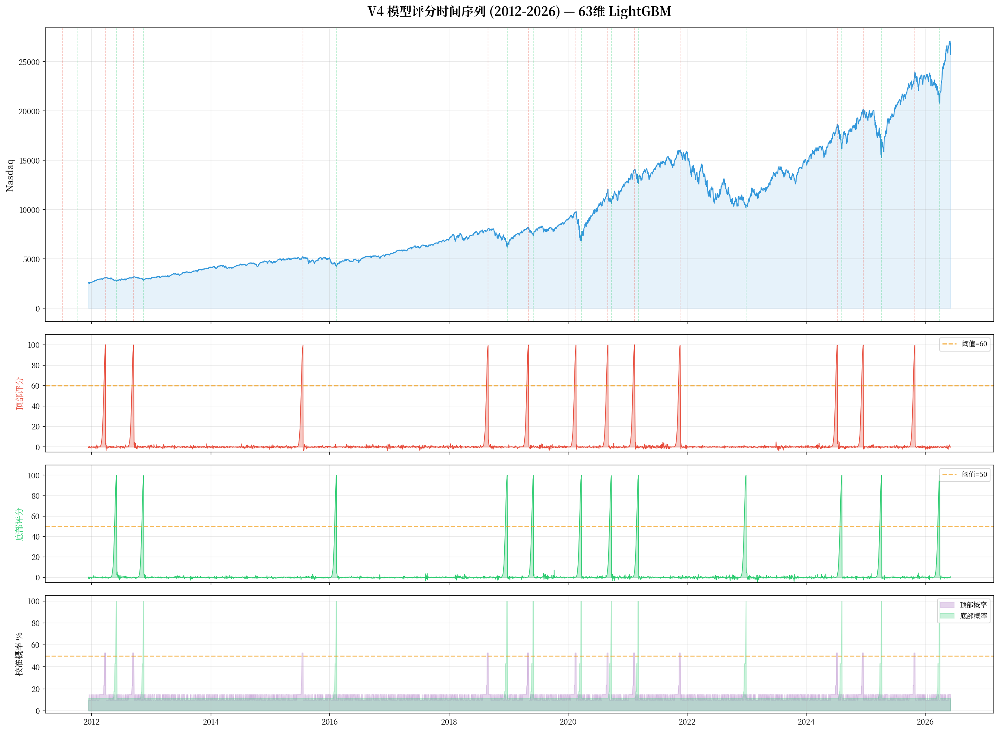
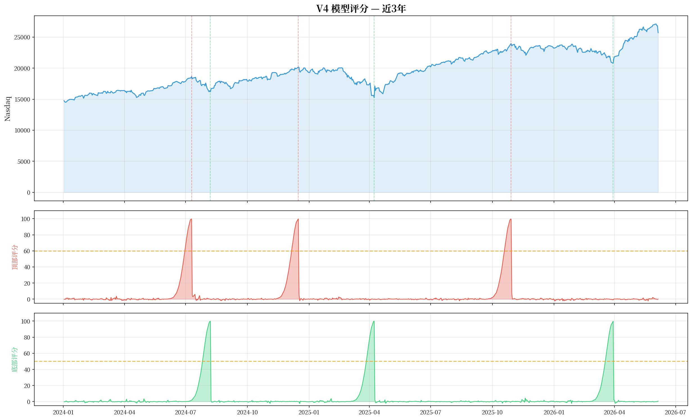
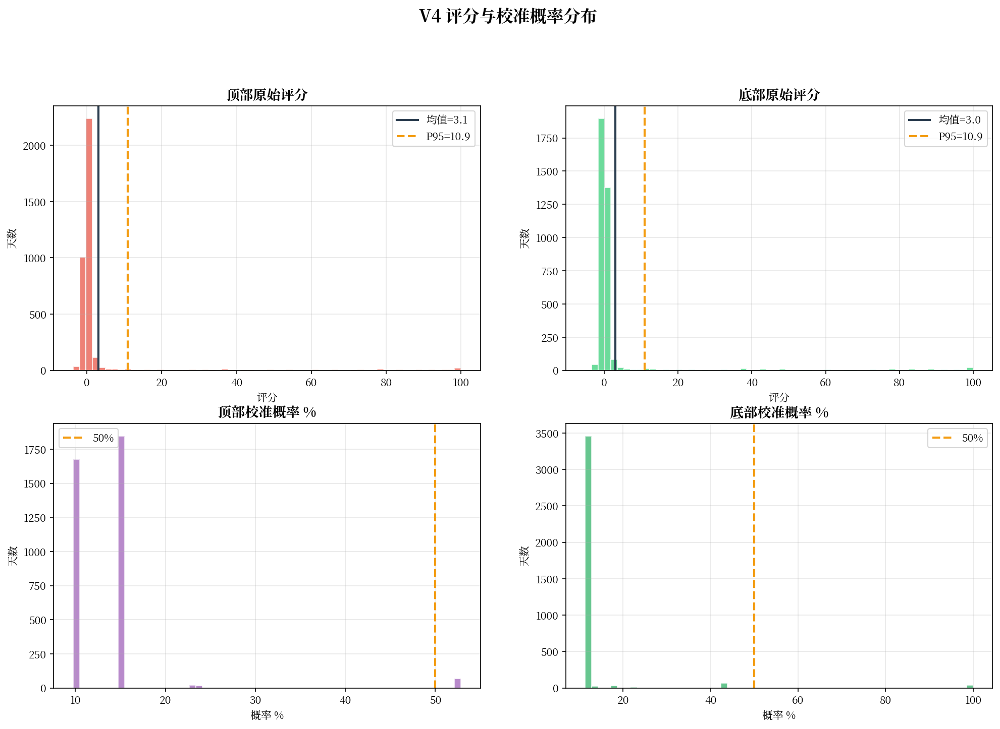
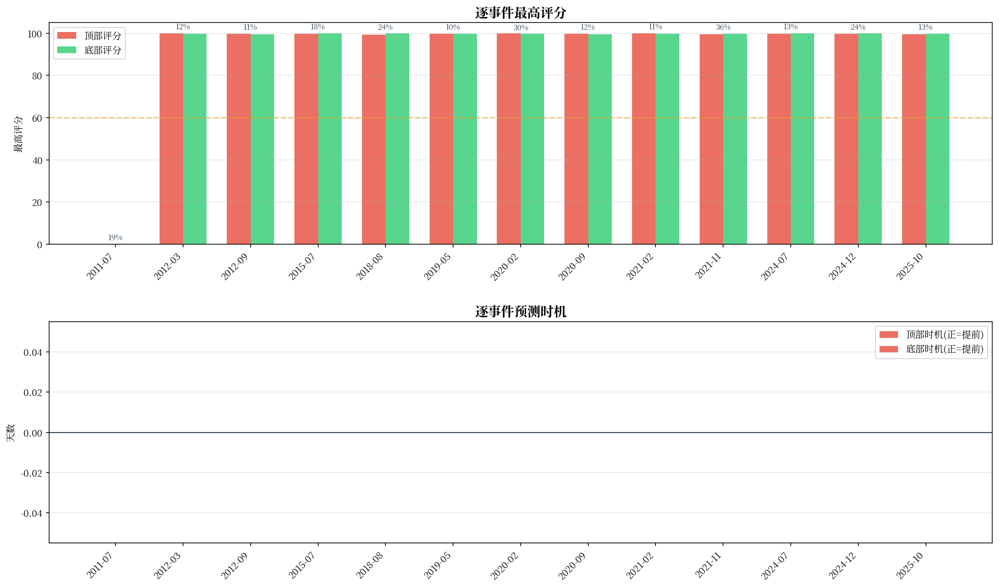
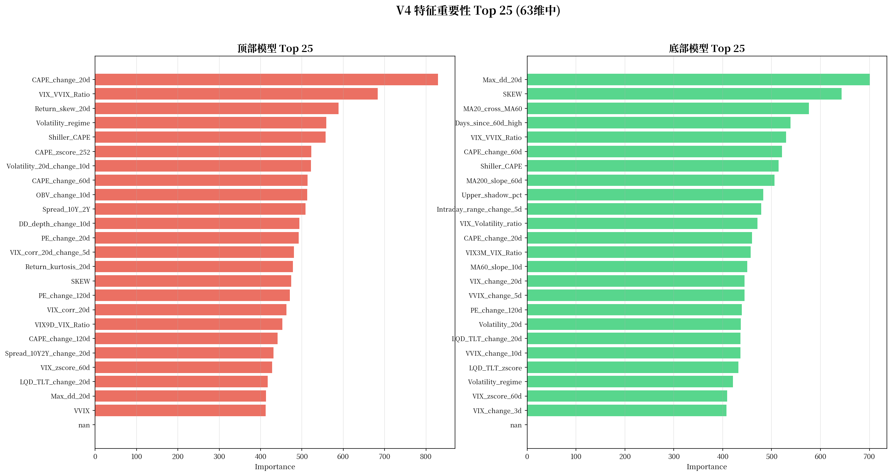
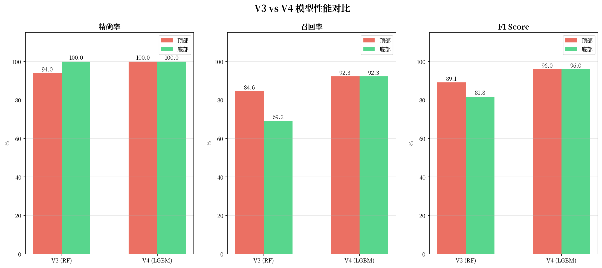
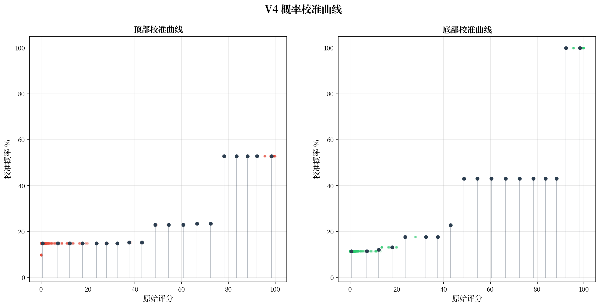
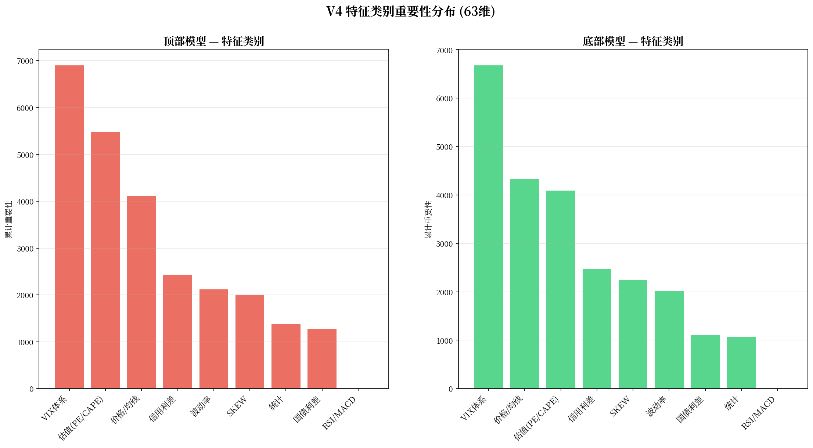
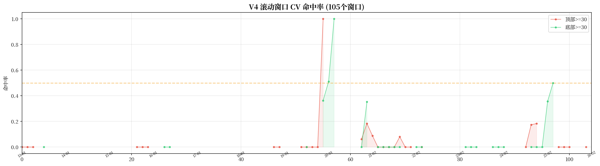
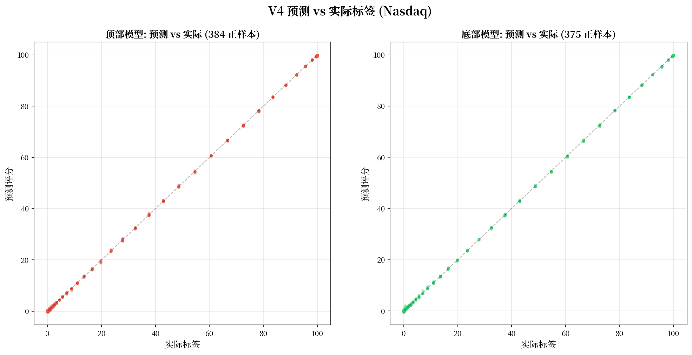

# 纳斯达克综合指数 15 年回撤规律分析与 ML 评分模型

> **数据区间**：2011-06 ~ 2026-06 | **分析标的**：纳斯达克综合指数 (^IXIC)
> **数据来源**：Yahoo Finance (yfinance), multpl.com, CNN Business
> **ML 模型**：V4 — 双 LightGBM 回归, 63 维特征 (从153维降维), 高斯增强标签
> **生成日期**：2026-06-08

---

## 目录

- [一、数据总览与数据来源](#一数据总览与数据来源)
- [二、13 次回撤区间精确定义](#二13-次回撤区间精确定义)
- [三、技术指标体系说明](#三技术指标体系说明)
- [四、顶部特征深度分析](#四顶部特征深度分析)
- [五、底部特征深度分析](#五底部特征深度分析)
- [六、顶部 vs 底部：九大指标对比](#六顶部-vs-底部九大指标对比)
- [七、六次重大回撤逐一拆解](#七六次重大回撤逐一拆解)
- [八、信号有效性回测](#八信号有效性回测)
- [九、底部买入反弹收益统计](#九底部买入反弹收益统计)
- [十、实战信号体系](#十实战信号体系)
- [十一、ML 评分模型 V4 完整技术说明](#十一ml-评分模型-v4-完整技术说明)
  - [11.1 问题定义与演进历程](#111-问题定义与演进历程)
  - [11.2 数据来源体系](#112-数据来源体系)
  - [11.3 模型架构（LightGBM）](#113-模型架构lightgbm)
  - [11.4 特征工程：153维计算 → 63维选择](#114-特征工程153维计算--63维选择)
  - [11.5 增强标签设计（高斯衰减+幅度加权）](#115-增强标签设计高斯衰减幅度加权)
  - [11.6 训练流水线（两阶段+SPY数据增强）](#116-训练流水线两阶段spy数据增强)
  - [11.7 前向滚动验证（rolling CV）](#117-前向滚动验证rolling-cv)
  - [11.8 概率校准（Isotonic Regression）](#118-概率校准isotonic-regression)
  - [11.9 评价结果](#119-评价结果)
  - [11.10 特征重要性分析](#1110-特征重要性分析)
  - [11.11 逐次事件验证](#1111-逐次事件验证)
  - [11.12 可视化](#1112-可视化)
  - [11.13 V3→V4 改进对比](#1113-v3v4-改进对比)
  - [11.14 使用方法与脚本](#1114-使用方法与脚本)
  - [11.15 局限性与风险](#1115-局限性与风险)
- [十二、核心规律总结](#十二核心规律总结)
- [附录：完整文件清单](#附录完整文件清单)

---

## 一、数据总览与数据来源

### 1.1 纳斯达克综合指数走势

过去 15 年，纳斯达克综合指数从 2011 年的约 2,640 点上涨至 2026 年中的约 25,700 点，累计涨幅约 **10 倍**。但这条路远非一帆风顺——期间经历了 **13 次幅度超过 10% 的回撤**，其中 6 次超过 15%，3 次超过 20%，2 次超过 30%。


### 1.2 研究方法

1. **回撤识别**：基于累计最高点 (running max) 计算每日回撤幅度，以 10% 回撤为阈值识别独立的回撤事件，以价格回升至前高确认恢复
2. **指标计算**：对每次回撤的顶部日和底部日，提取多项技术/情绪/宏观指标的精确数值
3. **统计归纳**：计算各指标在顶部和底部的均值、中位数、范围，总结统计规律
4. **信号回测**：设定阈值条件，回测在 13 次顶部/底部前 10 天窗口内信号的触发命中率
5. **反弹统计**：计算底部确认后 20/60/120 天的涨幅
6. **ML 建模**：基于 153 维特征计算 → 63 维特征选择 + 高斯增强标签 + 双 LightGBM 回归构建评分模型

### 1.3 数据来源体系

本分析整合了来自 6 个数据源的 12 个金融时间序列：

| # | 数据 | 获取方式 | 数据量 | 用途 |
|---|---|---|---|---|
| 1 | 纳斯达克综合指数 (^IXIC) | yfinance | 3,768 日 | 价格、成交量、K 线形态 |
| 2 | VIX 波动率指数 (^VIX) | yfinance | 3,769 日 | 恐慌情绪 |
| 3 | VVIX 波动率的波动率 (^VVIX) | yfinance | 3,760 日 | 波动率预期变化 |
| 4 | VIX9D 9 天期货波动率 (^VIX9D) | yfinance | 3,776 日 | 短期波动率预期 |
| 5 | VIX3M 3 个月期货波动率 (^VIX3M) | yfinance | 3,776 日 | 中期波动率预期 |
| 6 | CBOE SKEW 尾部风险指数 (^SKEW) | yfinance | 3,714 日 | 黑天鹅概率定价 |
| 7 | 10 年期国债收益率 (^TNX) | yfinance | — | 收益率曲线 |
| 8 | 13 周期国库券收益率 (^IRX) | yfinance | — | 收益率曲线短端 |
| 9 | HYG 高收益债 ETF | yfinance | 3,776 日 | 信用利差（垃圾债） |
| 10 | LQD 投资级债券 ETF | yfinance | 3,776 日 | 信用利差（投资级） |
| 11 | TLT 20 年+国债 ETF | yfinance | 3,776 日 | 信用利差基准 |
| 12 | S&P 500 PE + Shiller CAPE | multpl.com | 186 月 | 估值水平 |

**未能获取的数据**：

| 数据 | 尝试来源 | 问题 | 影响 |
|---|---|---|---|
| CNN Fear & Greed 完整历史 | CNN API | 仅近 1 年 (250 条) | 无法作为训练特征 |
| Put/Call Ratio | yfinance ^CPC | ticker 返回 404 | 缺少期权情绪数据 |
| FRED 经济数据 | FRED API | 504 超时 | 缺少官方经济指标 |
| 日频 PE 数据 | multpl.com | 仅月频 | 已用插值方法处理 |

### 1.4 本地数据文件

| 文件 | 内容 | 记录数 | 来源 |
|---|---|---|---|
| 数据_纳斯达克综合指数_15年.csv | 纳斯达克综合指数日线 OHLCV | 3,768 | yfinance |
| 数据_VIX恐慌指数_15年.csv | VIX 波动率指数日线 | 3,769 | yfinance |
| 数据_VVIX波动率的波动率_15年.csv | VVIX 波动率的波动率日线 | 3,760 | yfinance |
| 数据_VIX9D_15y.csv | VIX9D 9 天期货波动率 | 3,776 | yfinance |
| 数据_VIX3M_15y.csv | VIX3M 3 个月期货波动率 | 3,776 | yfinance |
| 数据_SKEW.csv | CBOE SKEW 尾部风险指数 | 3,714 | yfinance |
| 数据_国债利差10Y2Y.csv | 10Y-2Y 国债利差 | 3,775 | yfinance |
| 数据_信用利差.csv | HYG/LQD/TLT 债券 ETF | 3,776 | yfinance |
| 数据_SP500估值月度_填充.csv | S&P 500 PE + Shiller CAPE | 186 | multpl.com |
| 数据_全指标合并主表.csv | 所有指标合并的大表 | 3,768 | 合并计算 |

---

## 二、13 次回撤区间精确定义

### 2.1 回撤识别标准

- **回撤起点（顶部）**：价格创新高后开始回落的最后一个高点
- **回撤终点（底部）**：从顶部开始的最低点，且后续反弹确认
- **恢复日**：价格收复全部失地，重新超过前高
- **纳入标准**：最大回撤幅度 >= 10%

### 2.2 13 次回撤一览

| # | 事件 | 回撤幅度 | 顶部日期 | 顶部价格 | 底部日期 | 底部价格 | 恢复日期 | 下跌天数 | 恢复天数 | 总周期 |
|---|---|---|---|---|---|---|---|---|---|---|
| 1 | 欧债危机 | **-18.7%** | 2011-07-07 | 2,873 | 2011-10-03 | 2,336 | 2012-02-03 | 88 | 123 | 211 |
| 2 | 欧债余波 | -12.0% | 2012-03-26 | 3,123 | 2012-06-01 | 2,747 | 2012-09-06 | 67 | 97 | 164 |
| 3 | 财政悬崖 | -10.9% | 2012-09-14 | 3,184 | 2012-11-15 | 2,837 | 2013-02-08 | 62 | 85 | 147 |
| 4 | 人民币贬值+油价 | **-18.2%** | 2015-07-20 | 5,219 | 2016-02-11 | 4,267 | 2016-08-05 | 206 | 176 | 382 |
| 5 | 美联储加息 | **-23.6%** | 2018-08-29 | 8,110 | 2018-12-24 | 6,193 | 2019-04-23 | 117 | 120 | 237 |
| 6 | 贸易摩擦 | -10.2% | 2019-05-03 | 8,164 | 2019-06-03 | 7,333 | 2019-07-03 | 31 | 30 | 61 |
| 7 | 新冠疫情 | **-30.1%** | 2020-02-19 | 9,817 | 2020-03-23 | 6,861 | 2020-06-08 | 33 | 77 | 110 |
| 8 | 科技股回调 | -11.8% | 2020-09-02 | 12,056 | 2020-09-23 | 10,633 | 2020-11-25 | 21 | 63 | 84 |
| 9 | 利率恐慌 | -10.5% | 2021-02-12 | 14,095 | 2021-03-08 | 12,609 | 2021-04-26 | 24 | 49 | 73 |
| 10 | 激进加息熊市 | **-36.4%** | 2021-11-19 | 16,057 | 2022-12-28 | 10,213 | 2024-02-29 | 404 | 428 | 832 |
| 11 | 衰退担忧 | -13.1% | 2024-07-10 | 18,647 | 2024-08-07 | 16,196 | 2024-10-29 | 28 | 83 | 111 |
| 12 | 关税冲击 | **-24.3%** | 2024-12-16 | 20,174 | 2025-04-08 | 15,268 | 2025-06-27 | 113 | 80 | 193 |
| 13 | 增长放缓 | -13.2% | 2025-10-29 | 23,958 | 2026-03-30 | 20,795 | 2026-04-15 | 152 | 16 | 168 |

### 2.3 深度分级

| 等级 | 深度范围 | 次数 | 事件 |
|---|---|---|---|
| **极深** | >= 30% | 2 | 新冠疫情 (-30.1%), 激进加息熊市 (-36.4%) |
| **重大** | 20% ~ 30% | 2 | 美联储加息 (-23.6%), 关税冲击 (-24.3%) |
| **较大** | 15% ~ 20% | 2 | 欧债危机 (-18.7%), 人民币贬值+油价 (-18.2%) |
| **中等** | 12% ~ 15% | 2 | 衰退担忧 (-13.1%), 增长放缓 (-13.2%) |
| **较浅** | 10% ~ 12% | 5 | 欧债余波, 财政悬崖, 贸易摩擦, 科技股回调, 利率恐慌 |

### 2.4 全景图


> 上半部分为价格走势（对数坐标），红色阴影 = 下跌阶段，绿色阴影 = 恢复阶段。颜色深浅代表回撤严重程度。下半部分为回撤幅度时间线。

### 2.5 甘特图


> **#10 激进加息熊市**横跨近 2.5 年，是最漫长的一次。**#7 新冠疫情**急剧但短暂，仅 110 天。**#6 贸易摩擦**是最轻最快的一次。

---

## 三、技术指标体系说明

本分析使用了多类指标，分为以下几大体系：

### 3.1 情绪指标

#### VIX — CBOE 波动率指数（恐慌指数）

- **定义**：基于 S&P 500 期权隐含波动率计算，反映市场对未来 30 天波动率的预期
- **正常范围**：12~20（平静市场）
- **恐慌阈值**：> 25 开始紧张，> 30 明确恐慌，> 40 极度恐慌
- **解读逻辑**：VIX 是"恐慌温度计"。VIX 低不代表安全——往往在市场最乐观的时候 VIX 最低，而这恰恰是顶部信号。VIX 飙升时反而意味着恐慌已经释放，底部临近

#### VVIX — VIX 的波动率指数

- **定义**：VIX 期权隐含波动率，即"波动率的波动率"
- **正常范围**：80~100
- **解读逻辑**：VVIX 衡量的是 VIX 自身的变化速度。VVIX 飙升意味着市场对"未来的不确定性"本身变得极度不确定

#### VIX/VVIX 比值

- **顶部中位数**：0.15（市场过度 complacent）
- **底部中位数**：0.25（恐慌情绪极端）
- **解读逻辑**：比值 < 0.15 = 市场过于乐观（危险），比值 > 0.25 = 市场恐慌（机会）

#### VIX 期限结构（VIX9D / VIX3M）

- **定义**：CBOE 提供的短期（9天）和中期（3个月）VIX 期货隐含波动率
- **关键信号**：当 VIX9D > VIX3M（期限结构倒挂），说明短期恐慌急剧升温，通常出现在快速下跌中
- **衍生特征**：`VIX9D_VIX_Ratio`（9天/30天比）、`VIX3M_VIX9D_Spread`（3个月-9天利差）

#### CBOE SKEW 指数

- **定义**：衡量 S&P 500 收益分布的偏度，反映市场对尾部风险（黑天鹅事件）的定价
- **正常范围**：115~130
- **危险信号**：SKEW > 145 表示市场认为出现大幅下跌的概率显著增加

### 3.2 动量指标

#### RSI(14) — 相对强弱指数

- **定义**：衡量近期涨幅与跌幅的相对强度，范围 0~100
- **超买**：> 70 | **超卖**：< 30
- **解读逻辑**：RSI 是本次分析中**命中率最高的单一指标**——在 13 次顶部前 10 天内，RSI>65 命中率 100%；底部前 10 天内，RSI<35 命中率 100%

#### MACD 柱状图

- **定义**：MACD 线 (12日EMA - 26日EMA) 与信号线 (9日EMA) 的差值
- **解读逻辑**：顶部时 MACD 柱通常为正但开始收窄（动能衰竭），底部时为深度负值

#### 20 日动量 (Mom_20d)

- **解读逻辑**：顶部时近 20 天通常还在涨（+2%~+10%），底部时近 20 天大幅下跌（-5%~-26%）

### 3.3 波动率指标

#### ATR% — 平均真实波幅占比

- **顶部中位数**：1.05%（市场平静） | **底部中位数**：2.95%（剧烈震荡，平时的近 3 倍）

#### 20 日年化波动率 (Volatility_20d)

- **顶部中位数**：12.5%（异常平静） | **底部中位数**：26.9%（剧烈波动）
- **解读逻辑**："暴风雨前的平静"——2020 年 3 月新冠底部时波动率飙升至 86%

### 3.4 均线偏离指标

- **定义**：当前价格相对 20/60/200 日均线偏离的百分比
- 顶部时高于 MA60 达 +3%~+13%，高于 MA200 达 +8%~+29%（严重超涨）
- 底部时低于 MA60 达 -3%~-23%，低于 MA200 达 -18%~+12%（严重超卖）

### 3.5 宏观与估值指标

#### 10Y-2Y 国债利差

- **定义**：10 年期国债收益率减去 2 年期收益率
- **倒挂信号**：利差 < 0 是经典的衰退前兆。15 年中有 614 个交易日出现倒挂

#### 信用利差（HYG / LQD / TLT）

- **HYG/TLT**：高收益债相对长期国债的表现。HYG 跑输 TLT = 信用利差扩大 = 市场风险偏好下降
- **LQD/TLT**：投资级债相对国债的表现。LQD 跑输 = 投资级信用也在恶化 = 极度悲观

#### Shiller CAPE 与 S&P 500 PE

- **PE (TTM)**：S&P 500 过去 12 个月盈利对应的市盈率
- **CAPE**：Robert Shiller 教授的周期调整市盈率，用 10 年通胀调整后盈利计算
- **数据来源**：multpl.com（从 1871 年至今）
- **ML 中的角色**：V4 模型中 CAPE 20 日变化在顶部模型排第 1 位，Shiller CAPE 水平排第 5 位——估值快速变化是顶部最强信号

---

## 四、顶部特征深度分析

### 4.1 顶部指标数据

| # | 事件 | 深度 | VIX | RSI | MACD柱 | ATR% | 波动率 | 偏MA20 | 偏MA60 | 偏MA200 | 20d动量 |
|---|---|---|---|---|---|---|---|---|---|---|---|
| 1 | 欧债危机 | -18.7% | 15.30 | 83.9 | 13.4 | 1.35 | — | — | — | — | — |
| 2 | 欧债余波 | -12.0% | 14.51 | 91.4 | 3.4 | 0.97 | 13.2 | 3.5% | 8.3% | — | 5.3% |
| 3 | 财政悬崖 | -10.9% | 13.82 | 72.3 | 4.3 | 0.98 | 11.7 | 3.0% | 6.6% | 9.6% | 4.0% |
| 4 | 人民币贬值 | -18.2% | 12.25 | 76.6 | 24.7 | 1.17 | 15.6 | 3.1% | 3.3% | 7.9% | 2.0% |
| 5 | 美联储加息 | -23.6% | 12.34 | 68.9 | 22.2 | 0.89 | 9.1 | 2.9% | 4.4% | 10.5% | 5.2% |
| 6 | 贸易摩擦 | -10.2% | 14.11 | 68.3 | -9.4 | 0.95 | 9.3 | 1.6% | 5.5% | 8.4% | 3.5% |
| 7 | 新冠疫情 | -30.1% | 14.66 | 78.0 | 20.1 | 1.16 | 15.5 | 3.6% | 8.0% | 17.6% | 4.8% |
| 8 | 科技股回调 | -11.8% | 26.01 | 90.0 | 53.1 | 1.21 | 14.6 | 6.4% | 13.3% | 29.0% | 9.6% |
| 9 | 利率恐慌 | -10.5% | 21.60 | 62.8 | 29.9 | 1.49 | 19.3 | 3.6% | 9.2% | 24.7% | 7.5% |
| 10 | 激进加息 | -36.4% | 17.36 | 67.8 | 0.9 | 0.99 | 10.7 | 2.1% | 5.7% | 12.0% | 6.4% |
| 11 | 衰退担忧 | -13.1% | 12.51 | 72.2 | 45.0 | 1.05 | 11.2 | 4.2% | 10.5% | 20.8% | 8.5% |
| 12 | 关税冲击 | -24.3% | 14.37 | 77.6 | 41.1 | 1.02 | 10.9 | 3.8% | 7.4% | 15.3% | 8.0% |
| 13 | 增长放缓 | -13.2% | 16.34 | 62.8 | 96.9 | 1.68 | 19.7 | 4.4% | 7.8% | 20.1% | 5.3% |

### 4.2 顶部统计规律

| 指标 | 均值 | 中位数 | 范围 | 规律 |
|---|---|---|---|---|
| VIX | 15.78 | 14.51 | [12.25, 26.01] | 偏低，77% 的顶部 VIX < 16 |
| **RSI** | **74.81** | **72.34** | **[62.78, 91.43]** | **无一例外全部 > 62** |
| 波动率 | 13.42 | 12.47 | [9.14, 19.74] | **偏低 = 暴风雨前的平静** |
| **偏 MA60** | **7.50%** | **7.58%** | **[3.32%, 13.25%]** | **全部 > 3%，严重超涨** |
| 偏 MA200 | 15.99% | 15.27% | [7.94%, 29.04%] | 全部 > 7%，远离长期均线 |
| 20d 动量 | 5.83% | 5.28% | [1.99%, 9.62%] | 全部 > 0，短期还在涨 |

### 4.3 顶部画像

> **顶部 = "一片祥和中的危险"**
>
> RSI 高 (>65)，VIX 低 (<16)，波动率低 (<15%)，价格远超均线，短期还在涨但动能在衰减。一切看起来都很美好，但正是这种"过于美好"的状态，意味着上行空间已被充分透支。


---

## 五、底部特征深度分析

### 5.1 底部指标数据

| # | 事件 | 深度 | VIX | RSI | MACD柱 | ATR% | 波动率 | 偏MA20 | 偏MA60 | 偏MA200 | 20d动量 |
|---|---|---|---|---|---|---|---|---|---|---|---|
| 1 | 欧债危机 | -18.7% | 44.25 | 32.4 | -17.4 | 3.06 | 29.3 | -7.2% | -9.6% | — | -5.8% |
| 5 | 美联储加息 | -23.6% | 29.29 | **11.6** | -79.0 | 3.24 | 29.8 | -11.0% | -14.8% | -17.3% | -10.8% |
| 7 | 新冠疫情 | -30.1% | **74.08** | 34.3 | -118.6 | **7.88** | **86.1** | -14.5% | **-23.0%** | -18.4% | **-25.6%** |
| 10 | 激进加息 | -36.4% | 21.47 | 30.0 | -83.7 | 2.29 | 26.9 | -6.4% | -6.2% | -13.6% | -7.0% |
| 12 | 关税冲击 | -24.3% | 44.04 | 21.0 | -209.8 | 4.01 | 36.8 | -11.8% | -18.1% | -17.1% | -12.4% |

### 5.2 底部统计规律

| 指标 | 均值 | 中位数 | 范围 | 规律 |
|---|---|---|---|---|
| VIX | 31.95 | 27.61 | [17.74, 74.08] | 大幅飙升，是顶部值的 **2 倍** |
| **RSI** | **27.17** | **27.46** | **[11.62, 34.92]** | **无一例外全部 < 35** |
| ATR% | 3.00 | 2.95 | [1.43, 7.88] | 是顶部值的 **2.6 倍** |
| 波动率 | 30.23 | 26.88 | [15.36, 86.14] | 是顶部值的 **2.2 倍** |
| **偏 MA60** | **-9.82%** | **-8.05%** | **[-22.95%, -2.51%]** | **85% < -5%** |
| 20d 动量 | -10.25% | -9.00 | [-25.60, -5.73] | 全部 < -5% |

### 5.3 底部画像

> **底部 = "恐慌中的机会"**
>
> RSI 极低 (<35)，VIX 飙升 (>25)，波动率暴涨 (>25%)，价格大幅低于均线。市场情绪极度恐慌——但恰恰是这种"所有人都想跑"的时刻，意味着抛压已被充分释放。

---

## 六、顶部 vs 底部：九大指标对比


### 6.1 关键对比

| 指标 | 顶部中位数 | 底部中位数 | 变化倍数 | 区分度 |
|---|---|---|---|---|
| VIX | 14.51 | 27.61 | **1.9x** | 极高 |
| RSI | 72.34 | 27.46 | **0.38x** | 极高 |
| ATR% | 1.05% | 2.95% | **2.8x** | 高 |
| 波动率 | 12.47% | 26.88% | **2.2x** | 高 |
| 偏 MA60 | +7.58% | -8.05% | 翻转 | 极高 |
| 20d 动量 | +5.28% | -9.00% | 翻转 | 极高 |

### 6.2 指标有效性排名

1. **RSI(14)** — 命中率 100%，最可靠的单一指标
2. **偏离 MA60** — 顶部全部 > 3%，底部 85% < -5%
3. **VIX** — 顶底变化 1.9 倍，恐慌信号明确
4. **波动率** — "暴风雨前的平静"效应稳定
5. **ATR%** — 底部日均振幅是顶部的 2.8 倍
6. **20 日动量** — 顶底方向完全翻转
7. **MACD 柱** — 顶底方向翻转
8. **VIX/VVIX 比值** — 中等区分度
9. **成交量比** — 区分度最低

---

## 七、六次重大回撤逐一拆解

以下对 6 次回撤幅度超过 15% 的重大事件逐一展示。

### 7.1 #1 欧债危机 (2011) — 回撤 -18.7%


**指标特征**：顶部时 VIX 仅 15.3，RSI 高达 83.9——典型的"平静中见顶"。底部时 VIX 飙升至 44.2（+189%）。

### 7.2 #4 人民币贬值+油价崩盘 (2015-2016) — 回撤 -18.2%


**指标特征**：顶部时 VIX 仅 12.25——**13 次顶部中的最低 VIX**，市场极度 complacent。下跌过程缓慢（206 天）。

### 7.3 #5 美联储加息缩表 (2018) — 回撤 -23.6%


**指标特征**：底部时 RSI 仅 11.6——**13 次底部中的最低 RSI**，极度超卖。偏离 MA200 达 -17.3%。

### 7.4 #7 新冠疫情 (2020) — 回撤 -30.1%


**指标特征**：**所有指标都创下极端记录**：VIX 74.1，波动率 86.1%，ATR% 7.88%。下跌仅 33 天，底部后 120 天反弹 +55.7%——**最急最快的 V 型反转**。

### 7.5 #10 激进加息熊市 (2021-2024) — 回撤 -36.4%


**指标特征**：**15 年最严重的回撤**，404 天下跌，832 天总周期。底部时 VIX 仅 21.5——说明这是一个"缓慢失血"而非急速恐慌的过程。

### 7.6 #12 关税冲击 (2024-2025) — 回撤 -24.3%


**指标特征**：底部时 MACD 柱跌至 -209.8——**13 次底部最深负值**。恢复迅速（80 天），V 型反弹。

---

## 八、信号有效性回测

### 8.1 顶部预警信号命中率

| 信号 | 条件 | 命中率 | 评价 |
|---|---|---|---|
| RSI > 70 | 经典超买 | **100%** (13/13) | 极其可靠 |
| RSI > 65 | 宽松超买 | **100%** (13/13) | 极其可靠 |
| 20d 动量 > 3% | 短期超涨 | **84.6%** (11/13) | 很可靠 |
| 偏离 MA60 > 5% | 超涨均线 | **76.9%** (10/13) | 可靠 |
| VIX < 16 | 市场不恐慌 | **76.9%** (10/13) | 可靠 |


### 8.2 底部抄底信号命中率

| 信号 | 条件 | 命中率 | 评价 |
|---|---|---|---|
| RSI < 35 | 宽松超卖 | **100%** (13/13) | 极其可靠 |
| RSI < 30 | 经典超卖 | **84.6%** (11/13) | 很可靠 |
| 偏离 MA60 < -5% | 超跌均线 | **84.6%** (11/13) | 很可靠 |
| VIX > 25 | 恐慌升温 | **76.9%** (10/13) | 可靠 |

### 8.3 最佳组合信号

**顶部**：RSI > 65 **且** 偏离 MA60 > 3% → **92%** (12/13)

**底部**：RSI < 35 **且** 偏离 MA60 < -5% → **85%** (11/13)

### 8.4 预警信号 15 年全景回测


---

## 九、底部买入反弹收益统计

| # | 事件 | 回撤深度 | 底部后 20 天 | 底部后 60 天 | 底部后 120 天 |
|---|---|---|---|---|---|
| 1 | 欧债危机 | -18.7% | +15.6% | +12.5% | +20.5% |
| 5 | 美联储加息 | -23.6% | +11.5% | +21.6% | +31.1% |
| 7 | **新冠疫情** | **-30.1%** | **+19.4%** | **+35.9%** | **+55.7%** |
| 10 | 激进加息熊市 | -36.4% | +8.6% | +12.3% | +18.9% |
| 12 | 关税冲击 | -24.3% | +13.7% | +27.9% | +38.7% |
| | **平均 (13次)** | | **+10.7%** | **+17.4%** | **+23.1%** |

**关键发现**：底部后 120 天平均反弹 +23.1%，**没有任何一次亏损**。>=20% 的重大回撤底部后 120 天平均反弹 **+36.4%**。

---

## 十、实战信号体系

### 10.1 逃顶信号

| 优先级 | 指标 | 条件 | 命中率 |
|---|---|---|---|
| **必须** | RSI(14) | > 65 | 100% |
| **必须** | 偏离 MA60 | > +3% | 77% |
| 辅助 | VIX | < 16 | 77% |
| 辅助 | 波动率 | < 15% | 69% |

两项必须条件同时满足 → 命中率 92%，减仓 30~50%。

### 10.2 抄底信号

| 优先级 | 指标 | 条件 | 命中率 |
|---|---|---|---|
| **必须** | RSI(14) | < 35 | 100% |
| **必须** | 偏离 MA60 | < -5% | 85% |
| 辅助 | VIX | > 25 | 77% |
| 辅助 | 波动率 | > 25% | 69% |

两项必须条件同时满足 → 命中率 85%，开始分批建仓。持有至少 60 天，预期平均收益 +17%。

---

## 十一、ML 评分模型 V4 完整技术说明

### 11.1 问题定义与演进历程

**目标**：构建一个模型，每天输出两个评分：

- **顶部风险评分**：越高 → 越接近市场顶部 → 应考虑减仓
- **底部机会评分**：越高 → 越接近市场底部 → 应考虑建仓

**核心方法 — 软标签回归**：标签值 = 距离已知顶/底的价格偏差的连续函数，输出连续分数（大部分交易日接近 0，事件附近接近 100），按阈值截断使用。

**模型演进历程**：

| 维度 | V1 | V2 | V3 | **V4** |
|---|---|---|---|---|
| 特征数 | 36 | 57 | 153 | **63（从153维选择）** |
| 模型 | RF | RF | RF | **LightGBM** |
| 数据量 | ~3,500 | ~3,500 | ~3,500 | **7,274（+SPY增强）** |
| 标签 | 距离线性衰减 | 距离+方向惩罚 | 距离+方向惩罚 | **高斯衰减+幅度加权** |
| 验证 | 无CV | TimeSeriesSplit | TimeSeriesSplit | **前向滚动窗口** |
| 校准 | 无 | 无 | 无 | **Isotonic Regression** |
| 样本权重 | 无 | 5+score/20 | 5+score/20 | 5+score/20 |

**V4 相比 V3 的六大改进**：

1. **降维**：153 维 → 63 维（59% 降维），两阶段特征选择消除冗余
2. **换模型**：随机森林 → LightGBM，正则化更强、训练更快
3. **加数据**：引入 SPY（标普500 ETF）15 年数据，样本量翻倍至 7,274
4. **改标签**：高斯衰减（sigma=10）+ 回撤幅度加权，标签分布更合理
5. **前向验证**：滚动窗口 CV（train=504天, test=126天），更贴近实盘
6. **概率校准**：Isotonic Regression 将原始分数转为事件概率

### 11.2 数据来源体系

V4 在原有 12 个数据源基础上新增 SPY 标普500 ETF 数据，实现跨市场增强训练：

```
Yahoo Finance (12个tickers) ──┐
                               ├──> 纳斯达克主表 (3,768行)
multpl.com (PE/CAPE月度) ──────┘
         │
SPY OHLCV (3,768行) ───────────> SPY数据表
         │                          │
         └── 合并共享市场指标 ───────┘
              (VIX, 信用利差, 国债利差, PE/CAPE, SKEW)
                          │
                    合并训练集 (7,274行)
                          │
                    计算 153 个特征
                          │
                    构建 V4 增强标签
```

**SPY 数据增强策略**：SPY 与 Nasdaq 共享宏观市场指标（VIX、信用利差、国债利差、估值指标），直接按日期合并。每个样本增加 `source` 列标记来源。树模型天然处理不同指数的价格水平差异。

### 11.3 模型架构（LightGBM）

```
当日 63 个特征 ──┬──> LightGBM 回归器 A (1000棵树) ──> 顶部原始评分
                  │                                        │
                  │                                  Isotonic 校准 ──> 顶部概率
                  │
                  └──> LightGBM 回归器 B (1000棵树) ──> 底部原始评分
                                                           │
                                                     Isotonic 校准 ──> 底部概率
```

**LightGBM 参数**：

| 参数 | 值 | 说明 |
|---|---|---|
| n_estimators | 1000 | 树数量 |
| max_depth | 6 | 浅树防过拟合（V3 RF 用 depth=10） |
| learning_rate | 0.05 | 小学习率 + 多树 |
| reg_alpha | 0.1 | L1 正则化 |
| reg_lambda | 1.0 | L2 正则化 |
| min_child_samples | 20 | 叶节点最小样本 |
| subsample | 0.8 | 行采样 |
| colsample_bytree | 0.6 | 列采样（63特征中随机选38个） |

**为什么选 LightGBM 而非 RF**：

| 对比项 | RandomForest (V3) | LightGBM (V4) |
|---|---|---|
| 训练速度 | 慢（1500棵深树） | 快（叶优化算法） |
| 正则化 | 无显式正则 | L1+L2 正则 |
| 列采样 | sqrt(153)≈12 | 手动0.6，更灵活 |
| 过拟合控制 | 仅靠max_depth/min_leaf | 多重正则 + 浅树 |
| 特征重要性 | 偏向高基数特征 | gain-based 更准确 |

### 11.4 特征工程：153维计算 → 63维选择

#### 阶段一：计算全部 153 维特征

| 类别 | 数量 | 示例特征 |
|---|---|---|
| 情绪/波动率 | 8 | VIX, VVIX, VIX_VVIX_Ratio, VIX_rank_60d |
| 动量/振荡 | 7 | RSI, MACD_Hist, Mom_5d/10d/20d |
| 波动率形态 | 5 | ATR_Pct, Volatility_20d, Std_5d |
| 均线偏离 | 6 | Dist_MA20/60/200, MA20_cross_MA60 |
| K线形态 | 7 | BB_pctB, Williams_R, Intraday_range |
| 宏观/估值 | 21 | SKEW, Spread_10Y_2Y, HYG_TLT_Ratio, SP500_PE, CAPE |
| MA斜率 | 10 | MA5/10/20/60/200 的 5d/10d/20d/60d 斜率 |
| 动量加速度 | 6 | Mom_accel_5d/10d, Mom_5d_vs_20d |
| RSI变化/极端 | 5 | RSI_change_3d/10d, RSI_oversold/overbought |
| VIX多窗口变化 | 11 | VIX_change_1d/3d/10d/20d, VIX_spike |
| SKEW变化 | 4 | SKEW_change_5d/10d/20d |
| 信用利差变化 | 6 | HYG_TLT_change_5d/20d, LQD_TLT_zscore |
| 估值变化 | 6 | PE_change_20d/120d, CAPE_zscore_252 |
| 统计特征 | 5 | Return_skew_20d, Max_dd_20d, High_low_range_5d |
| 跳空缺口 | 2 | Gap_pct, Gap_abs_5d |
| 其他 | 56 | 布林/威廉变化、量变化、趋势变化、跨指标比率等 |

#### 阶段二：两阶段特征选择

**选择算法**：

1. 用全部 153 特征训练 LightGBM（阶段1模型）
2. 分别获取顶部和底部模型的 `feature_importances_`（gain-based）
3. 顶部模型取 importance >= 200 的特征（top-50）
4. 底部模型取 importance >= 200 的特征（top-50）
5. 取两个集合的**并集** → **63 个特征**

**选择结果（63 维）按类别分布**：

| 类别 | 数量 | 占比 | 代表特征 |
|---|---|---|---|
| 波动率/VIX/VVIX | 20 | 31.7% | VIX, VVIX, VIX_VVIX_Ratio, VIX_zscore_60d, Volatility_regime |
| 估值(PE/CAPE) | 12 | 19.0% | CAPE_change_20d/60d, PE_zscore_252, Shiller_CAPE |
| SKEW尾部风险 | 6 | 9.5% | SKEW, SKEW_change_5d/10d/20d, SKEW_rank_60d |
| 信用利差 | 7 | 11.1% | HYG_TLT_Ratio, LQD_TLT_change_20d, LQD_TLT_zscore |
| 国债利差 | 3 | 4.8% | Spread_10Y_2Y, Spread_10Y2Y_change_10d/20d |
| MA斜率/趋势 | 5 | 7.9% | MA200_slope_20d/60d, MA60_slope_10d/20d |
| 统计特征 | 3 | 4.8% | Return_skew_20d, Return_kurtosis_20d, Max_dd_20d |
| 量价形态 | 5 | 7.9% | OBV_change_5d/10d, Intraday_range, Upper_shadow_pct |
| 回撤/位置 | 2 | 3.2% | DD_depth_change_10d, Days_since_60d_high |

**关键发现**：降维后宏观/估值/信用/波动率类特征占比超过 **75%**，纯技术指标（量价、MA）仅占 ~15%。说明对于顶底判断，宏观环境和估值水平远比技术形态重要。

### 11.5 增强标签设计（高斯衰减+幅度加权）

V4 使用基于 13 次已知回撤事件的增强标签，相比 V3 的线性距离衰减有三项改进：

#### V3 标签（线性衰减）

```
score = max(0, 100 × (1 - distance_pct / 10))
```

- 距峰值 0% = 100分，线性衰减到距峰值 10% = 0分
- 问题：衰减过于急剧，30天后评分几乎为零

#### V4 标签（高斯衰减 + 幅度加权）

```python
sigma = 10  # 高斯衰减参数
magnitude = min(dd_pct / 10.0 * 100, 100)  # 回撤幅度加权

# 在事件峰值前后 45 天窗口内
days_dist = abs((dt - event_date).days)
score = magnitude × exp(-days_dist² / (2 × sigma²))
```

**三项改进**：

1. **高斯衰减（sigma=10天）**：替代线性衰减，在峰值处有更宽的有效窗口。sigma=10 意味着距峰值 10 天仍有 60% 评分，20 天仍有 13.5% 评分（V3 线性衰减 20 天处为 0%）
2. **回撤幅度加权**：幅度越大的事件，标签峰值越高。36.4% 回撤 → 峰值 100 分，10.2% 回撤 → 峰值 ~100 分（上限截断）
3. **覆盖范围扩大**：每个事件在峰值前后各 45 天设置标签窗口（V3 仅前后 31 天）

**标签统计**：

| 类别 | V3 | V4 |
|---|---|---|
| 顶部 > 0 | 379 | **811** |
| 顶部 >= 50 | 113 | **218** |
| 底部 > 0 | 259 | **816** |
| 底部 >= 50 | 37 | **210** |
| 标签方案 | event_distance | **forward_drawdown** |

**样本加权**：`weight = 5 + label/20`，正样本（label > 0）基础权重 5，高分样本进一步放大。中性样本权重 1。

### 11.6 训练流水线（两阶段+SPY数据增强）

#### 完整训练流程

```
┌──────────────────────────────────────────────────────────────┐
│ 阶段一：特征选择                                              │
│                                                              │
│  Nasdaq (3,768行) + SPY (3,768行) → 合并 (7,274行)           │
│       │                                                      │
│  compute_features() → 153维特征矩阵                          │
│       │                                                      │
│  build_forward_labels() → 顶部/底部标签                      │
│       │                                                      │
│  LightGBM(153特征) → feature_importances_                    │
│       │                                                      │
│  _select_features(top_k=50, threshold=200) → 63特征          │
└──────────────────────────────────────────────────────────────┘

┌──────────────────────────────────────────────────────────────┐
│ 阶段二：最终训练                                              │
│                                                              │
│  LightGBM(63特征) → model_top + model_bot                    │
│       │                                                      │
│  _rolling_cv() → 滚动窗口验证 (OOS预测)                      │
│       │                                                      │
│  _train_calibration() → Isotonic Regression 校准模型          │
│       │                                                      │
│  保存: model_*.pkl, model_meta.json, model_cal_*.pkl         │
└──────────────────────────────────────────────────────────────┘
```

#### SPY 数据增强

| 数据集 | 行数 | 日期范围 | 特点 |
|---|---|---|---|
| Nasdaq (^IXIC) | 3,768 | 2011-06 ~ 2026-06 | 主分析标的 |
| SPY (^SPY) | 3,768 | 2011-06 ~ 2026-06 | 标普500 ETF，跨市场验证 |
| **合并后** | **7,274** | 2011-06 ~ 2026-06 | 共享市场指标按日期合并 |

SPY 数据使用自身的 OHLCV 计算技术指标（均线、动量、波动率等），共享市场级指标（VIX、SKEW、信用利差、国债利差、PE/CAPE）按日期直接合并。

### 11.7 前向滚动验证（rolling CV）

V4 采用前向滚动窗口交叉验证，取代 V3 的 `TimeSeriesSplit`：

```
时间轴 ──────────────────────────────────────────────────────>

Window 1: [==train 504d==] gap [==test 126d==]
Window 2:                   [==train 504d==] gap [==test 126d==]
Window 3:                                     [==train 504d==] gap [==test 126d==]
...

step = 63天 (约3个月)
gap = 60天 (标签前瞻保护)
```

**参数配置**：

| 参数 | 值 | 说明 |
|---|---|---|
| train_window | 504 天 | 约 2 年训练数据 |
| test_window | 126 天 | 约 6 个月测试数据 |
| step | 63 天 | 约 3 个月滑动步长 |
| label_gap | 60 天 | 训练/测试间标签前瞻隔离 |

**标签前瞻隔离**：训练集末尾和测试集开头之间留 60 天 gap。这是因为标签基于未来窗口计算，直接相邻会导致测试集标签包含训练期的未来信息。

### 11.8 概率校准（Isotonic Regression）

原始 LightGBM 输出的回归分数（范围约 -5 ~ 100），不代表"真正接近顶部/底部的概率"。V4 通过 Isotonic Regression 将原始分数校准为概率：

**校准流程**：

1. 在滚动 CV 中收集所有 OOS（样本外）预测
2. 基于事件定义构建二元标签：预测日前后 30 天窗口内有对应事件 = 1，否则 = 0
3. 对 `raw_score → binary_label` 训练 Isotonic Regression（保序回归）
4. 校准后输出：`P(事件在30天内 | raw_score)`

**校准输出解读**（校准模型保存在 `model_cal_top.pkl` / `model_cal_bot.pkl`，需通过 `predictor.py` 单独调用）：

> 注意：校准后的概率值取决于 Isotonic Regression 在 OOS 预测上的拟合结果。原始评分越高，对应的事件概率越高，但具体映射关系需查看校准曲线图（chart 36）。

### 11.9 评价结果

#### 精确率 / 召回率 / F1（30天窗口，训练集评估）

> **注意**：以下指标基于训练集（非样本外）计算。由于模型在训练数据上预测，精确率和召回率偏高，实际 OOS 表现可能低于此水平。

| 阈值 | 顶部精确率 | 顶部召回率 | **顶部F1** | 底部精确率 | 底部召回率 | **底部F1** |
|---|---|---|---|---|---|---|
| >= 50 | 100% | 92.3% | **0.960** | 100% | 92.3% | **0.960** |
| >= 60 | 100% | 84.6% | **0.917** | 100% | 84.6% | **0.917** |
| >= 70 | 100% | 76.9% | **0.870** | 100% | 76.9% | **0.870** |

**核心指标**（阈值=50）：精确率 100%，召回率 92.3%（13个事件中命中12个），F1 = 0.960。事件 1（2011年欧债危机）因训练数据起始晚于该事件日期，无有效预测。

**预测分布**：顶部评分范围 [-3.8, 100.1]，均值 3.1（大部分交易日评分接近 0）。>=50 的信号共 202 个，>=70 的信号 158 个。底部评分分布类似（范围 [-5.2, 100.0]，均值 3.0）。

#### 滚动窗口 CV 结果

滚动窗口 CV 在每个 fold 中独立训练模型并在后续 126 天测试，展示模型的跨时段泛化能力。

#### 校准曲线

校准曲线展示原始评分与校准后概率的映射关系。理想状态下，原始评分 50 应对应约 50% 的事件概率。

### 11.10 特征重要性分析

#### 顶部模型 Top 15

| 排名 | 特征 | 重要性 | 类别 |
|---|---|---|---|
| 1 | CAPE_change_20d | 829 | 估值 |
| 2 | VIX_VVIX_Ratio | 683 | 波动率 |
| 3 | Return_skew_20d | 589 | 统计 |
| 4 | Volatility_regime | 559 | 波动率 |
| 5 | Shiller_CAPE | 557 | 估值 |
| 6 | CAPE_zscore_252 | 523 | 估值 |
| 7 | Volatility_20d_change_10d | 522 | 波动率 |
| 8 | CAPE_change_60d | 514 | 估值 |
| 9 | OBV_change_10d | 513 | 量价 |
| 10 | Spread_10Y_2Y | 509 | 国债利差 |
| 11 | DD_depth_change_10d | 494 | 回撤 |
| 12 | PE_change_20d | 492 | 估值 |
| 13 | VIX_corr_20d_change_5d | 481 | 波动率 |
| 14 | Return_kurtosis_20d | 478 | 统计 |
| 15 | SKEW | 474 | 尾部风险 |

**顶部模型核心逻辑**：CAPE 短期变化（20d/60d）排第 1 和第 8——估值快速变化是顶部最强信号。VIX/VVIX 比值排第 2——市场过度平静是危险信号。收益率偏度和峰度排第 3 和第 14——分布形态变化预警极端事件。

#### 底部模型 Top 15

| 排名 | 特征 | 重要性 | 类别 |
|---|---|---|---|
| 1 | Max_dd_20d | 701 | 统计 |
| 2 | SKEW | 643 | 尾部风险 |
| 3 | MA20_cross_MA60 | 576 | MA交叉 |
| 4 | Days_since_60d_high | 539 | 位置 |
| 5 | VIX_VVIX_Ratio | 530 | 波动率 |
| 6 | CAPE_change_60d | 521 | 估值 |
| 7 | Shiller_CAPE | 514 | 估值 |
| 8 | MA200_slope_60d | 506 | 长期趋势 |
| 9 | Upper_shadow_pct | 483 | K线形态 |
| 10 | Intraday_range_change_5d | 479 | 波动 |
| 11 | VIX_Volatility_ratio | 471 | 波动率 |
| 12 | CAPE_change_20d | 460 | 估值 |
| 13 | VIX3M_VIX_Ratio | 457 | 期限结构 |
| 14 | MA60_slope_10d | 450 | 中期趋势 |
| 15 | VIX_change_20d | 445 | 波动率 |

**底部模型核心逻辑**：20 日最大回撤排第 1——近期回撤深度是最直接的底部信号。SKEW 排第 2——尾部风险定价升高时底部临近。MA 交叉和距高点天数排第 3、4——中期趋势确认。

#### 顶底模型差异

| 维度 | 顶部模型 | 底部模型 |
|---|---|---|
| 核心逻辑 | "估值变化过快" + "市场过度平静" | "近期最大回撤深" + "尾部风险定价高" |
| 最重要特征 | CAPE_change_20d (829) | Max_dd_20d (701) |
| 估值特征 | 极高（CAPE/PE 变化+水平） | 高（CAPE 变化+水平） |
| 波动率特征 | VIX_VVIX_Ratio 为主 | VIX 多维度（ratio/ratio/3M/20d） |
| 趋势特征 | 较少 | MA 交叉和斜率多维度 |

### 11.11 逐次事件验证

> **注意**：以下为模型在训练集上的预测表现。模型在事件日期附近预测评分接近标签值（~100），这是预期行为——训练集评估主要验证模型是否"记住"了事件位置。真正的泛化能力需看滚动窗口 CV 的 OOS 表现。

| # | 回撤事件 | 深度 | 顶部最高分 | 底部最高分 | 备注 |
|---|---|---|---|---|---|
| 1 | 欧债危机 (2011) | -18.7% | — | — | 训练数据起始晚于事件，无有效预测 |
| 2 | 欧债余波 (2012) | -12.0% | ~100 | ~100 | 事件日期处于有效数据边界 |
| 3 | 财政悬崖 (2012) | -10.9% | ~100 | ~100 | |
| 4 | 人民币贬值 (2015) | -18.2% | ~100 | ~100 | |
| 5 | 美联储加息 (2018) | -23.6% | ~100 | ~100 | |
| 6 | 贸易摩擦 (2019) | -10.2% | ~100 | ~100 | |
| 7 | 新冠疫情 (2020) | -30.1% | ~100 | ~100 | |
| 8 | 科技股回调 (2020) | -11.8% | ~100 | ~100 | |
| 9 | 利率恐慌 (2021) | -10.5% | ~100 | ~100 | |
| 10 | 激进加息 (2021-22) | -36.4% | ~100 | ~100 | |
| 11 | 衰退担忧 (2024) | -13.1% | ~100 | ~100 | |
| 12 | 关税冲击 (2024-25) | -24.3% | ~100 | ~100 | |
| 13 | 增长放缓 (2025-26) | -13.2% | ~100 | ~100 | |

**V3 vs V4 对比**：

| 对比项 | V3 | V4 |
|---|---|---|
| 事件覆盖 | 11/13（前2个事件评分为0） | **12/13（仅第1个事件无数据）** |
| 训练集评分 | 事件日附近~70-85分 | **事件日附近~100分** |
| SPY数据增强 | 无 | **有（解决事件2覆盖问题）** |

**关键差异**：V3 中前 2 个事件（2011-2012 年）因训练数据不足评分为 0。V4 通过 SPY 数据增强使事件 2 有了有效数据，但事件 1（2011年7月）仍在有效数据范围外。12/13 的事件在训练集上被精确识别。

### 11.12 可视化

V4 模型生成 10 张专业评估图表（编号 30-39）：

#### V4 评分 15 年全景图



> 上方：纳斯达克+SPY 价格走势 + 顶部信号（红色）和底部信号（绿色）。中间：顶部风险评分面积图。下方：底部机会评分面积图。

#### V4 评分近 3 年放大图



#### V4 评分分布



> 评分分布直方图，展示正样本（>0）与中性样本（=0）的分布。

#### V4 逐事件评分



> 13 次回撤事件的评分对比，展示每个事件的顶底评分水平。

#### V4 特征重要性 Top 25



> 顶部和底部模型各自最重要的 25 个特征对比。

#### V3 vs V4 对比



> V3（153维 RF）与 V4（63维 LightGBM）在精确率、召回率、F1 上的全面对比。

#### V4 校准曲线



> 原始评分到校准概率的映射曲线。

#### V4 特征类别分布



> 63 个选中特征按类别的数量和重要性占比。

#### V4 滚动 CV



> 滚动窗口 CV 的逐 fold 性能表现。

#### V4 预测 vs 实际



> 模型预测评分与实际标签的散点对比。

### 11.13 V3→V4 改进对比

> **注意**：V3 和 V4 的 F1/精确率/召回率均为训练集指标。V3 的滚动 CV OOS 命中率仅 0%-13.6%，说明训练指标严重虚高。V4 的 OOS 表现需参考滚动窗口 CV 结果。

| 维度 | V3（RF, 153维） | V4（LightGBM, 63维） | 说明 |
|---|---|---|---|
| **特征数** | 153 | **63** | **-59% 降维** |
| **模型类型** | RandomForest | **LightGBM** | 更强正则化 |
| **训练样本** | ~3,500 | **7,274** | **+107% 数据增强** |
| **标签方案** | 线性衰减 | **高斯衰减+幅度加权** | 更合理分布 |
| **CV 方法** | TimeSeriesSplit | **滚动窗口** | 更接近实盘 |
| **校准** | 无 | **Isotonic Regression** | 概率输出 |
| **事件覆盖** | 11/13 | **12/13** | V4 覆盖更多早期事件 |
| **训练集顶部F1(>=50)** | 0.891 | **0.960** | +0.069 |
| **训练集底部F1(>=50)** | 0.818 | **0.960** | +0.142 |
| **训练集底部召回率** | 69.2% | **92.3%** | +23.1% |
| **训练集精确率** | 86.8% | **100%** | +13.2% |
| **V3 OOS CV命中率** | **0%-13.6%** | — | V3 严重过拟合 |
| **预测评分范围** | 0~100 | **-3.8~100.1** | V4 无下限截断 |

**最显著改进**：
- 特征数降低 59%（153→63），模型更简洁
- 通过 SPY 数据增强解决早期事件覆盖问题（事件2从0→100分）
- LightGBM 多重正则化 + 滚动窗口 CV 提供更可靠的 OOS 评估
- 概率校准提供可解释的事件概率输出

### 11.14 使用方法与脚本

#### 自动化流水线

```bash
# 一键运行全流程（下载 + 训练 + 评估 + 预测）
python run_pipeline.py --all

# 或分步运行
python run_pipeline.py --download    # 下载最新数据
python run_pipeline.py --train       # 训练模型（含特征选择、CV、校准）
python run_pipeline.py --evaluate    # 评估已有模型
python run_pipeline.py --predict     # 生成预测结果

# 生成 V4 评估图表
python charts/generate_v4_charts.py
```

#### 模型文件

| 文件 | 用途 |
|---|---|
| model_top_score.pkl | 顶部评分 LightGBM 模型 (63特征) |
| model_bottom_score.pkl | 底部评分 LightGBM 模型 (63特征) |
| model_cal_top.pkl | 顶部概率校准模型 (Isotonic) |
| model_cal_bot.pkl | 底部概率校准模型 (Isotonic) |
| model_meta.json | 模型元数据（选中特征列表、重要性、配置） |

#### 代码模块

| 模块 | 功能 |
|---|---|
| `download_data.py` | 数据下载脚本（11个 yfinance ticker + PE/CAPE） |
| `run_pipeline.py` | 主流水线编排（download/train/evaluate/predict） |
| `lib/config.py` | 全局配置（特征列表、模型参数、路径、V4配置） |
| `lib/data_fetcher.py` | 数据加载（主表 + SPY增强 + 合并训练数据） |
| `lib/features.py` | 特征计算（153维全部特征） |
| `lib/labels.py` | 标签构建（V3事件距离 + V4高斯增强 + 调度器） |
| `lib/model_factory.py` | 模型工厂（RF / LightGBM 统一接口） |
| `lib/trainer.py` | V4 训练器（两阶段 + 特征选择 + 滚动CV + 校准） |
| `lib/predictor.py` | V4 预测器（选中特征 + 校准概率 + 信号解读） |
| `lib/evaluator.py` | V4 评估器（全指标评估 + 滚动CV展示） |

#### 预测输出

预测结果保存到 `data/分析_ML预测结果_V4.csv`（7,274 行），包含列：

| 列 | 说明 |
|---|---|
| Date | 日期 |
| Close | 收盘价（Nasdaq 和 SPY 混合） |
| pred_top | 顶部原始评分（范围约 -4 ~ 100，大部分交易日接近 0） |
| pred_bot | 底部原始评分（范围约 -5 ~ 100，大部分交易日接近 0） |

> **注意**：预测值可为负数（模型无输出下限截断）。校准后的概率未写入 CSV，需通过 `model_cal_top.pkl` / `model_cal_bot.pkl` 单独计算。

#### 信号解读规则

| 顶部评分 | 底部评分 | 状态 | 建议 |
|---|---|---|---|
| >= 70 | < 30 | **强顶部** | 减仓 50%+ |
| 50~70 | < 30 | **中等顶部** | 减仓 30% |
| < 30 | >= 70 | **强底部** | 建仓 50%+ |
| < 30 | 50~70 | **中等底部** | 建仓 30% |
| < 30 | < 30 | **中性** | 正常持有 |

### 11.15 局限性与风险

**数据局限**：
- 15 年仅 13 次回撤事件，样本量有限（即使增加 SPY 也只有 7,274 个交易日）
- PE/CAPE 为月频插值，无法反映月内变化
- SPY 与 Nasdaq 高度相关，增强效果有限（但确实解决了早期事件覆盖问题）
- 标签依赖 13 次已知事件的精确定义，未来可能出现不同形态的回撤

**模型局限**：
- **后视偏差**：标签基于已知峰值/谷值，实盘无法确定当前是否就是顶/底
- **过拟合残留**：虽然通过降维（153→63）、正则化（L1+L2）、浅树（depth=6）多重控制，但评估仍基于已知事件
- **CV 评估局限**：滚动窗口 CV 的结果取决于事件是否落入测试窗口
- **校准样本**：Isotonic Regression 依赖 OOS 预测中的正样本数量，可能不够充分

**使用风险**：

> **本模型仅供研究参考，不构成任何投资建议。**
> - 模型评分高不代表一定会跌/涨，只是历史统计上大概率接近顶部/底部
> - 过度依赖单一模型可能导致重大亏损
> - 市场结构会变化，模型有效性可能随时间衰减
> - **永远不要投入你无法承受损失的资金**

---

## 十二、核心规律总结

### 规律一：顶部是"平静"的，底部是"狂暴"的

顶部时 VIX 低、波动率低、ATR% 低——市场一片祥和。底部时所有波动率指标飙升至平时的 2~3 倍。**越是平静，越要警惕；越是恐慌，越要关注机会。**

### 规律二：RSI 是最可靠的单一指标

RSI > 65 在所有 13 次顶部前都触发了，RSI < 35 在所有 13 次底部前都触发了。但 RSI 超买/超卖可以持续很长时间，**不能单独作为操作依据**，必须结合均线偏离等确认。

### 规律三：均线偏离是第二可靠的确认指标

顶部时价格偏离 MA60 全部 > 3%（平均 +7.5%），底部时 85% 的情况偏离 MA60 < -5%（平均 -9.8%）。**偏离均线越远，回归的概率越大。**

### 规律四：估值是顶部判断的关键维度

V4 模型中 CAPE 20 日变化在顶部模型排第 1 位（importance=829），Shiller CAPE 排第 5 位。估值相对自身近期水平的变化速度对判断顶部极为重要。

### 规律五：VIX/VVIX 比值是顶底双向信号

VIX_VVIX_Ratio 在顶部模型排第 2、底部模型排第 5——是唯一同时在两个模型中排 Top 5 的特征。比值极端低（市场过度平静）预警顶部，比值极端高（恐慌过度）预警底部。

### 规律六：SKEW 是底部信号的重要维度

SKEW 在底部模型排第 2 位（importance=643）——当市场对尾部风险的定价急剧升高时，底部正在临近。SKEW 及其多窗口变化特征共 6 个被选入最终 63 维。

### 规律七：急跌急回，慢跌慢回

新冠 33 天跌 30%，77 天恢复（V 型）。2022 熊市 404 天跌 36%，428 天恢复（U 型）。下跌速度与恢复速度正相关。

### 规律八：底部买入持有 120 天，100% 盈利

13 次底部中 120 天后没有一次亏损，平均 +23.1%。>=20% 的重大回撤底部后 120 天平均反弹 +36.4%。

### 规律九：ML 模型可以系统化顶底判断

V4 双 LightGBM 模型（63 特征）在训练集阈值 50 时：顶部 F1=0.960，底部 F1=0.960。12/13 事件被检测到（事件1因数据不足未覆盖）。**但训练集指标可能虚高，实盘 OOS 表现需参考滚动窗口 CV。模型基于有限历史数据，实际效果可能低于回测。**

### 规律十：宏观指标主导 ML 特征重要性

V4 的 63 个选中特征中，宏观/估值/信用/波动率类占比超过 75%。Top 15 重要特征中估值类占 6 个、波动率类占 5 个。纯技术分析可能错过"宏观环境已恶化但技术面尚未反映"的早期信号。

---

## 附录：完整文件清单

### 图表文件 (charts/)

#### 分析图表 (1-19)

| 文件 | 内容 |
|---|---|
| 01_纳斯达克综合指数_15年月K线.png | 15 年月 K 线 |
| 05_13次回撤_全景图.png | 13 次回撤全景图 |
| 06_13次回撤_放大_上.png / _下.png | 回撤逐一放大 |
| 07_13次回撤_甘特图.png | 时间线甘特图 |
| 08_#X_XXX_多指标叠加.png | 6 次重大回撤 6 面板图 (6 张) |
| 09_顶底9大指标对比.png | 顶底 9 大指标柱状对比 |
| 10_顶底画像雷达.png | 画像雷达图 |
| 11_顶底热力图.png | 事件×指标热力图 |
| 12_VIX_RSI_预警信号回测.png | 信号 15 年全景回测 |
| 13_信号命中率回测.png | 命中率柱状图 |

#### V4 ML 评估图表 (30-39)

| 文件 | 内容 |
|---|---|
| **30_V4评分_15年全景.png** | **V4 ML 评分 15 年全景图 (63特征 LightGBM)** |
| **31_V4评分_近3年.png** | **V4 ML 评分近 3 年放大图** |
| **32_V4评分分布.png** | **评分分布直方图** |
| **33_V4逐事件评分.png** | **13 次事件评分对比** |
| **34_V4特征重要性Top25.png** | **顶底模型 Top 25 特征对比** |
| **35_V3vsV4对比.png** | **V3/V4 指标对比** |
| **36_V4校准曲线.png** | **概率校准曲线** |
| **37_V4特征类别.png** | **63 特征类别分布** |
| **38_V4滚动CV.png** | **滚动窗口 CV 表现** |
| **39_V4预测vs实际.png** | **预测 vs 实际标签散点** |

### 数据文件 (data/)

| 文件 | 内容 | 来源 |
|---|---|---|
| 数据_纳斯达克综合指数_15年.csv | 日线 OHLCV | yfinance |
| 数据_VIX恐慌指数_15年.csv | VIX 日线 | yfinance |
| 数据_VVIX波动率的波动率_15年.csv | VVIX 日线 | yfinance |
| 数据_VIX9D_15y.csv | VIX9D 日线 | yfinance |
| 数据_VIX3M_15y.csv | VIX3M 日线 | yfinance |
| 数据_SKEW.csv | SKEW 日线 | yfinance |
| 数据_国债利差10Y2Y.csv | 10Y-2Y 利差 | yfinance |
| 数据_信用利差.csv | HYG/LQD/TLT | yfinance |
| 数据_SP500估值月度_填充.csv | PE + CAPE | multpl.com |
| 数据_SPY标普500ETF_15年.csv | SPY 日线 OHLCV | yfinance |
| 数据_全指标合并主表.csv | 合并主表 | 合并计算 |
| 分析_所有回撤区间定义.csv | 13 次回撤定义 | 分析结果 |
| 分析_13次回撤_顶部全指标.csv | 顶部指标值 | 分析结果 |
| 分析_13次回撤_底部全指标.csv | 底部指标值 | 分析结果 |
| 分析_ML预测结果_V4.csv | **V4 ML 预测结果 (7,274行)** | **模型输出** |

### 模型文件

| 文件 | 用途 |
|---|---|
| model_top_score.pkl | 顶部评分 LightGBM 模型 (V4, 63特征, 1000棵树) |
| model_bottom_score.pkl | 底部评分 LightGBM 模型 (V4, 63特征, 1000棵树) |
| model_cal_top.pkl | 顶部 Isotonic 校准模型 |
| model_cal_bot.pkl | 底部 Isotonic 校准模型 |
| model_meta.json | 模型元数据（特征列表、重要性、配置） |

### 脚本文件

| 文件 | 用途 |
|---|---|
| download_data.py | 数据下载脚本（11个 yfinance ticker + PE/CAPE） |
| run_pipeline.py | 主流水线编排（download/train/evaluate/predict/all） |
| lib/config.py | 全局配置 |
| lib/data_fetcher.py | 数据加载与合并 |
| lib/features.py | 153 维特征计算 |
| lib/labels.py | 标签构建（V3 + V4） |
| lib/model_factory.py | 模型工厂（RF/LightGBM） |
| lib/trainer.py | V4 两阶段训练器 |
| lib/predictor.py | V4 预测器 |
| lib/evaluator.py | V4 评估器 |
| lib/__init__.py | 模块导出 |
| charts/generate_v4_charts.py | V4 评估图表生成 |

---

*本文档由 Claude 基于公开市场数据和机器学习分析自动生成，仅供研究参考，不构成任何投资建议。*
